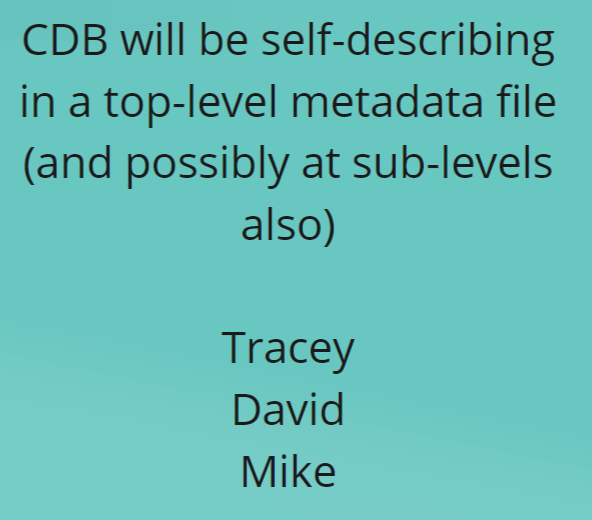
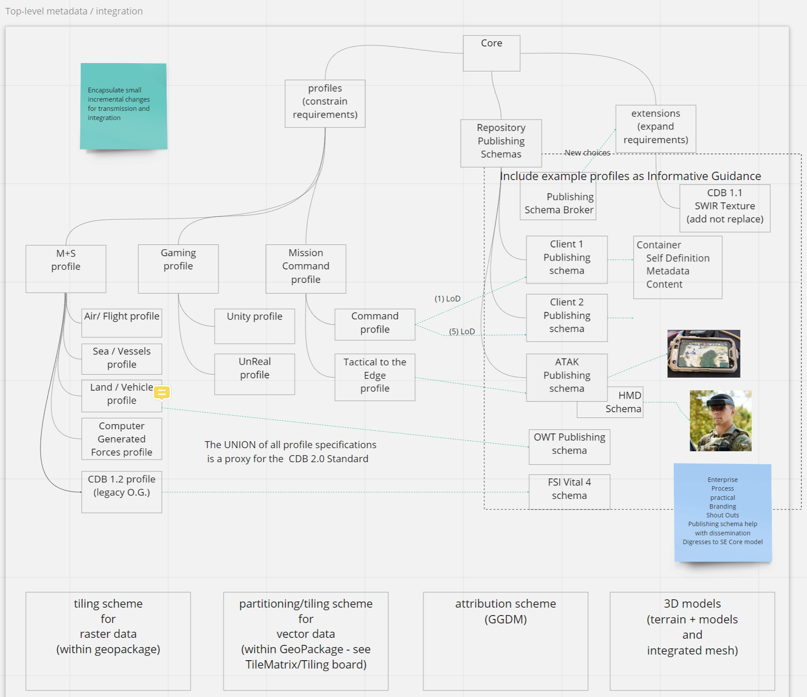

[[metadata]]

:figure-caption: Figure Mtd_Ph3 -
:figure-num: 0

== CDB X Metadata and Integration

This section discusses metadata in CDB X

= Summary of history of CDB X metadata discussions.

The earlier 'industry' versions, and OGC CDB 1.x versions of CDB contain a 'metadata' directory.  Despite the directory name, this is a collection of .XSD (XML Schema Definition) and associated .XML (eXtensible Markup Language) files that are essentially controlled vocabularies for elements of the CDB standard.

In the OGC CDB  Github "Schema" repo, the contents of the root level are:

[#img_CDB1-schema-root-level-files,reftext='{figure-caption} {counter:figure-num}']
.OGC CDB Schema Github Repo Root level files.
image::images/CDB 1dotX schema repo root directory files.png[width=750,align="center"]

and the contents of the Metadata subdirectory are:

[#img_CDB1-schema-metadata-subdir-files,reftext='{figure-caption} {counter:figure-num}']
.OGC CDB Schema Github Repo Metadata sub-directory files.
image::images/CDB 1dotX schema repo Metadata file directory.png[width=750,align="center"]

= Phase 3 Consensus, Day 3

[#img_Metadata-sub-team-consensus,reftext='{figure-caption} {counter:figure-num}']
.Day 3 Consensus and formation of the Metadata / Integration sub-team.

= Phase 3, Day 4

[#img_Metadata-Day-4-Whiteboard,reftext='{figure-caption} {counter:figure-num}']
.Metadata Day 4 Whiteboard.

= Phase 3, Day 5

[#img_Attribution-Day-4-Whiteboard,reftext='{figure-caption} {counter:figure-num}']
.Metadata Day 5 Whiteboard.
image::images/Metadata Ph3 Day 5.png[width=1000,align="center"]

= Plan for Experimentation in subsequent phases
