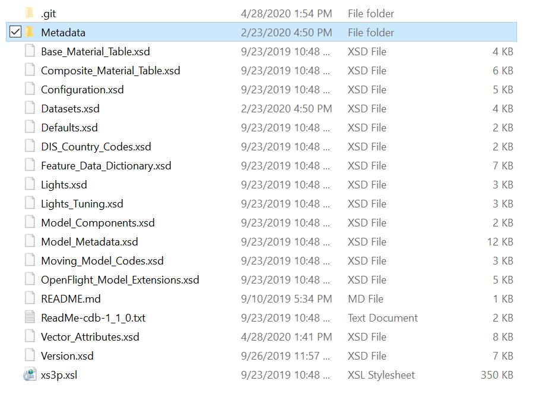
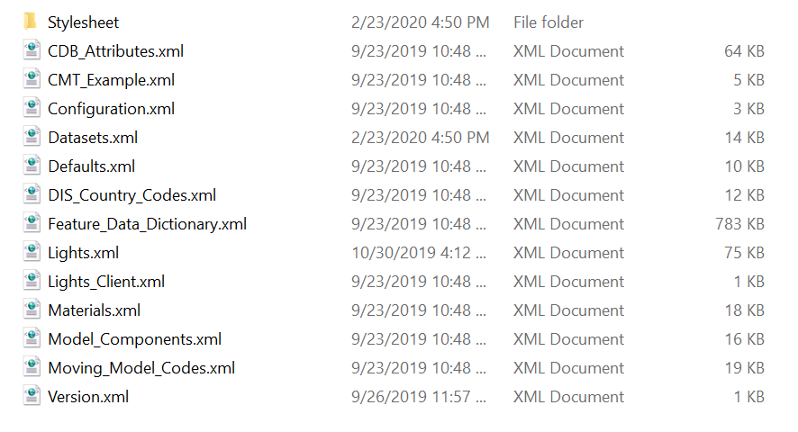
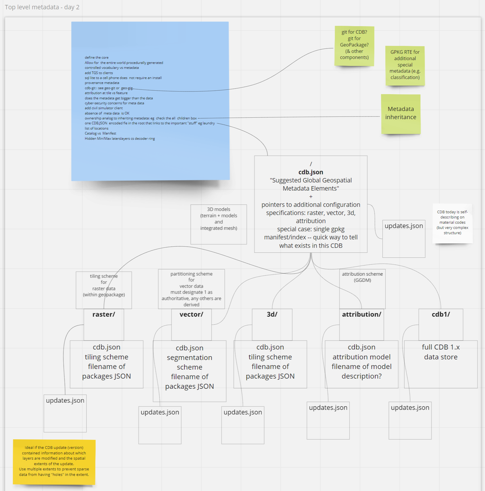

[[metadata]]

:figure-caption: Figure Mtd_Ph3 -
:figure-num: 0

== CDB X Metadata and Integration

This section discusses the role of metadata in CDB-X.

=== Summary of history of CDB-X metadata discussions.

The earlier 'industry' CDB versions and the OGC CDB 1.x versions of CDB contain a 'metadata' directory.  Despite the directory name, this is a collection of .XSD (XML Schema Definition) and associated .XML (eXtensible Markup Language) files that are metadata, controlled vocabularies, and enumerations for elements of the CDB standard.

NOTE: More specifically, the majority of what is referred to as metadata in the CDB standard is not metadata! The majority of the schemas, metadata references, and related requirements are actually controlled vocabularies (code-lists). Lights, materials, and so on are controlled vocabularies and not metadata. Some elements of the standard, such as “version” are referred to as metadata and could be classed as metadata.

In the OGC CDB  Github "Schema" repo, the contents of the root level are:

[#img_CDB1-schema-root-level-files,reftext='{figure-caption} {counter:figure-num}']
.OGC CDB Schema Github Repo Root level files.

and the contents of the Metadata subdirectory are:

[#img_CDB1-schema-metadata-subdir-files,reftext='{figure-caption} {counter:figure-num}']
.OGC CDB Schema Github Repo Metadata sub-directory files.

OGC CDB V1.1 is a minor revision of OGC CDB Standard that provides guidance and recommendations for optional global and local metadata in a CDB datastore.  The description of the new geospatial metadata provisions is in Section 5.1 of the CDB Standard Volume 1 Core document.

During the CDB 1.1 revision discussions, the SWG evaluated metadata elements as specified in a number of international standards as well as DoD metadata specifications. The following metadata standards, widely referenced and used in the geospatial community, were considered as input to the recommendations:

-	Dublin Core
-	DCAT
-	INSPIRE/19115
-	DDMS 1 (2003)
-	DDMS 5 (2012) M&S Profile
-	NOAA 19115 Profile
-	FGDC
-	GeoDCAT-AP
-	US Federal Open Data Metadata schema (see annex A)

Evaluation of these metadata standards led to defining a limited set of metadata specified as guidance in the CDB 1.1 Standard. For ease of reference, sections 5.1.10 thru 5.1.12 from Volume 1 of OGC CDB V1.2 are repeated here:

[[GeospatialMetadataGuidance]]

==== Geospatial Metadata – Guidance

These are optional metadata files. This file is not included with the CDB distribution schema package.

Most metadata standards specify dozens of possible elements, such as author, that can be specified in a metadata encoding. This is why in many communities there are profiles that are applicable to the information sharing and discovery requirements of that community. For example, there are numerous profiles of ISO 19115:2013 Geographic information – Metadata. These include the INSPIRE, Defence NSG Geospatial Core metadata, and FGDC profiles. As such, the CDB standard does not specify mandatory and/or optional metadata elements. Instead, a suggested set of minimal metadata elements are provided. The two lists – one for global and one for local – are based on an evaluation of mandatory elements in eight widely implemented metadata standards that are used in the geospatial and simulation communities. The one requirement is that all local metadata in a CDB data store provides the same mandatory elements as defined in the metadata standard specified in the Version metadata.

These following two sub-clauses recommend the metadata elements for global and local metadata. The use of F.1 refers to Table F.1 in ISO 19115-1:2014. Each element is identified by a general string followed by two element names The first name is the DCAT name followed by the ISO 19115:2014 element name.

[[SuggestedGlobalGeospatialMetadataElements]]
===== Suggested Global Geospatial Metadata Elements

Resource Identifier (dct:identifier, MD_Metadata.metadataIdentifier): A unique identifier for the entire CDB data store instance. This identifier is persistent and is considered global metadata. For example, this could be a Digital Object Identifier (DOI). The *DOI* system provides a framework for persistent identification of electronic resources management of intellectual content, managing metadata, linking customers with content suppliers, facilitating electronic commerce and enable automated management of media.

Resource Title (http://purl.org/dc/terms/title[dct:title], CI_Citation.title): Title by which the resource is known (Table F.1). For global metadata for a CDB data store, this would be a name given to the entire data store. For example, this could be “Yemen demonstration CDB data store.”

Resource point of contact (dcat:contactPoint, (MD_Metadata.contact/CI_ResponsibleParty): Name of the person, position, or organization responsible for the resource. (Table F.1). This is a text string. An example of a resource point of contact could be “Flight Safety” or “CAE.”

Resource reference date (dct:issued, CI_Citation.date): A date which is used to help identify the resource. (Table F.1). For global metadata, this is the date that the CDB data store was created or issued.

Resource Language (dct:language, PT_Locale): The language and character set used in the resource (if a language is used). (Table F.1) NOTE: We should recommend use of ISO 639-2 . For example, for English, the code would be “ENG.”

Geographic Location (dct:spatial, EX_GeographicBoundingBox): Geographic description or coordinates (latitude/longitude) which describes the location of the resource. Note: I think for the CDB standard that the definition should be narrowed to the bounding box of the contents of the data store. (Table F.1). We should also follow guidance from OGC OWS Common. See also 19115 annex B.3.1.2 Geographic extent information.

Resource abstract (dct:description footnote:[DCAT does not have a concept “abstract”. Use description instead.], MD_DataIdentification.abstract): A brief description of the content of the resource (Table F.1).

Metadata date stamp (dct:issued, MD_Metadata.dateInfo): Reference date(s) for the metadata, especially creation. (Table F.1). Note: Date gives values for year, month and day. Character encoding of a date is a string which shall follow the format for date specified by ISO 8601. This class is documented in full in ISO/TS 19103.

Temporal Extent information for the dataset (dct:temporal, EX_TemporalExtent): The temporal extent of the resource. For a CDB data store, this would be the temporal range of when the data store was initially created to the point where the most recent content was created.

Constraints on resource access and use (dct:accessRights, MD_SecurityConstraints): Security restrictions on the access and use of the resource. These would be constraints for an entire CDB data store. This could be information necessary to generate an EDH compliant encoding.

Constraints on resource access and use (dct:license, MD_LegalConstraints): A sub-class of all access constraints. These legal constraints include copyright, patent, patent pending, trademark, license, Intellectual Property Rights, restricted, and other. At the global level, these are legal constraints applicable to an entire CDB data store.

===== Suggested Local Geospatial Metadata Elements

Local Geospatial metadata can be stored in a number of different folder locations based on the data resource (data set) for which the metadata is associated. For instance, metadata for vector data will be stored at the LoD/tile level. Metadata for a moving model would be stored in the same folder using the same path name as the actual model definition. See Clause 5.1.2 above for examples.
+
While the same metadata elements are recommended for both global and local geospatial metadata, there are some differences that should be considered.
+
_Metadata Reference Information_ (dct:identifier, MD_Metadata.metadataIdentifier) This is a unique identifier for the dataset. In CDB, this could be the pathname to the dataset or the tile. These pathnames are unique. Using such identifiers would facilitate development of a RESTful API for discovery and access of CDB resources.
+
_Resource Title_ (http://purl.org/dc/terms/title[dct:title], CI_Citation.title): Title by which the data set is known (Table F.1). For local metadata, this could be a name given to a layer or model in the data store. In a CDB data store, at the dataset or tile level this would be a name given to the resource, such as “county soils.”
+
_Resource point of contact_: Name of the person, position, or organization responsible for the resource. This is a text string. An example of a resource point of contact for the content for a given layer and tile could be “Ordnance Survey.”
+
_Resource reference date_ (dct:issued , CI_Citation.date): A date which is used to help identify the resource. For local metadata, this could the date that the tile content was created in the CDB data store or the date a moving model was added to the data store
+
_Spatial Resolution Information_ (No equivalent, MD_Identification.spatialResolution): The nominal scale and/or spatial resolution of the resource. This description can include LoD information. Note: This is not precision! Precision is more about the number of decimal places and not the accuracy of the resource.

===== Where are local metadata files stored?

Typically, local metadata files will be stored with the physical data. For GTModel geotypical data sets, the metadata file would be stored along with the model XML file. If the model is stored in multiple LoDs, the metadata would also be stored at each LoD. For tiled vector data, the local metadata would be stored with the vector files at the tile level.

==== Recommendations

The following are the recommendations for metadata and provenance in CDB-X. Please note that all Sprint participants agreed that metadata including provenance is a critical requirement for the CDB-X Standard. They also agreed that some elements should be mandatory.

. Metadata and provenance content should be self-describing.
. Keep the core set of mandatory metadata elements limited and simple. Collecting and maintaining metadata can be costly – unless workflows are designed to capture metadata as part of the production process.
. Define an extensible CDB metadata model that allows for easily incorporating additional metadata elements for specific data types, domains or applications. A good example would be the metadata required to make SWIR and NIR in a CDB data store useful by discovery, access, processing, and visualization services for those data types.
. Discuss and agree on element names for the mandatory elements. This is because each metadata standard names elements differently. This also suggests that a metadata element crosswalk document may be required. The beginnings of such a document were developed as part of the CDB 1.1 revision work. 
. Every CDB dataset should have its own metadata that describes the content of that specific dataset. This will allow for much more flexible extensibility of new data types and enhances the value of existing datasets and enhances discoverability. 
. Consider whether the GeoPackage Metadata extension is robust and flexible enough to meet CDB-X requirements.

==== Future vision of role of metadata in CDB-X

The following diagram provides a suggestion of where CDB-X metadata could exist.

[#img_Attribution-Day-4-Whiteboard,reftext='{figure-caption} {counter:figure-num}']
.Metadata Day 5 Whiteboard.

