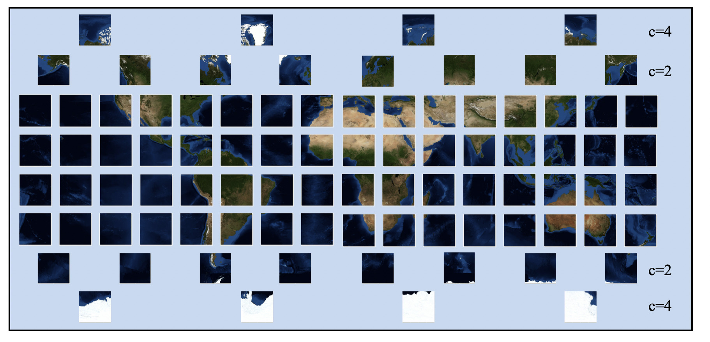
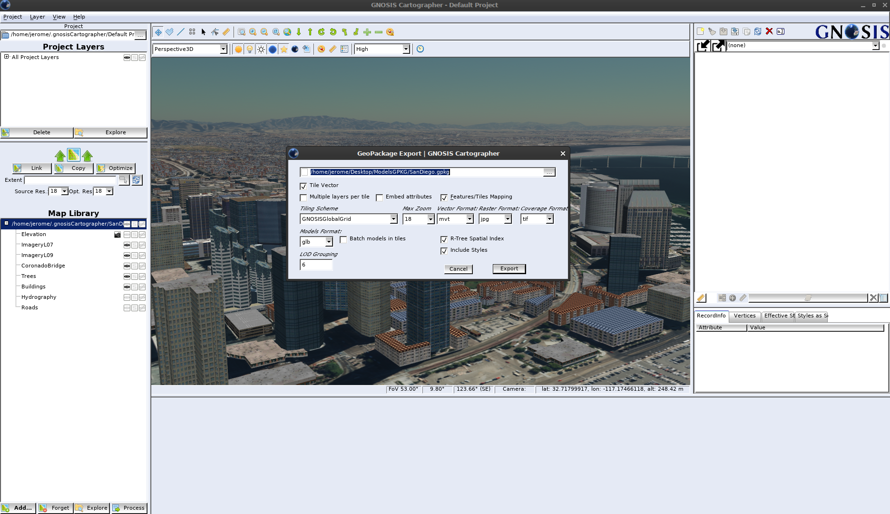
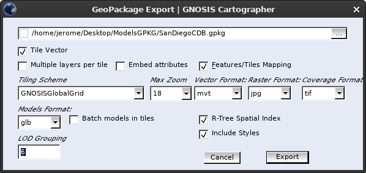

[[tiling]]
== Tiling and packaging of data layers

This chapter covers:

- The evaluation of a specific global tiling scheme for CDB X, 
- The configurable grouping of Levels of Detail to balance file size versus file count, 
- An approach to packaging one or more data layers in GeoPackages (including coverage, vector and 3D data), 
- Current and proposed GeoPackage extensions for storing this data, and 
- As well as the results of related prototyping activities.

The tiling sub-group was initially assigned specifically to explore tiled coverage data However, based on initial work some experiments evolved went beyond the initial teting scope. The additional experimentation also applied the same tiling approach to vector data and 3D models and used existing or new extensions to store this tiled data in GeoPackages.

=== OGC Standards Relevant to Tiling and Packaging

Based on the discussions and results of the experimentation, the Tiling Subgroup participants believe the following:

`Recommendation:` Any tiling schemes specified in a CDB X data store (repository) SHALL be based on and consistent with the:

* https://portal.ogc.org/files/?artifact_id=92962&version=1[OGC Core Tiling Conceptual and Logical Models for 2D Euclidean Space] (19-014r3)
* https://www.ogc.org/standards/tms[OGC Two Dimensional Tile Matrix Set Standard] (17-083r2)

Additional information is now provided on these key OGC standards that are highly relevant to the development and approval of CDB 2.0.

==== OGC Core Tiling Conceptual and Logical Models for 2D Euclidean Space

This OGC Abstract Specification consists of two Parts: A General Tiling Conceptual Model and, based on the Conceptual Model, a Logical Model for the Tessellation (Tiling) of 2D Euclidean Space. Tiling  of  2D  Euclidean  space  is  the  most  commonly  known  approach  to  partitioning  space  in traditional  geospatial  technology.  However, there are also common elements and/or semantics for any approach to partitioning space in any dimension. The logical model in this document defines a set  common  required  elements  and  then  follows  with  more  specific  requirements  for  the  two dimensional case.

Part  1  of  the  Abstract  Specification  describes  a  general  tiling  conceptual  model.  The conceptual model is applicable to any dimension.  The  conceptual model makes no assumptions regarding content, use cases, implementation scenarios, or how the space is to be tessellated (tiled).  The conceptual model is abstract and cannot be implemented as is.

Part  2  of  the Tiling  Abstract  Specification  defines  a  detailed  logical  model  for  the  tessellation  of  2D Euclidean  Space.  One  or  more  logical  models  are  required  to  provide  the  requirements  and structure  necessary  for  implementation.  Therefore, in  addition to the conceptual model, this Abstract Specification also specifies a core logical model for the 2D planar (Euclidean) use case.

==== OGC Two Dimensional Tile Matrix Set Standard

The OGC Tile Matrix Set standard defines the rules and requirements for a tile matrix set as a way to index space based on a set of regular grids defining a domain (tile matrix) for a limited list of scales in a Coordinate Reference System (CRS) as defined in [OGC 08-015r2] Abstract Specification Topic 2: Spatial Referencing by Coordinates. Each tile matrix is divided into regular tiles. In a tile matrix set, a tile can be univocally identified by a tile column a tile row and a tile matrix identifier. This document presents a data structure defining the properties of the tile matrix set in both UML diagrams and in tabular form. This document also presents a data structure to define a subset of a tile matrix set called tile matrix set limits. XML and JSON encodings are suggested both for tile matrix sets and tile matrix set limits. Finally, the document offers practical examples of tile matrix sets both for common global projections and for specific regions.

=== Design Objectives for CDB X Tiling, LoDs and Layers

The following are the key design principles for a CDB X tiling, levels of detail, and layering. These design principals were discussed and documented during Phase 1 discussions as well as during the experimentation.

* OGC GeoPackage structured containers are a primary storage format for derived vector data layers, coverages, and other data types as identified (`TBD`). The two OGC Standards of relevance are https://portal.opengeospatial.org/files/12-128r15[OGC GeoPackage version 1.1] and http://docs.opengeospatial.org/is/17-066r1/17-066r1.html[OGC GeoPackage Extension for Tiled Gridded Coverage Data].
* Use metadata for whole datasets that describe how data layers are regrouped in GeoPackages (LOD grouping and data layer grouping)
* Provide for fewer top level tiles than in OGC CDB 1.x
* Store imagery in GeoPackage according to the tiling scheme specified below (`need anchor`)
* Store coverage data in GeoPackage according to the tiling scheme specified below (`need anchor`). Suggested coverage types based on current CDB standard and user specified requirements: (Ellipsoidal body surface): Elevation models, visual and non-visual (multi-spectral) imagery, terrain light maps (emissive at night), and raster materials (for non-visual sensors). Should be extensible to support other types.
* Coordinate Reference System is WGS 84 with epoch encoding (same as current CDB Standard except for epoch).
* Need to keep the various encodings that CDB 1.x already has:
** Elevation compression encodings (use of scaled integers vs floating point for smaller data sizes)
** Elevation grids that are adjustable (better terrain fidelity at lower LODs/zoom levels)
** Raster Material encodings using multiple coverage layers
** Imagery Compression (Imagery is typically the largest layer in CDB by disk storage)
* Must enable a "relatively" easy migration path from the CDB 1.1/1.2 tiling/LoD structure into the CDB X structure.

=== Proposed Tiling Logical Model for CDB X

The following figure, based on the Tiling Abstract Specification Logical Model and the CDB 1.x Conceptual Model, shows the properties by class (concept) and the relationships between the classes.

[#img_logical-model,reftext='{figure-caption} {counter:figure-num}']
.Logical Model for partitioning based on tiles in CDB X.
image::images/tiling_logical_model.jpg[width=800,align="center"]

=== Proposed CDB X Tiling Scheme

[#img_gggtms-model,reftext='{figure-caption} {counter:figure-num}']
.Level 2 of the GNOSIS Global Grid proposed for CDB X.


The proposed tiling scheme would be based on the GNOSISGlobalGrid, where the tiling starts with a 2x4 grid of tiles with each tile 90 degrees on a side that covers the whole Earth.  This is zoom level 0 (or tile matrix identifier "0").  Each experiment used a tile size of 256x256, although that could be experimented with.  At each successive zoom level, each lower level tile is split into four new tiles at the next zoom level, except for any tile that touches either the North or South Pole is not split in the longitude direction.  This subdivision can continue until the zoom level is high enough to accommodate the highest resolution data that is to be stored within the CDB X.

References for the GNOSISGlobalGrid tiling scheme:

* The 2D TMS Standard Annex H.2: http://docs.opengeospatial.org/is/17-083r2/17-083r2.html#106
* The 2D TMS JSON description: http://schemas.opengis.net/tms/1.0/json/examples/GNOSISGlobalGrid.json
* Testbed 13 - Vector Tiles ER: http://docs.opengeospatial.org/per/17-041.html#_global_gnosis_tiling_scheme_adapted_to_polar_regions
* OGC Standard Tracker - Global WGS84 tiling scheme adapted to polar regions (quad tree except for always having 4 tiles at the poles): http://ogc.standardstracker.org/show_request.cgi?id=520
* OGC Ideas Repository - Global tiling grid approximating equal-area while maintaining a simple latitude/longitude aligned rectangular tile layout (not quite a DGGS) https://github.com/opengeospatial/ideas/issues/59
* Vector Tiles Pilot - Phase 2 Summary ER: https://docs.ogc.org/per/19-088r2.html


[#img_logical-model,reftext='{figure-caption} {counter:figure-num}']
.Proposed Tiling Scheme for CDB X.
image::images/image2020-7-8_10-39-39.png[width=515,align="center"]

=== Findings from experiments

The following graph compares the CDB 1.x zones with the Gnosis grid and shows how the GNOSIS algorithm helps to keep the typical tile closer to a “square” than CDB’s zones.

[#img_logical-model,reftext='{figure-caption} {counter:figure-num}']
.CDB 1.x to GNOSIS Comparison - Ratio.
image::images/image2020-9-4_10-41-0.png[width=800,align="center"]

==== Tiling Changes From OGC CDB 1.x

Benefits from changing to the proposed tiling scheme:

* OGC CDB 1.x has 41,220 top level tiles, which requires opening huge numbers of files to visualize the Earth at global scales.  The proposed CDB X tiling would use 8 tiles to cover the Earth at the coarsest level of detail.
* The concept of "zones" in OGC CDB 1.x are still present in the tiling scheme, but algorithmically derived rather than at fixed latitudes.  New zones are introduced at higher levels of detail, keeping the tiles near the poles closer to an ideal square shape than in OGC CDB 1.x
* The ratio of the longitude size of tiles is always 1:1, 2:1, or the inverse 1:2, where OGC CDB 1.x has several ratios that must be supported, such as 2:1, 3:2 and 4:3.

Drawbacks from changing to the proposed tiling scheme include the following.  NOTE: These issues would require some level of rework for existing CDB applications to be compatible with the new tiling scheme.

* The new tiling scheme is incompatible with OGC CDB 1.x, as there is no alignment between the tile areas and the LOD or zoom levels.  To convert data between these two tiling schemes would require merging and splitting of raster data tiles, while changing their resolution, and would require reprocessing all the coverage data (like imagery).
* Some CDB applications might have more trouble with tiles that are not based on integer latitude and longitude boundaries.
* Some CDB applications might have an issue with a format where there are not a fixed number of "zones" (using the OGC CDB 1.x term) or different grid cell sizes used.  This is because the GNOSIS grid introduces a new "zone" closer to the poles at each successive zoom level to help preserve a grid cell that is closer to an ideal square real world size.
* Tile Matrix Set naming (numbering) is different from OGC CDB 1.x, with the numbering starting from the top left corner of a set of tiles in CDB X vs starting from the bottom left corner of a set of tiles in OGC CDB 1.x.

=== Proposed CDB X Data Container

The coverage, vector and 3D models data could be stored using http://www.geopackage.org/spec/[GeoPackage] containers.
Imagery and coverage data would always be tiled. Vector data could optionally be stored in tiles using extensions for tiled vector data being standardized in the OGC. 
3D models could either be stored in a single table referenced by placement points, or as batched tiled 3D models.

=== Proposed Levels of Detail Grouping

There are two proposed ways to group data within a series of GeoPackage containers.  Within these choices is a tradeoff between the format simplicity of working with a single container, and access latency due to larger file and table sizes.

1. For edge users and smaller areas, the Subgroup particpants `recommend` that all the CDB X coverage layers be present within a single GeoPackage container.  This approach could be an export from a larger CDB X dataset, where only the resolutions and the boundaries of the data needed are stored and delivered to an end user.
2. For Modeling and Simulation uses, as well as data repository cases, the Subgroup participants `recommend` that a series of GeoPackage containers be used to store CDB X coverage layers.  This involves storing a region of the world at a set of zoom levels, or levels of detail, within a single GeoPackage, with a specified file and directory naming scheme.  This approach would allow for faster access to data at specified areas and zoom levels.  It would also lend itself to concurrent access and editing for data repository maintainers.
** The particpants propose that a configurable grouping value be used to specify how many zoom levels or levels of detail are put into a single GeoPackage.  This would be a tradeoff between the number of GeoPackages created and the file and table sizes within each GeoPackage.
** Multiple grouping numbers were experimented with. 5 was found to be a good number for packaging together all data layers of the San Diego CDB. This grouping number might need to be adjusted for different types of data layers, or different data sets as well.
** The proposed naming of each GeoPackage file is based on the layer name and the coarsest, lowest level tile included within the grouping inside the GeoPackage.  That tile's level, row (from the top) and column within the tile matrix set make up the filename, along with the level of the finest or highest level tile that can be placed into this GeoPackage.  For example:  **Coverages_L4_R16_C12_L6.gpkg**
** The proposed directory naming creates a directory tree to limits the number of GeoPackage files that could exist within a single directory.  Each GeoPackage will exist within a set of directory names that represents each coarser or lower zoom level GeoPackage that encompases the smaller higher resolution area.  For example:  The file, **Coverages_L4_R16_C12_L6.gpkg**, will exist in the directory named **Coverages\L0_R1_C0\L1_R2_C1**
*** The file and directory naming needs to be easy to compute algorithmically or exist within a catalog, without having to search a data repository to discover arbitrarily named files.

To facilitate extraction from a large (or even worldwide) dataset, easily merging these extracted sub-datasets, as well as the ability
to augment these base datasets with additional more detailed insets, without requiring to repackage the entire dataset, the following solutions are proposed:

* The publisher of a large repository of data could pre-establish fixed maximum LODs for specific data layers (e.g. imagery, elevation, 3D Models)
* When inset data is added to a dataset, these could go beyond the regular maximum LOD specified for the 'packaging',
thus these inset tiles are always grouped together with the tiles of the regular maximum LOD.

Recommendation: Define this capability for splitting GeoPackages based on a specific tiling scheme outside of the CDB X standard so that it can be used by itself.

=== Proposed `cdb.json` index of packages and data layers

The Tiling group developed a simple schema for describing the data layers provided by a CDB X, which CDB component selector they correspond to, and how
they are packaged in one ore more _packages_, which can themselves either be stored in a single GeoPackage (zero or _null_ LOD grouping), or separated in
multiple GeoPackage based on tiles grouped in multiple LODs (non-zero LOD grouping). This index allows the flexibility to use the best suited configuration
for a given dataset or use case, yet it is very simple for a client to parse and access the data in a deterministic manner using any of these configurations.
When using a single GeoPackage is used, potentially this `cdb.json` could be included inside as metadata (using the GeoPackage metadata extension) to make
this GeoPackage a single file, very portable compliant CDB X.
The following `cdb.json` index files demonstrate the three main configuration possibilities.
Additional examples are also provided along with the experiments results.

*Example 1*: two data layers (with a maximum LOD of 16 and 18) packaged as a single GeoPackage ("groupLOD" : 0 -- all LODs grouped together).
This will be a single file named `SampleCDBX.gpkg`.

```json
{
   "packages" : [
      {
         "name" : "SampleCDBX",
         "tms" : "GNOSISGlobalGrid",
         "groupLOD" : 0,
         "maxLOD" : 18,
         "layers" : [
            {
               "name" : "Elevation",
               "cs1" : 1,
               "maxLOD" : 16
            },
            {
               "name" : "Imagery",
               "cs1" : 4,
               "maxLOD" : 18
            },
         ]
      }
   ]
}
```

*Example 2*: two data layers (with a maximum LOD of 16 and 18) packaged as a single package, grouped in GeoPackages covering tiles across 5 LODs.
The one package will be organized in a folder named `SampleCDBX`, and the GeoPackages files will be grouped by 5 counting down from the maximum LOD 18,
e.g. `SampleCDBX/L0_R0_C0/L4_R10_C11/L9_R324_C356/SampleCDBX_L14_R10376_C11415_L18.gpkg`.
```json
{
   "packages" : [
      {
         "name" : "SampleCDBX",
         "tms" : "GNOSISGlobalGrid",
         "groupLOD" : 5,
         "maxLOD" : 18,
         "layers" : [
            {
               "name" : "Elevation",
               "cs1" : 1,
               "maxLOD" : 16
            },
            {
               "name" : "Imagery",
               "cs1" : 4,
               "maxLOD" : 18
            }
         ]
      }
   ]
}
```

*Example 3*: three data layers (with a maximum LOD of 16, 18 and 13) packaged as three separate packages.
Elevation is grouped in GeoPackages covering tiles across 6 LODs, Imagery is grouped in tiles across 7 LODs while Buildings are stored grouped in a single GeoPackage.
The Elevation package will be organized in a folder named `Elevation`, and the GeoPackages files will be grouped by 5 counting down from the maximum LOD 16,
e.g. `Elevation/L0_R0_C0/L5_R20_C22/Elevation_L11_R1302_C1427_L16.gpkg`.
The Imagery package will be organized in a folder named `Imagery`, and the GeoPackages files will be grouped by 7 counting down from the maximum LOD 18,
e.g. `Imagery/L0_R0_C0/L5_R20_C22/Imagery_L12_R2605_C2855_L18.gpkg`.
The Buildings will be stored in a single file named `Buildings.gpkg`.

```json
{
   "packages" : [
      {
         "name" : "Elevation",
         "tms" : "GNOSISGlobalGrid",
         "groupLOD" : 6,
         "maxLOD" : 16,
         "layers" : [
            {
               "name" : "Elevation",
               "cs1" : 1,
               "maxLOD" : 16
            }
         ]
      },
      {
         "name" : "Imagery",
         "tms" : "GNOSISGlobalGrid",
         "groupLOD" : 7,
         "maxLOD" : 18,
         "layers" : [
            {
               "name" : "Imagery",
               "cs1" : 4,
               "maxLOD" : 18
            }
         ]
      },
      {
         "name" : "Buildings",
         "tms" : "GNOSISGlobalGrid",
         "groupLOD" : 0,
         "maxLOD" : 13,
         "layers" : [
            {
               "name" : "Buildings",
               "cs1" : 100,
               "cs2" : 1,
               "subComponent" : 1,
               "maxLOD" : 13
            }
         ]
      }
   ]
}
```

Recommendation: Consider also defining this description of the packages and LOD grouping outside of the CDB X standard so that it can be used elsewhere as well.

=== Backwards Compatibility with OGC CDB 1.x

The current OGC CDB tiling scheme can be described as a Tile Matrix Set (TMS) that encodes the CDB fixed zones and the larger tile dimensions,
as seen in this https://maps.ecere.com/ogcapi/tileMatrixSets/CDBGlobalGrid[example description] (https://maps.ecere.com/ogcapi/tileMatrixSets/CDBGlobalGrid?f=json[JSON encoding]).
Using this TMS, a profile or extension of OGC CDB 1.x could be created that would support the same GeoPackage containers and level of detail groupings, while conforming to the OGC CDB 1.x conceptual model.  Using this approach could bring in some concepts of CDB X into OGC CDB 1.x and make the transition easier to a future version of OGC CDB.

NOTE: We do not recommend supporting more than one tiling scheme in a version of CDB, as this choice is foundational to how data layers are processed and stored and accessed.

=== GeoPackage Tile Matrix Set extension

The engineering tests created in this effort made use of a proposed Tile Matrix Set extension defined and initially tested in the
https://www.ogc.org/projects/initiatives/vtp2[2019 OGC Vector Tiles Pilot Phase 2], which enables support for the
https://maps.ecere.com/ogcapi/tileMatrixSets/GNOSISGlobalGrid[GNOSIS Global Grid].
This extension has not yet been adopted as an official OGC GeoPackage extension, but is on the GeoPackage Standard Working Group roadmap.
The current draft is available from here: https://gitlab.com/imagemattersllc/ogc-vtp2/-/tree/master/extensions/14-tile-matrix-set.adoc[GeoPackage Two Dimensional Tile matrix Set (TMS) extension (Draft)].

NOTE: Even though most current software do not yet support the GeoPackage TMS extension, the level 0 data
(e.g. for the BlueMarble imagery sample GeoPackages) will still work e.g. in QGIS, as the GNOSIS Global Grid does not use variable widths at level 0.

=== Tiled Coverage Data

The http://docs.opengeospatial.org/is/17-066r1/17-066r1.html[GeoPackage Tiled Gridded Coverage extension] would be ideal for storing tiled coverage data, but it has some drawbacks that would need to be addressed.
Current limitations include:

* Only single channel data is allowed in the coverage extension.  Many CDB coverages use more than one channel (Imagery, Raster Materials, etc.).  The alternative would be to store CDB X coverage data using different GeoPackage concepts, such as tiles for imagery, coverages for elevation, and related tables for raster material data.
** Current change request:  http://ogc.standardstracker.org/show_request.cgi?id=662
* GeoTiff data only supports using 32-bit floating point data.  In OGC CDB 1.x, GeoTiff files are used to store 8 bit unsigned and 8, 16, or 32 bit signed binary data as well.  And the proposed OGC CDB 1.2 will also adopt the use of binary 1-bit data elements as well.
** Current change request:  http://ogc.standardstracker.org/show_request.cgi?id=661
* An https://github.com/opengeospatial/geopackage/issues/551[issue] was filed asking for better clarity about whether 16-bit PNG encoding is signed or unsigned

Multiple sample GeoPackages using TMS / GNOSISGlobalGrid are described and linked below in the results of the experiments.

The following are recommendations and suggested additional discussion topics. These recommendations and discussion topics resulted from the Tiling sub-groups discussion on an enhanced tiling model for CDB X and the potential impacts on the various data types (layers) in the current CDB standard and existing CDB data stores.

==== Elevation min/max

CDB X needs to continue supporting the Min/Max Elevation component concept. In order to reduce the number of files and complexity, the recommendation is to move the minimum and maximum elevation values for the gridded elevation coverage contained in a tile to the tile metadata.

NOTE: The MinElevation and MaxElevation components are part of the MinMaxElevation dataset whose purpose is to provide a CDB conformant data store with the necessary data and structure to achieve a high level of determinism in computing line-of-sight intersections with the terrain.  The values of each component are with respect to WGS-84 reference ellipsoid.

==== Image Compression - JPEG

Recommendation: That loss-less and lossy image compression solutions be explored for use in CDB X. Any such solutions are not viewed as a replacement for JPEG 2000 but instead as alternatives. This could be accomplished by submitting a change request for the OGC GeoPackage standard that provides guidance and requirements for support of other image formats beyond PNG and JPG. The sub-group identified a potential candidate: https://flif.info/[FLIF - Free Lossless Image Format], although this format looks to be relatively slow as well.

NOTE: JPEG-2000 has very high compression, even in lossless mode, and there are multiple open-source implementations. However, performance can be extremely slow and non-optimal for all use cases.

==== Materials

Recommendation: CDB X needs to support material data to provide the same functionality as CDB 1.x. To also reduce the number of files, this can be accomplished by putting all the raster material data (including material table) in a single CDB data layer in GeoPackage, perhaps using the related tables extension. The subgroup did have some discussion on what "materials" means in the CDB 1.x context. Materials in current CDB have to do with the physical substance of a feature that can then be used to simulate the emmisive or reflective properties of a feature in wavelengths of the electromagnetic spectrum other than what the human eye senses. These are for non-visualization use cases or special visualization such as IR or Radar. The subgroup did also discuss for the possible need for CDB X to provide guidance on using Physically-Based Rendering (PBR) to support the visualization/rendering use case. glTF, I3S, and 3D Tiles all support PBR.

=== Tiled Vector Data

To tile vector data (including points referencing 3D models), draft GeoPackage extensions defined during the _OGC Vector Tiles pilots_ were used:

. https://gitlab.com/imagemattersllc/ogc-vtp2/-/blob/master/extensions/1-vte.adoc[GeoPackage Vector Tiles] The GeoPackage Tiled Vector Data extension defines the rules and requirements for encoding tiled feature data (aka "vector tiles") into a GeoPackage data store.
. https://gitlab.com/imagemattersllc/ogc-vtp2/-/blob/master/extensions/4-vtae.adoc[GeoPackage Vector Tiles Attributes Extension] This extension defines a relationship between features contained in a tiled layer and tiles containing those features.
. https://gitlab.com/imagemattersllc/ogc-vtp2/-/blob/master/extensions/2-mvte.adoc[MapBox Vector Tiles extension] The GeoPackage Mapbox Vector Tiles extension defines the rules and requirements for encoding vector tiles in a GeoPackage data store as Mapbox Vector Tiles.

As an alternative to encoding tiled vector data as Mapbox Vector Tiles, some experiments used the
http://docs.opengeospatial.org/per/18-025.html#GMTSpecs[GNOSIS Map Tiles] encoding, specified by Ecere in Testbed 13 and 14.

Recommendation: Although the use of non-tiled vector data layers (e.g. storing the geometry as WKB in GeoPackage features tables) should also be supported
by CDB, the use of tiled vector data extension should be allowed. In particular, tiling vector data is essential for dealing with features spanning
a very large geospatial extent, such as coastlines (e.g. OpenStreetMap ways tagged with https://wiki.openstreetmap.org/wiki/Coastline[`natural=coastline`]).

NOTE: Such large single features where tiling is essential was not used in experiments of the Vector data group, which focused on testing the performance
of a large number of features stored indexed, but not tiled inside GeoPackages.

One thing that was noted is that even if the vector geometry is tiled and organized into multiple GeoPackages, it might be useful to support storing the data
attributes separately only at the top-level (level 0) tiles, or in a single GeoPackage storing only data attributes, to avoid duplication of that information
at each grouping level.

=== Tiled 3D Models

Two approaches were experimented with to include 3D Models in GeoPackages, along with textures used by those models.

- A) one where 3D models are individually stored in a single table, and referenced and placed by tiled vector data (points),
- B) and another where batched 3D models are the content of the tiles.

Results of experiments for both variations are found below in the experiments description.

==== 3D Models Extension

As a draft GeoPackage extension for 3D models is being defined, rows are added to the `gpkgext_extensions` table to identify all tables set up for this extension.

For all of these tables, the `extension_name` is configured to be `ecere_3d_models`, the definition to be http://github.com/ecere/gpkgext-3dmodels, and the `scope` to be `read-write`.

The tables registered with this extension are:

- `gpkgext_3d_models` (only used for the reference points approach A)
- the individual tiles tables for batched 3D models (only used for approach B)
- `gpkgext_textures` for shared textures

==== A) Referenced 3D models with placement information

In this approach, best suited for geo-typical models, a single table per GeoPackage (`gpkgext_3d_models`) is used to define one model per row, in a blob within the `model` field.
A `format` field allows to specify the format. Both glTF and E3D have been used in the experiments.
The `name` field allows to specify a name for the model, andt the `lod` field can optionally be used to distinguish between multiple level of details for the model, or left NULL if only a single version exists. The combination of `name`, `lod` and `format` must be unique.

The `model::id` field of the attributes table for the 3D models referencing points (which would also contain the point geometry in a non-tiled approach) references the `id` (primary key) of the `gpkgext_3d_models` table.
The attributes table may also contain additional fields for scaling and orienting the models:

- `model::scale`; or `model::scaleX`, `model::scaleY` and `model::scaleZ` for non-uniform scaling
- `model::yaw`, `model::pitch` and `model::roll`

These attributes duplicate the CDB fields `AO1`, `SCALx`, `SCALy`, `SCALz` (and in a sense `MODL` as well), but are intended to be defined in a non-CDB specific manner within a generic 3D Models extension for GeoPackage.

The following SQL is used to create the `gpkgext_3d_models` table:

```sql
CREATE TABLE gpkgext_3d_models (
   id INTEGER PRIMARY KEY AUTOINCREMENT NOT NULL,
   name TEXT NOT NULL,
   lod INTEGER,
   format TEXT NOT NULL,
   model BLOB,
   CONSTRAINT unique_models UNIQUE(name, lod, format));
```

Example `gpkgext_3d_models`:

```
id  name               lod  format  model
--  -----------------  ---  ------  -----
1   coniferous_tree01       glb     glTF
2   palm_tree01             glb     glTF
```

Sample SQL table creation for attributes table referencing the 3D models:

```sql
CREATE TABLE attributes_Trees (
   id INTEGER PRIMARY KEY AUTOINCREMENT NOT NULL,
   AO1 REAL, CNAM TEXT, RTAI INTEGER,
   SCALx REAL, SCALy REAL, SCALz REAL,
   AHGT TEXT, BBH REAL, BBL REAL, BBW REAL, BSR REAL,
   CMIX INTEGER, FACC TEXT, FSC INTEGER, HGT REAL,
   MODL TEXT,
   `model::id` INTEGER,
   `model::yaw` REAL,
   `model::scale` REAL)
```

==== B) Batched 3D Models tiles

In this approach, best suited for geo-specific models, a single model covers a whole tile, batching all 3D models from the data layer found within that tile, and is stored in a tiles table much like raster or vector tiles (as a glTF blob in the `tile_data` field).
It is closer to the 3D Tiles / One World Terrain approach, and could potentially also combine both 3D Terrain and 3D Models (though ideally keeping them as distinct nodes within the model). Such an approach may facilitate transition between CDBX and OWT.

Because GeoPackage does not define a generic mechanism to specify the encoding of `tile_data` (it has previously been suggested that this would be a good field to add to the `gpkg_contents` table), the encoding of the 3D model must be deducted from the content of the blob. Fortunately, both glTF and E3D feature a header signature which facilitates this. The `3d-models` type is introduced to specify in the `data_type` column of the `gpkg_contents` table.

The translation origin of the model, as well as its orientation, is implied from the center of the tile (from the tile matrix / tile matrix set) for which it defined. The model is defined in the 3D cartesian space where (0, 0, 0) lies at that center, sitting directly on the WGS84 ellipsoid, and oriented so that by default it appears upright with its X axis pointing due East, its Z axis pointing North, and its Y axis pointing away from the center of the Earth. In other words, it would be equivalent to having a single point situated at the center of the tile in the referenced 3D points approach.

The height of the individual features (e.g. buildings) within the batched models tile models has already been adjusted match the elevation model. However, each separate feature from CDB is encoded in the model as a separate node to facilitate re-adjusting it to new elevation.

==== Textures table

The textures table has the following fields:

- `id`: integer primary key
- `name`: The filename used in the model to refer to the texture
- `width`: width of the texture
- `height`: height of the texture
- `format`: e.g. "png"
- `texture`: blob containing the texture data

The combination of `name`, `width`, `height` and `format` must be unique.

The following SQL statement is used to create the table:

```sql
CREATE TABLE gpkgext_textures (
   id INTEGER PRIMARY KEY AUTOINCREMENT NOT NULL,
   name TEXT NOT NULL,
   width INTEGER NOT NULL,
   height INTEGER NOT NULL,
   format TEXT NOT NULL,
   texture BLOB,
   CONSTRAINT unique_textures UNIQUE(name, width, height, format));
```

```
id  name   width  height  format  texture
--  -----  -----  ------  ------  -------
1   1.png  512    512     png     �PNG
2   1.png  256    256     png     �PNG
3   2.png  512    512     png     �PNG
4   2.png  256    256     png     �PNG
```

=== Ecere GeoPackage Tiling Experiments

==== Overview

Ecere conducted multiple experiments during the sprint tiling and packaging data sourced from CDB 1.x content.

- The first experiment's objective was to share an example of how to store CDB data in a GeoPackage following the GNOSIS Global Grid, using the TileMatrixSet and
vector tiles extensions, as well as describing this content using the proposed `cdb.json` schema. The Camp Pendleton sample CDB from Presagis was used
for this experiment.

- The second experiment aimed to demonstrate how to distribute data covering a large area in multiple GeoPackages using a pre-determined LOD grouping setting.
The bigger San Diego CDB dataset provided by CAE was used for this experiment as well as the next.

- The third experiment investigated storing 3D models inside the GeoPackages using two different approaches.
One approach is very similar to the CDB 1.x data model where all 3D models are stored in a single table and referenced from points stored in tiled vector data.
In the other approach, 3D models are batched per tile and stored in the `tile_data` blob of GeoPackage tiles table. The local origin of the 3D model corresponds
to the center of the tile in which it is stored, assuming a coordinate system whose axes are aligned with East, North and Up.
This approach is more similar to the one used for 3D Tiles and One World Terrain.

These were originally described as separate experiments on the https://github.com/sofwerx/cdb2-concept/wiki[CDB X concept wiki], but here the combined final results of producing a prototype
CDB X for the full San Diego CDB are presented. These results cover tiling the imagery, elevation, vector data and 3D models for the full San Diego CDB.

[#img_gpkgexport,reftext='{figure-caption} {counter:figure-num}']
.Ecere GeoPackage / CDB X Export dialog and options in Ecere’s GNOSIS Cartographer


[#img_gpkgexport2,reftext='{figure-caption} {counter:figure-num}']
.Ecere GeoPackage / CDB X Export dialog and options close up


==== Data results

===== Single GeoPackage

This one GeoPackage contains the whole San Diego CDB data (not including Blue Marble):

NOTE: In the texture table for this GeoPackage, the texture names are prefixed by an extra directory to differentiate the numbered textures used in the
different 3D models data layers, however the reference from the 3D models was not yet updated to reflect this.

https://portal.ogc.org/files/?artifact_id=95378[Complete San Diego CDB X - _cdb.json_ index]

*FIXME awaiting portal link:* ftp://cdb-x-2020@ftp.ogc.org/Ecere/SanDiego.gpkg.7z[Complete San Diego CDB X - GeoPackage] (12.8 GiB, 9.8 GiB compressed)

*FIXME awaiting portal link:* ftp://cdb-x-2020@ftp.ogc.org/Ecere/SanDiego.gpkg[Complete San Diego CDB X - GeoPackage using GNOSIS Map Tiles and E3D Models] (10.3 GiB uncompressed)

===== Data layers packaged together (tiles grouped in multiple GeoPackages)

This series of GeoPackages (also covering the whole San Diego CDB) groups tiles of 5 LODs for all data layers within the same GeoPackage.
In this approach, the textures are stored in a separate folder to avoid repeating them in each separate GeoPackage.

https://portal.ogc.org/files/?artifact_id=95366[_cdb.json_ index]

*FIXME awaiting portal link:* ftp://cdb-x-2020@ftp.ogc.org/Ecere/SanDiego.7z[One package using an LOD grouping of 5] (14.6 GiB, 9.9 GiB compressed)

https://portal.ogc.org/files/?artifact_id=95370[Partial dataset (subset of the overall extent) using an LOD grouping of 5] (1.4 GiB, 217.5 MiB compressed)

===== As separate layers

A series of GeoPackages (11.2 GB compressed) of the San Diego CDB, plus a full resolution global coverage (for one particular month) of the NASA Visible Earth Blue Marble,
along with an accompanying `cdb.json` can be found at:

https://portal.ogc.org/index.php?m=projects&a=view&project_id=466&tab=2&artifact_id=95320[OGC portal folder]

https://portal.ogc.org/files/?artifact_id=95345[Top-level _cdb.json_ index]

The individual layers, as well as alternate encodings of some of them and are listed below:

====== Elevation

https://portal.ogc.org/files/?artifact_id=95352[Elevation (using 16-bit integer PNG encoding)] (483 MiB, 472 MiB compressed)

https://portal.ogc.org/files/?artifact_id=95328[Elevation (using 16-bit integer Paeth/LZMA GMT encoding)] (370.8 MiB, 365.2 MiB compressed)

*FIXME awaiting portal link:* ftp://cdb-x-2020@ftp.ogc.org/Ecere/ElevationTIF.7z[Elevation (using 32-bit float GeoTIFF encoding)] (1.4 GiB, 1.3 GiB compressed)

====== Imagery

*_Encoded as JPG_:*

NOTE: The imagery in these GeoPackages is lossy. Recommendation: allow the use of JPEG-2000 and/or additional lossless formats more compact than PNG in GeoPackages.

*FIXME awaiting portal link:* ftp://cdb-x-2020@ftp.ogc.org/Ecere/BlueMarble.7z[Full resolution global coverage (for one particular month) of the NASA Visible Earth Blue Marble] (1.6 GiB, 1.4 GiB compressed)

*FIXME awaiting portal link:* ftp://cdb-x-2020@ftp.ogc.org/Ecere/ImageryMedium.7z[Medium resolution imagery] (4.9 GiB, 4.7 GiB compressed)

*FIXME awaiting portal link:* ftp://cdb-x-2020@ftp.ogc.org/Ecere/ImageryHigh.7z[High resolution imagery] (4.5 GiB, 4.3 GiB compressed)

====== Vector data

*_Tiled and encoded as Mapbox Vector Tiles:_*

https://portal.ogc.org/files/?artifact_id=95348[Hydrography] (424 KiB)

https://portal.ogc.org/files/?artifact_id=95350[Roads] (69.1 MiB, 17.6 MiB compressed)

https://portal.ogc.org/files/?artifact_id=95346[Airport Lights] (144 KiB)

*_Tiled and encoded as GNOSIS Map Tiles:_*

NOTE: The latest specifications for the GNOSIS Map Tiles encoding is available in the http://docs.opengeospatial.org/per/18-025.html#GMTSpecs[Annex B] of the _CityGML and Augmented Reality_ Engineering Report.

https://portal.ogc.org/files/?artifact_id=95330[Hydrography] (248 KiB)

https://portal.ogc.org/files/?artifact_id=95331[Roads] (38 MiB, 23.4 MiB compressed)

https://portal.ogc.org/files/?artifact_id=95329[Airport Lights] (148 KiB)

====== 3D Models

*_Single GeoPackages using Mapbox Vector Tiles for reference points, and models encoded as binary glTF:_*

https://portal.ogc.org/files/?artifact_id=95351[Buildings] (2.9 GiB, 321.3 MiB compressed)

https://portal.ogc.org/files/?artifact_id=95349[Trees] (2 MiB)

https://portal.ogc.org/files/?artifact_id=95347[Coronado Bridge] (272 KiB)

*_Single GeoPackages using GNOSIS Map Tiles for reference points, and models encoded as E3D:_*

NOTE: The latest specifications for the _E3D_ 3D Model and _GNOSIS Map Tiles_ encodings are available in the http://docs.opengeospatial.org/per/18-025.html[_CityGML and Augmented Reality_ Engineering Report],
(http://docs.opengeospatial.org/per/18-025.html#E3DSpecs[Appendix A] and http://docs.opengeospatial.org/per/18-025.html#GMTSpecs[Appendix B], respectively).

NOTE: The unconmpressed GeoPackages are more compact because the E3D models feature internal LZMA compression.

https://portal.ogc.org/files/?artifact_id=95340[Buildings (GNOSIS Map Tiles / E3D)] (560.8 MiB, 332.8 MiB compressed)

https://portal.ogc.org/files/?artifact_id=95339[Trees (GNOSIS Map Tiles / E3D)] (1.8 MiB)

https://portal.ogc.org/files/?artifact_id=95338[Coronado Bridge (GNOSIS Map Tiles / E3D)] (196 KiB)

*_Multiple GeoPackages using various LOD grouping, Mapbox Vector Tiles for reference points, and models encoded as binary glTF:_*

https://portal.ogc.org/files/?artifact_id=95344[Buildings grouped by 4 LODs] (4.1 GiB, 446.6 MiB compressed)

https://portal.ogc.org/files/?artifact_id=95343[Buildings grouped by 5 LODs] (3.7 GiB, 409.2 MiB compressed)

NOTE: The larger size for grouping by 4 and 5 LODs is mainly a result of lower resolution models being duplicated in higher level grouping GeoPackages.

https://portal.ogc.org/files/?artifact_id=95342[Buildings grouped by 7 LODs] (2.9 GiB, 321.3 MiB compressed)

NOTE: Except for the directory / file naming, the 7 LODs buildings are equivalent to 6 LODs since there are only 6 LODs of buildings in the dataset.

https://portal.ogc.org/files/?artifact_id=95341[Trees grouped by 6 LODs] (2.9 MiB, 1.2 MiB compressed)

NOTE: Except for the directory / file naming, the 6 LODs trees are equivalent to any other LOD groupings, since there is only 1 LOD of trees in the dataset.

*_Single GeoPackages batching 3D models for each tile as binary glTF:_*

NOTE: The model is encoded in the `tile_data` field of the tiles table. This approach is best suited for geo-specific models, and can be used directly as the glTF payload of a `.b3dm` 3D Tile (with proper transformation matrix in JSON tileset).

https://portal.ogc.org/files/?artifact_id=95337[Buildings (glTF / batched 3D models tiles)] (3.9 GiB, 512.4 MiB compressed)

https://portal.ogc.org/files/?artifact_id=95335[Trees (glTF / batched 3D models tiles)] (91 MiB, 2.3 MiB compressed)

https://portal.ogc.org/files/?artifact_id=95336[Coronado Bridge (glTF / batched 3D models tiles)] (576 KiB)

*_Single GeoPackages batching 3D models for each tile as E3D:_*

NOTE: The model is encoded in the `tile_data` field of the tiles table. This approach is best suited for geo-specific models. The unconmpressed GeoPackages are more compact because the E3D models feature internal LZMA compression.

https://portal.ogc.org/files/?artifact_id=95334[Buildings (E3D / batched 3D models tiles)] (417.3 MiB, 339.8 MiB compressed)

https://portal.ogc.org/files/?artifact_id=95333[Trees (E3D / batched 3D models tiles)] (3.3 MiB)

https://portal.ogc.org/files/?artifact_id=95332[Coronado Bridge (E3D / batched 3D models tiles)] (256 KiB)

==== OGC API access demo

At this address: https://maps.ecere.com/ogcapi/collections/SanDiegoCDB

the San Diego CDB data from the GNOSIS data store can be accessed directly through the GNOSIS Map Server, including rendering maps, downloading coverages,
accessing as tiles in different tiling schemes, accessing individual vector features, retrieving them as (re-merged) GeoJSON, visualizing them on GeoJSON.io,
accessing as 3D Tiles tilesets or individual tiles, also supporting retrieving batched 3D tiles as binary glTF.
and so on. These delivery capabilities demonstrate that tiled data actually supports a wide range of use cases.
More details about accessing this data via the OGC API can be found in the Engineering Report for the OGC Interactive Simulation and Gaming Sprint.

At this address: https://maps.ecere.com/ogcapi/collections/SanDiegoLayers

the prototype CDB X split GeoPackages can be accessed directly .
However at this point, the map server and visualization client do not present this as a unified data source, so instead the tiles structure and individual GeoPackages are individually accessible.

==== Visualization

Ecere's GNOSIS 3D visualization tools can currently visualize the individual CDB X/GeoPackage elevation and imagery directly.
Like for the server however the split geopackages are not yet unified as a single data source.
Accessing and visualizing the 3D models from the GeoPackage tables remains to be implemented.

[#img_campPendleton,reftext='{figure-caption} {counter:figure-num}']
.Visualizing Camp Pendleton CDB X/GeoPackage in Ecere's GNOSIS Cartographer.
image::images/ecere-cdbx-1.png[width=800,align="center"]

'''

The following screenshots are visualization of the intermediate GNOSIS data store used to generate the CDB X using the same tiling scheme.
Part of this effort was accomplished during the https://www.ogc.org/projects/initiatives/isg-sprint[OGC Interoperable Simulation and Gaming Sprint].
A https://www.youtube.com/watch?v=gyaQjqy0N8g[video] was also published.

In addition to the San Diego CDB dataset, worldwide elevation data from http://viewfinderpanoramas.org/[Viewfinder Panoramas] by Jonathan de Ferranti and imagery from NASA Visible Earth’s https://earthobservatory.nasa.gov/features/BlueMarble[Blue Marble] are used outside of the extent covered by the San Diego dataset.

[#img_sd1,reftext='{figure-caption} {counter:figure-num}']
.San Diego CDB data visualized in Ecere’s GNOSIS Cartographer (cape)
image::https://github.com/opengeospatial/OGC-ISG-Sprint-Sep-2020/raw/master/Sprint%20Report/images/Ecere/SanDiego1.jpg[width=800,align="center"]

[#img_sd2,reftext='{figure-caption} {counter:figure-num}']
.San Diego CDB data visualized in Ecere’s GNOSIS Cartographer (hotels and palm trees)
image::https://github.com/opengeospatial/OGC-ISG-Sprint-Sep-2020/raw/master/Sprint%20Report/images/Ecere/SanDiego2.jpg[width=800,align="center"]

[#img_sd4,reftext='{figure-caption} {counter:figure-num}']
.San Diego CDB data visualized in Ecere’s GNOSIS Cartographer (skyscrapers)
image::https://github.com/opengeospatial/OGC-ISG-Sprint-Sep-2020/raw/master/Sprint%20Report/images/Ecere/SanDiego4.jpg[width=800,align="center"]

[#img_sd5,reftext='{figure-caption} {counter:figure-num}']
.San Diego CDB data visualized in Ecere’s GNOSIS Cartographer (Coronado bridge)
image::https://github.com/opengeospatial/OGC-ISG-Sprint-Sep-2020/raw/master/Sprint%20Report/images/Ecere/SanDiego5.jpg[width=800,align="center"]

[#img_sd11,reftext='{figure-caption} {counter:figure-num}']
.San Diego CDB data visualized in Ecere’s GNOSIS Cartographer (airstrip)
image::https://github.com/opengeospatial/OGC-ISG-Sprint-Sep-2020/raw/master/Sprint%20Report/images/Ecere/SanDiego11.jpg[width=800,align="center"]

[#img_sd15,reftext='{figure-caption} {counter:figure-num}']
.San Diego CDB data visualized in Ecere’s GNOSIS Cartographer (high above, showing 3D globe)
image::https://github.com/opengeospatial/OGC-ISG-Sprint-Sep-2020/raw/master/Sprint%20Report/images/Ecere/SanDiego15.jpg[width=800,align="center"]

This last image features ESA Gaia’s Sky in colour (Gaia Data Processing and Analysis Consortium (DPAC); A. Moitinho / A. F. Silva / M. Barros / C. Barata, University of Lisbon, Portugal; H. Savietto, Fork Research, Portugal.) CC BY SA 3.0.

==== Cesium JS / 3D Tiles demo

[#img_sdCesium1,reftext='{figure-caption} {counter:figure-num}']
.San Diego CDB (before implementing support for textures in generated 3D Tiles)
image::http://ecere.com/tmp/SanDiegoCesium.png[width=800,align="center"]

[#img_CesiumJS3DTiles,reftext='{figure-caption} {counter:figure-num}']
.CesiumJS Client accessing San Diego CDB data as 3D Tiles from Ecere’s GNOSIS Map Server (Petco Park)
image::https://github.com/opengeospatial/OGC-ISG-Sprint-Sep-2020/raw/master/Sprint%20Report/images/Ecere/CesiumSanDiego3.jpg[width=800,align="center"]

The following JavaScript code, which can simply be copied to the https://sandcastle.cesium.com/[Cesium Sand Castle], can be used to visualize the data as 3D Tiles, including textures. It sets up the buildings, trees as well as the Coronado Bridge, together with the Cesium world terrain. One limitation is that the generated tileset is still missing multiple level of details, therefore visualizing a large area will be quite slow.

```js
var worldTerrain = Cesium.createWorldTerrain({ requestWaterMask: true, requestVertexNormals: true });
var viewer = new Cesium.Viewer("cesiumContainer", { terrainProvider: worldTerrain });
var scene = viewer.scene;
var trees = scene.primitives.add(new Cesium.Cesium3DTileset(
   { url: "https://maps.ecere.com/ogcapi/collections/SanDiegoCDB:Trees/3DTiles/tileset.json" }));
var bridge = scene.primitives.add(new Cesium.Cesium3DTileset(
   { url: "https://maps.ecere.com/ogcapi/collections/SanDiegoCDB:CoronadoBridge/3DTiles/tileset.json" }));
var buildings = scene.primitives.add(new Cesium.Cesium3DTileset(
   { url: "https://maps.ecere.com/ogcapi/collections/SanDiegoCDB:Buildings/3DTiles/tileset.json" }));
```

This 3D Tiles distribution is currently being generated from the GNOSIS Data Store / E3D models. Support to stream as 3D Tiles straight from CDBX GeoPackages should also be achievable.

==== Future work

- Support for visualizing 3D models directly from the CDB X/GeoPackages dataset in GNOSIS Cartographer client
- Support for GNOSIS Map Server streaming 3D models directly from CDB X/GeoPackage
- Support for unifying split GeoPackages making up the CDB X dataset as a single data source
- Attribution per model within the single tile model. This is supported directly in E3D for triangular face-level attribution (it was clarified that glTF2 does not supports this, and extensions were considering vertex rather than face attributions).

=== FlightSafety GeoPackage Tiling Experiments

*Setup*: The data used for these experiments are primarily freely available, and include the following:

* Blue Marble (NASA) that was georeferenced using GDAL - https://visibleearth.nasa.gov/collection/1484/blue-marble
* The high resolution inset is from USGS downloads of Central Park in New York City

*Tiling Scheme*: The tiling scheme uses the https://maps.ecere.com/ogcapi/tileMatrixSets/GNOSISGlobalGrid[GNOSIS Global Grid] (using TMS extension -- https://gitlab.com/imagemattersllc/ogc-vtp2/-/blob/master/extensions/14-tile-matrix-set.adoc).  We are using the same type of json file that Ecere is using in their experiment.

*LOD Grouping* The grouping is pre-set per experiment.  The groups are calculated from the highest LOD, back to coarser LODs.  For example, if there are 7 LODs (0-6) and a grouping of 4, then LODs 3 through 7 are in one GeoPackage, and LODs 0 through 2 are in another GeoPackage.

*Directory and Naming Scheme* Each top level tile is within a directory that encodes the LOD, the row (rows are counted from the top, so north to south), and the column (longitude west to east).  Fox example, "L0_R1_C2".  Each tile directory contains one GeoPackage file (for example "Imagery_L0_L2_R1_C2.gpkg") and all the tile directories that refine this area (such as "L3_R9_C22").  There were two intentions to this directory structure:

- Limit the number of files in a directory (to keep from running into OS limitations).
- Make it a bit easier to export a portion of the world by hand from one CDB X to another.

==== FlightSafety Experiment 1

===== Purpose of Experiment
This experiment was designed to:

- Show how the top levels of the tiling scheme work,
- Show the LOD groupings within multiple GeoPackage files, and
- Show the proposed directory and file naming.

There were eight top level tiles (2 rows and 4 columns) and all GeoPackages that refine one of these tiles are under that tile's directory structure.

===== Processing
This experiment uses the NASA Blue Marble imagery to approximate world-wide imagery at a high level.  This provides seven levels of detail of data (L0 to L6).  Normally, the GeoPackage files should be larger for efficient use. However to demonstrate the LOD groupings, only four LODs were grouped together.  So that tools can view the imagery more easily, the imagery is stored as JPEGs.  Originally the thought was to create Jpeg2000 files but checking the results in a tool such as "DB Browser for SQLite" was harder.  The content volume for the data used this experiment was around 300 MB.

===== Data Location
Compressed 7-zip file with test data can be found at:  https://portal.ogc.org/files/?artifact_id=95358

==== FlightSafety Experiment 2

===== Purpose of Experiment

This experiment was designed to further test the limits of the LOD grouping and directory organization.  This experiment is similar to the World CDB X Experiment 1 but with a small higher resolution inset of imagery.  Images added were 15m data at LOD level 12 covering New York City and 2 ft imagery covering Central Park on Manhattan Island at LOD level 16.

===== Processing
The same processing was used as in  Experiment 1 but with an LOD grouping of 6. During the sub-groups planning for this experiment, the hyposthesis was that was an ideal balancing size and number of sub-directories ( (2^6)^2 = 4096 maximum directories within one folder.  The maximum LOD for this experiment was 16 (60cm).  To find the highest resolution data, look at file CDBX_highres\Imagery\L0_R0_C1\L5_R17_C37\L11_R1120_C2412\Imagery_L11_L16_R1120_C2412.gpkg.  The data size for this experiment was almost 1.5 GB.

===== Data Location
The full compressed file had to be split into two pieces as a multi-part zip file, to enable saving on the OGC portal.

* https://portal.ogc.org/files/?artifact_id=95361
* https://portal.ogc.org/files/?artifact_id=95371

==== Observations from Experiments 1 and 2

* The file names and directory names are pretty hard to read and understand by looking at the files. However, since the tiles are rarely on a "geocell" boundary, a good naming scheme may not exist.
* Creating the LOD groupings based on the highest LOD of data makes it difficult to add data of a higher resolution later on.  This might also make it harder to create "Versions" of the data that have been updated.
* There were a considerable number of directories created with this tiling and naming scheme.  In general, there is a 1-to-1 ratio of files to directories.

==== FlightSafety Experiments 3 and 4

=====  Purpose of Experiment

These experiments utilized two different tiled layers: Imagery and Elevation.  The constraints for this experiment were :

* There are two different tiled layers: Imagery and Elevation.
* The data coverage was world-wide, containing 1000m resolution imagery and elevation.
* The directory structure was reworked to reduce the number of directories produced so that it was no longer a 1-to-1 file to directory ratio.  To copy over a section of the world, one would need to copy both the GeoPackage and the directory with similar names
* The GeoPackage files were renamed to be *lod_row_col_endlod*.gpkg, to keep the lod/row/column triplet together.  For example, Imagery_L4_R9_C6_L6.gpkg

=====  Updated Directory Structure

The directory structure was changed from having each GeoPackage within a directory of the same name (yielding a 1:1 ratio of files to directories) to having a finer resolution GeoPackage in a directory with the coarser tile name.  If there is even finer/higher resolution data beyond this GeoPackage, that data will be found in a directory at the same level as the GeoPackage with the tile name that matches most of the GeoPackage filename (except for the end lod value).  Pictures of the structure below:

[#img_topTilesNew,reftext='{figure-caption} {counter:figure-num}']
.Top GeoPackage Level.
image::images/topTilesNew.JPG[width=400,align="center"]

[#img_level0New,reftext='{figure-caption} {counter:figure-num}']
.Mid-level directory structure.
image::images/level0New.JPG[width=400,align="center"]

[#img_level4New,reftext='{figure-caption} {counter:figure-num}']
.Leaf directory structure.
image::images/level4New.JPG[width=400,align="center"]

===== Processing

This experiment uses the NASA Blue Marble imagery as world-wide imagery and USGS GTOPO30 elevation data.  This provides 7 levels of detail of data (L0 to L6).  Normally, the GeoPackage files should be larger for efficient use, but to show the LOD groupings, only 3 LODs are grouped together.  The imagery is stored as Jpeg, so that SQLite tools can view the imagery easier, and the elevation is stored as 32-bit floating point GeoTiff files.  The uncompressed data size for this experiment is around 3.05 GB.

For Experiment 3, the imagery and elevation layers were built into different GeoPackages and different directory structures.  For Experiment 4, the imagery and elevation were combined into a single set of GeoPackages and directories while keeping the LOD grouping.

===== Data Location
The full compressed files had to be split into multiple pieces as a multi-part zip file, to enable saving on the OGC portal.

* Experiment 3 compressed zip files containing both data layers as separate GeoPackage layers in the CDB X tiling output:
** https://portal.ogc.org/files/?artifact_id=95374
** https://portal.ogc.org/files/?artifact_id=95375
** https://portal.ogc.org/files/?artifact_id=95376
* Experiment 4 compressed zip files containing both data layers in a merged GeoPackage layer in the CDB X tiling output
** https://portal.ogc.org/files/?artifact_id=95379
** https://portal.ogc.org/files/?artifact_id=95380
** https://portal.ogc.org/files/?artifact_id=95381

==== Observations for Experiments 3 and 4

* The file names and directory names are pretty hard to read and understand by looking at the files. However since the tiles are rarely on a "geocell" boundary, their might not be a good naming scheme.
* Creating the LOD groupings based on the highest LOD of data makes it difficult to add data of a higher resolution later on.  This might also make it harder to create "Versions" of the data that have been updated.
* There are a lot of directories created with this tiling and naming scheme.  In general, there is a 1-to-1 ratio of files to directories, and directories seem to be more work for an OS to create/modify/delete.
* Official GeoPackage standards are pretty rigid for raster data.  Tiles support a very limited set of raster types (PNG or JPG), and the coverage extension supports only 16-bit PNG or 32-bit float GeoTiff.  Current OGC CDB 1.1 supports data types of 8-bit unsigned, 8/16/32 bit signed, and 32-bit floating point data types, with CDB 1.2 adding the capability to support Tiff bilevel images (1-bit).
* Do we need the extra flexibility of putting different layers in different directory structures (and thus different GeoPackage files)?

