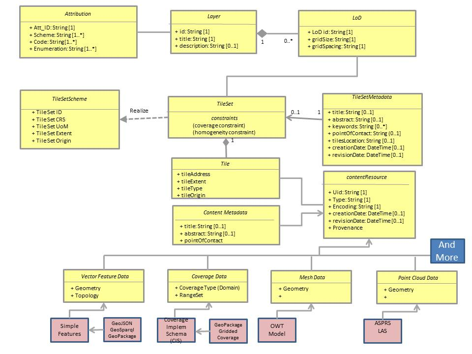
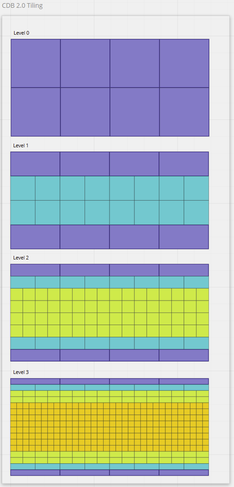
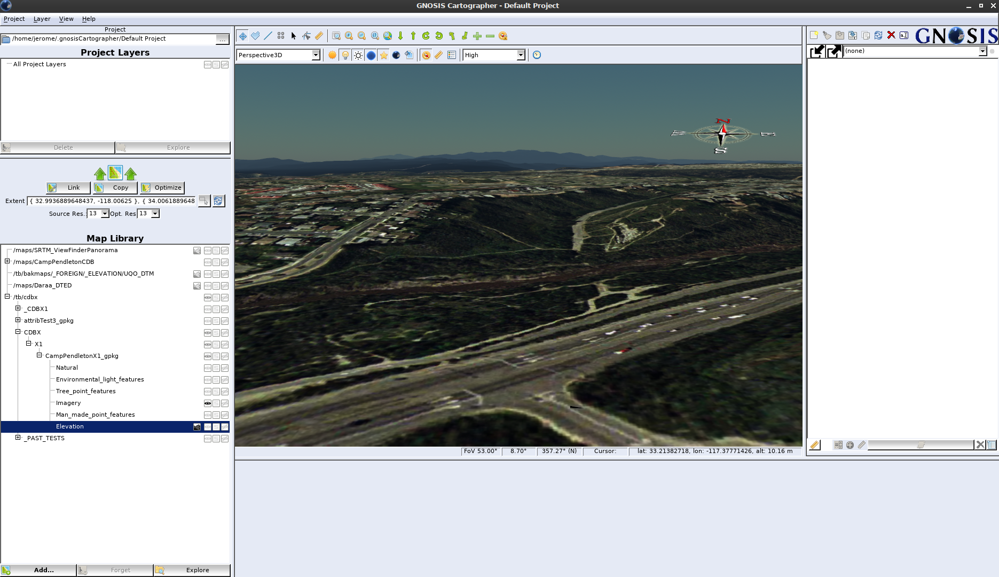
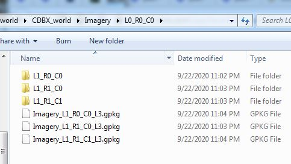
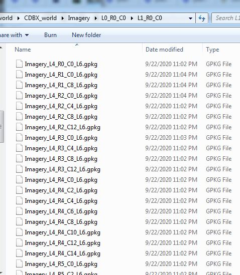

[[tiling]]
==  Tiling and Tiled Coverages


== CDB X Tiling Design Principals, Requirements, Tiled Data Conceptual Model and GeoPackage

This clause provides discussion of tiled data and GeoPackage requirements and the results of the prototyping activities.

=== General

Any tiling schemes specified in a CDB X data store (repository) SHALL be based on and consistent with the:

* https://portal.ogc.org/files/?artifact_id=92962&version=1[OGC Core Tiling Conceptual and Logical Models for 2D Euclidean Space] (19-014r3)
* https://www.ogc.org/standards/tms[OGC Two Dimensional Tile Matrix Set Standard] (17-083r2)

==== OGC Core Tiling Conceptual and Logical Models for 2D Euclidean Space

This OGC Abstract Specification consists of two Parts: A General Tiling Conceptual Model and, based on the Conceptual Model, a Logical Model for the Tessellation (Tiling) of 2D Euclidean Space. Tiling  of  2D  Euclidean  space  is  the  most  commonly  known  approach  to  partitioning  space  in traditional  geospatial  technology.  However, there are also common elements and/or semantics for any approach to partitioning space in any dimension. The logical model in this document defines a set  common  required  elements  and  then  follows  with  more  specific  requirements  for  the  two dimensional case.

Part  1  of  the  Abstract  Specification  describes  a  general  tiling  conceptual  model.  The conceptual model is applicable to any dimension.  The  conceptual model makes no assumptions regarding content, use cases, implementation scenarios, or how the space is to be tessellated (tiled).  The conceptual model is abstract and cannot be implemented as is.

Part  2  of  the Tiling  Abstract  Specification  defines  a  detailed  logical  model  for  the  tessellation  of  2D Euclidean  Space.  One  or  more  logical  models  are  required  to  provide  the  requirements  and structure  necessary  for  implementation.  Therefore, in  addition to the conceptual model, this Abstract Specification also specifies a core logical model for the 2D planar (Euclidean) use case.

==== OGC Two Dimensional Tile Matrix Set Standard

The OGC Tile Matrix Set standard defines the rules and requirements for a tile matrix set as a way to index space based on a set of regular grids defining a domain (tile matrix) for a limited list of scales in a Coordinate Reference System (CRS) as defined in [OGC 08-015r2] Abstract Specification Topic 2: Spatial Referencing by Coordinates. Each tile matrix is divided into regular tiles. In a tile matrix set, a tile can be univocally identified by a tile column a tile row and a tile matrix identifier. This document presents a data structure defining the properties of the tile matrix set in both UML diagrams and in tabular form. This document also presents a data structure to define a subset of a tile matrix set called tile matrix set limits. XML and JSON encodings are suggested both for tile matrix sets and tile matrix set limits. Finally, the document offers practical examples of tile matrix sets both for common global projections and for specific regions.

=== Design Objectives for CDB X Tiling and LoDs and Layers

The following are the key design principals for a CDB X tiling, levels of detail, and layering.

* OGC GeoPackage structured containers are a primary storage format for derived vector data layers, coverages, and other data types as identified (`TBD`). The two OGC Standards of relevance are https://portal.opengeospatial.org/files/12-128r15[OGC GeoPackage version 1.1] and http://docs.opengeospatial.org/is/17-066r1/17-066r1.html[OGC GeoPackage Extension for Tiled Gridded Coverage Data].
* Use metadata for whole datasets that describe how data layers are regrouped in GeoPackages (LOD grouping and data layer grouping)
* Provide for fewer top level tiles than in OGC CDB 1.x
* Store imagery in GeoPackage according to the tiling scheme specified below (`need anchor`)
* Store coverage data in GeoPackage according to the tiling scheme specified below (`need anchor`). Suggested coverage types based on current CDB standard and user specified requirements: (Ellipsoidal body surface): Elevation models, visual and non-visual (multi-spectral) imagery, terrain light maps (emissive at night), and raster materials (for non-visual sensors). Should be extensible to support other types.
* Coordinate Reference System is WGS 84 with epoch encoding (same as current CDB Standard except for epoch).
* Need to keep the various encodings that CDB 1.x already has:
** Elevation compression encodings (use of scaled integers vs floating point for smaller data sizes)
** Elevation grids that are adjustable (better terrain fidelity at lower LODs/zoom levels)
** Raster Material encodings using multiple coverage layers
** Imagery Compression (Imagery is typically the largest layer in CDB by disk storage)
* Must enable a "relatively" easy migration path from the CDB 1.1/1.2 tiling/LoD structure into the CDB X structure.

=== Proposed Tiling Logical Model for CDB X

The following figure, based on the Tiling Abstract Specification Logical Model and the CDB 1.x Conceptual Model, shows the properties by class (concept) and the relationships between the classes.

[#img_logical-model,reftext='{figure-caption} {counter:figure-num}']
.Logical Model for partitioning based on tiles in CDB X.


=== Proposed CDB X Tiling Structure

The proposed tiling scheme would be based on the GNOSISGlobalGrid, where the tiling starts with a 2x4 grid of tiles with each tile 90 degrees on a side that covers the whole Earth.  This is zoom level 0 (or tile matrix identifier "0").  Each experiment used a tile size of 256x256, although that could be experimented with.  At each successive zoom level, each lower level tile is split into four new tiles at the next zoom level, except for any tile that touches either the North or South Pole is not split in the longitude direction.  This subdivision can continue until the zoom level is high enough to accommodate the highest resolution data that is to be stored within the CDB X.


References for the GNOSISGlobalGrid tiling scheme:
* The 2D TMS JSON description: http://schemas.opengis.net/tms/1.0/json/examples/GNOSISGlobalGrid.json
* Testbed 13 - Vector Tiles ER: http://docs.opengeospatial.org/per/17-041.html#_global_gnosis_tiling_scheme_adapted_to_polar_regions
* OGC Standard Tracker - Global WGS84 tiling scheme adapted to polar regions (quad tree except for always having 4 tiles at the poles): http://ogc.standardstracker.org/show_request.cgi?id=520
* OGC Ideas Repository - Global tiling grid approximating equal-area while maintaining a simple latitude/longitude aligned rectangular tile layout (not quite a DGGS) https://github.com/opengeospatial/ideas/issues/59
* Vector Tiles Pilot - Phase 2 Summary ER: https://docs.ogc.org/per/19-088r2.html


[#img_logical-model,reftext='{figure-caption} {counter:figure-num}']
.Proposed Tiling Scheme for CDB X.


==== Tiling Changes From OGC CDB 1.x

Benefits from changing to the proposed tiling scheme:

* OGC CDB 1.x has 41,220 top level tiles, which requires opening huge numbers of files to show the Earth at world scales.  The proposed CDB X tiling would use 8 tiles to cover the Earth at the coarsest level of detail.
* The concept of "zones" in OGC CDB 1.x are still present in the tiling scheme, but algorithmically derived rather than at fixed latitudes.  New zones are introduced at higher levels of detail, keeping the tiles near the poles closer to an ideal square shape than in OGC CDB 1.x
* The ratio of the longitude size of tiles is always a 2:1 (or the inverse 1:2) ratio, where OGC CDB 1.x has several ratios that must be supported, such as 2:1, 3:2 and 4:3

Drawbacks from changing to the proposed tiling scheme include the following.  These issues might require some level of incompatibility or rework for existing CDB applications.

* The new tiling scheme is incompatible with OGC CDB 1.x, as there is no alignment between the tile areas and the LOD or zoom levels.  To convert data between these two tiling schemes would require merging and splitting of raster data tiles, while changing their resolution, and would require reprocessing all the coverage data (like imagery).
* Some CDB applications might have more trouble with tiles that are not based on integer latitude and longitude boundaries.
* Some CDB applications might have an issue with a format where there are not a fixed number of "zones" (using the OGC CDB 1.x term) or different grid cell sizes used.  This is because the GNOSIS grid introduces a new "zone" closer to the poles at each successive zoom level to help preserve a grid cell that is closer to an ideal square real world size.
* Tile Matrix Set naming (numbering) is different that OGC CDB 1.x, with the numbering starting from the top left corner of a set of tiles in CDB X vs starting from the bottom left corner of a set of tiles in OGC CDB 1.x.

=== Proposed CDB X Data Container

The coverage tiles would be stored using GeoPackage containers.  The GeoPackage Tiled Gridded Coverage extension would be ideal for storing tiled coverage data, but it has some drawbacks that would need to be addressed.  Current limitations include:

* Only single channel data is allowed in the coverage extension.  Many CDB coverages use more than one channel (Imagery, Raster Materials, etc.).  The alternative would be to store CDB X coverage data using different GeoPackage concepts, such as tiles for imagery, coverages for elevation, and related tables for raster material data.
** Current change request:  http://ogc.standardstracker.org/show_request.cgi?id=662
* GeoTiff data only supports using 32-bit floating point data.  In OGC CDB 1.x, GeoTiff files are used to store 8 bit unsigned and 8, 16, or 32 bit signed binary data as well.  And the proposed OGC CDB 1.2 will also adopt the use of binary 1-bit data elements as well.
** Current change request:  http://ogc.standardstracker.org/show_request.cgi?id=661
* The engineering tests created in this effort made use of a proposed Tile Matrix Set extension that has not been adopted as an OGC GeoPackage extension.
** Current GPKG TMS draft: https://gitlab.com/imagemattersllc/ogc-vtp2/-/tree/master/extensions[GPKG TMS Extension (Draft)]

=== Proposed CDB X Coverage Grouping

There are two proposed ways to group data within a series of GeoPackage containers.  Within these choices is a tradeoff between the format simplicity of working with a single container, and access latency due to larger file and table sizes.

1. For edge users and smaller areas, we would recommend that all the CDB X coverage layers be present within a single GeoPackage container.  This approach could be an export from a larger CDB X dataset, where only the resolutions and the boundaries of the data needed are stored and delivered to an end user.
1. For Modeling and Simulation uses, as well as data repository cases, we recommend that a series of GeoPackage containers be used to store CDB X coverage layers.  This involves storing a region of the world at a set of zoom levels, or levels of detail, within a single GeoPackage, with a specified file and directory naming scheme.  This approach would allow for faster access to data at specified areas and zoom levels.  It would also lend itself to concurrent access and editing for data repository maintainers.
** We propose that a configurable grouping value be used to specify how many zoom levels or levels of detail are put into a single GeoPackage.  This would be a tradeoff between the number of GeoPackages created and the file and table sizes within each GeoPackage.
** An initial grouping of 6 levels of coverage data in a single GeoPackage seems to be a reasonable number to use, but has not been extensively tested with.
** The proposed naming of each GeoPackage file is based on the layer name and the coarsest, lowest level tile included within the grouping inside the GeoPackage.  That tile's level, row (from the top) and column within the tile matrix set make up the filename, along with the level of the finest or highest level tile that can be placed into this GeoPackage.  For example:  **Coverages_L4_R16_C12_L6.gpkg**
** The proposed directory naming creates a directory tree to limits the number of GeoPackage files that could exist within a single directory.  Each GeoPackage will exist within a set of directory names that represents each coarser or lower zoom level GeoPackage that encompases the smaller higher resolution area.  For example:  The file, **Coverages_L4_R16_C12_L6.gpkg**, will exist in the directory named **Coverages\L0_R1_C0\L1_R2_C1**
*** The file and directory naming needs to be easy to compute algorithmically or exist within a catalog, without having to search a data repository to discover arbitrarily named files.

=== Backwards Compatibility with OGC CDB 1.x

It is possible to keep the new GeoPackage container and level of detail groupings, and use the older OGC CDB 1.x tiling scheme with the creation of a Tile Matrix Set that is compatible with the existing CDB tile schema.  So the use of GeoPackage containers and coverage grouping could be used in a future version of CDB 1.x, although the new tiling scheme would not be backwards compatible.  At this time, we do not recommend supporting more than one tiling scheme, as this choice is foundational to how data layers are processed and stored.


Sample GeoPackage using TMS / GNOSISGlobalGrid for both elevation & vector data tiles: https://portal.ogc.org/files/?artifact_id=92565

=== Additional CDB X Recommendations

The following are recommendations and suggested additional discussion topics. These recommendations and discussion topics resulted from the Tiling sub-groups discussion on an enhanced tiling model for CDB X and the potential impacts on the various data types (layers) in the current CDB standard and existing CDB data stores.

==== Elevation min/max

CDB X needs to continue supporting the Min/Max Elevation component concept. In order to reduce the number of files and complexity, the recommendation is to move the minimum and maximum elevation values for the gridded coverage contained in a tile to the tile metadata. Note: The MinElevation and MaxElevation components are part of the MinMaxElevation dataset whose purpose is to provide a CDB conformant data store with the necessary data and structure to achieve a high level of determinism in computing line-of-sight intersections with the terrain.  The values of each component are with respect to WGS-84 reference ellipsoid.  

==== Image Compression - JPEG

Recommendation: That loss-less image compression solutions be explored for use in CDB X. Any such solutions are not viewed as a replacement for JPEG 2000 but instead as alternatives. This could be accomplished by submitting a change request for the OGC GeoPackage standard that provides guidance and requirements for support of other image formats beyond PNG and JPG. The sub-group identified a potential candidate: https://flif.info/[FLIF - Free Lossless Image Format].NOTE: JPEG-2000 has very high compression, even in lossless mode, and there are multiple open-source implementations. However, performance can be extremely slow and non-optimal for all use cases. 

==== Materials

Recommendation: CDB X needs to support material data to provide the same functionality as CDB 1.x. To also reduce the number of files, this can be accomplished by putting all the raster material data (including material table) in a single CDB data layer in GeoPackage, perhaps using the related tables extension. The subgroup did have some discussion on what "materials" means in the CDB 1.x context. Materials in current CDB have to do with reflectance in wavelengths other than what the human eye senses. These are for non-visualization use cases or special visualization such as IR. The subgroup did also discuss for the possible need for CDB X to provide guidance on using Physically-Based Rendering (PBR) to support the visualization/rendering use case. glTF, I3S, and 3D Tiles all support PBR.

=== Findings from experiments

The following graph compares the CDB 1.x zones with the Gnosis grid and shows how the GNOSIS algorithm helps to keep the typical tile closer to a “square” than CDB’s zones.

[#img_logical-model,reftext='{figure-caption} {counter:figure-num}']
.CDB 1.x to GNOSIS Comparison - Ratio.
image::images/image2020-9-4_10-41-0.png[width=600,align="center"]


=== CDB X Tiling/GeoPackage Experiment #1 (Ecere)

==== Data and GeoPackage Structure

A 1.4 GB GeoPackage of the Camp Pendleton sample CDB from Presagis (originally used in OGC Testbed 13), along with an accompanying `cdb.json` can be found at:

http://maps.ecere.com/CDBX/X1/

In the first Excere experiment, the camp Pendleton data was stored in a single GeoPackage using the  "null grouping" mode, i.e. everything stored in a single GeoPackage. Potentially even the cdb.json could be included inside as metadata (using the GeoPackage metadata extension) to make this GeoPackage very portable.

Inside the GeoPackage, all layers were tiled using the Ecere https://maps.ecere.com/ogcapi/tileMatrixSets/GNOSISGlobalGrid[GNOSIS Global Grid]. This approach was implemented for the experiment using the proposed (and early draft) https://gitlab.com/imagemattersllc/ogc-vtp2/-/blob/master/extensions/14-tile-matrix-set.adoc[GeoPackage Two Dimensional Tile matrix Set (TMS) extension]. This extension was defined and initially tested in the https://www.ogc.org/projects/initiatives/vtp2[2019 OGC Vector Tiles Pilot Phase 2].

The content includes imagery data, stored as JPEGs, and terrain data stored as GeoTIFFs. This was accomplished using an imlpementation of the http://docs.opengeospatial.org/is/17-066r1/17-066r1.html[OGC GeoPackage Tiled Gridded Coverage Extension].

The content also included the Natural and Environmental light features vector layers. For this experiment, this content was stored  using Mapbox Vector Tiles. This included points intended to reference 3D models such as "Man-made point features" and "Tree point features".

The early draft GeoPackage Tiled Vector Data (vector tiles) extensions were used for this:

. https://gitlab.com/imagemattersllc/ogc-vtp2/-/blob/master/extensions/4-vtae.adoc[GeoPackage Tiled Vector Data Attributes Extension] This extension defines a relationship between features contained in a tiled layer and tiles containing those features.
. https://gitlab.com/imagemattersllc/ogc-vtp2/-/blob/master/extensions/1-vte.adoc[GeoPackage Tiled Vector Data] The GeoPackage Tiled Vector Data extension defines the rules and requirements for encoding tiled feature data (aka "vector tiles") into a GeoPackage data store.
. https://gitlab.com/imagemattersllc/ogc-vtp2/-/blob/master/extensions/2-mvte.adoc[MapBox Vector Tiles extension] The GeoPackage Mapbox Vector Tiles extension defines the rules and requirements for encoding vector tiles in a GeoPackage data store as Mapbox Vector Tiles.

NOTE: Ecere is planning to add the 3D models in the next experiments -- for geo-specific, both one glTF for a whole tile, as well as individual models to be referenced by the points.

For the case of points referencing the 3D models (best suited for geo-typical), those glTF files would be stored in a single 3D models table, as well as a textures table (if the models share rather than embed textures). The related table extension would be used to relate the features attributes.

For the geo-specific / one glTF for the whole tile, the glTF could potentially be stored in a tiles table instead, and the models constituting the payload (much like raster or vector tiles).

==== OGC API access demo

At this address: https://maps.ecere.com/ogcapi/collections/CDBX:X1:CampPendletonX1.gpkg

You can directly access this CDB X Experiment #1 GeoPackage through our GNOSIS Map Server, including rendering maps, downloading coverages, accessing as tiles in different tiling schemes, accessing individual vector features, retrieving them as (re-merged) GeoJSON, visualizing them on GeoJSON.io and so on.
To some extent, this demonstrates that even though the data is tiled, this layout actually supports a wide range of use cases.

==== Visualization

Ecere software can currently visualize the CDB X/GeoPackage elevation and imagery directly in the Ecere 3D visualization tool (albeit with a few glitches at the moment at terrain tile edges).

[#img_logical-model,reftext='{figure-caption} {counter:figure-num}']
.Ecere Camp Pendleton GeoPackage in CDB X.


==== Live Cesium JS / 3D Tiles demonstation

Navigate to https://sandcastle.cesium.com/ and copy/paste the following four (4) lines of Java Script code:

```js
var worldTerrain = Cesium.createWorldTerrain({requestWaterMask: true, requestVertexNormals: true, });
var viewer = new Cesium.Viewer("cesiumContainer", { terrainProvider: worldTerrain });
var scene = viewer.scene;
var tileset = scene.primitives.add(new Cesium.Cesium3DTileset({ url: "https://maps.ecere.com/ogcapi/collections/CampPendletonCDB:Buildings/3DTiles/tileset.json" }));
```

Then click "Run", and zoom in onto Camp Pendleton. Camp Pendleton is at the height of the southern part of the northernmost of the 2 islands just west of southern California. As the image is zoomed, 3D buildings should come into view.

This tiled 3D distribution (for OGC API collection http://maps.ecere.com/ogcapi/collections/CampPendletonCDB:Buildings) is currently being generated on the fly from the Ecere GNOSIS Data Store / E3D models. NOTE: No textures have been added yet.

Once the 3D models are added to the CDBX GeoPackage, it should be possible to stream as 3D Tiles <CESIUM??> straight from the CDBX/GeoPackage as well, rather than the original CampPendleton CDB repository.

==== Next steps (this section will change as new content is provided)

- Support for splitting in multiple GeoPackages with LoD grouping
- A table for storing glTF models, for referenced 3D models (either only for geo-typical trees, or even the geo-specific buildings as well), and using Related tables extensions to relate the models table to other tables
- Single glTF models covering a whole tile for geo-specific models
- Export similar GeoPackages for San Diego CDB
- Attribution per model within the single tile model. We support this directly in E3D, and I wonder whether glTF2 supports this.
I know the main thing that a batched 3D model 3D Tile adds in addition to a glTF is a Features Table which does precisely this, so I am not sure whether glTF 2 has this capability built in (i.e. allowing to use a .glb directly rather than a .b3dm).
- Support for visualizing the dataset including 3D models in our GNOSIS Cartographer client (work required to support CDB consisting of multiple of GeoPackages as a single data source)
- Support for GNOSIS Map Server streaming 3D models from CDB X/GeoPackage

=== FlightSafety GeoPackage Tiling Experiments

*Setup*: The data used for these experiments are primarily freely available, and include the following
* Blue Marble (NASA) that was georeferenced using GDAL - https://visibleearth.nasa.gov/collection/1484/blue-marble
* The high resolution inset is from USGS downloads of Central Park in New York City

*Tiling Scheme*: The tiling scheme uses the [GNOSIS Global Grid](https://maps.ecere.com/ogcapi/tileMatrixSets/GNOSISGlobalGrid) (using TMS extension -- https://gitlab.com/imagemattersllc/ogc-vtp2/-/blob/master/extensions/14-tile-matrix-set.adoc).  We are using the same type of json file that Ecere is using in their experiment.

*LOD Grouping* The grouping is pre-set per experiment.  The groups are calculated from the highest LOD, back to coarser LODs.  For example, if there are 7 LODs (0-6) and a grouping of 4, then LODs 3 through 7 are in one GeoPackage, and LODs 0 through 2 are in another GeoPackage.

*Directory and Naming Scheme* Each top level tile is within a directory that encodes the LOD, the row (rows are counted from the top, so north to south), and the column (longitude west to east).  Fox example, "L0_R1_C2".  Each tile directory contains one GeoPackage file (for example "Imagery_L0_L2_R1_C2.gpkg") and all the tile directories that refine this area (such as "L3_R9_C22").  There were two intentions to this directory structure:

- Limit the number of files in a directory (to keep from running into OS limitations).
- Make it a bit easier to export a portion of the world by hand from one CDB X to another.

==== FlightSafety Experiment 1

===== Purpose of Experiment
This experiment was designed to: 

- Show how the top levels of the tiling scheme work, 
- Show the LOD groupings within multiple GeoPackage files, and 
- Show the proposed directory and file naming.  

There were eight top level tiles (2 rows and 4 columns) and all GeoPackages that refine one of these tiles are under that tile's directory structure.

===== Processing
This experiment uses the NASA Blue Marble imagery to approximate world-wide imagery at a high level.  This provides seven levels of detail of data (L0 to L6).  Normally, the GeoPackage files should be larger for efficient use. However to demonstrate the LOD groupings, only four LODs were grouped together.  So that tools can view the imagery more easily, the imagery is stored as JPEGs.  Originally the thought was to create Jpeg2000 files but checking the results in a tool such as "DB Browser for SQLite" was harder.  The content volume for the data used this experiment was around 300 MB.

===== Data Location
Compressed 7-zip file at:  https://drive.google.com/drive/folders/1zfdBnAHpf9McLTbaJotdKGR_tXQad4dy?usp=sharing

==== FlightSafety Experiment 2

===== Purpose of Experiment

This experiment was designed to further test the limits of the LOD grouping and directory organization.  This experiment is similar to the World CDB X Experiment 1 but with a small higher resolution inset of imagery.  Images added were 15m data at LOD level 12 covering New York City and 2 ft imagery covering Central Park on Manhattan Island at LOD level 16.

===== Processing
The same processing was used as in  Experiment 1 but with an LOD grouping of 6. During the sub-groups planning for this experiment, the hyposthesis was that was an ideal balancing size and number of sub-directories ( (2^6)^2 = 4096 maximum directories within one folder.  The maximum LOD for this experiment was 16 (60cm).  To find the highest resolution data, look at file CDBX_highres\Imagery\L0_R0_C1\L5_R17_C37\L11_R1120_C2412\Imagery_L11_L16_R1120_C2412.gpkg.  The data size for this experiment was almost 1.5 GB.

===== Data Location
Compressed 7-zip file at:  https://drive.google.com/drive/folders/1zKuu0oQy3K5oKestuPIvL-BRiSPn9oaO?usp=sharing

==== Observations from Experiments 1 and 2

* The file names and directory names are pretty hard to read and understand by looking at the files. However, since the tiles are rarely on a "geocell" boundary, a good naming scheme may not exist.
* Creating the LOD groupings based on the highest LOD of data makes it difficult to add data of a higher resolution later on.  This might also make it harder to create "Versions" of the data that have been updated.
* There were a considerable number of directories created with this tiling and naming scheme.  In general, there is a 1-to-1 ratio of files to directories.

==== FlightSafety Experiments 3 and 4

=====  Purpose of Experiment

These experiments utilized two different tiled layers: Imagery and Elevation.  The constraints for this experiment were :

* There are two different tiled layers: Imagery and Elevation.
* The data coverage was world-wide, containing 1000m resolution imagery and elevation.
* The directory structure was reworked to reduce the number of directories produced so that it was no longer a 1-to-1 file to directory ratio.  To copy over a section of the world, one would need to copy both the GeoPackage and the directory with similar names
* The GeoPackage files were renamed to be *lod_row_col_endlod*.gpkg, to keep the lod/row/column triplet together.  For example, Imagery_L4_R9_C6_L6.gpkg

=====  Updated Directory Structure

The directory structure was changed from having each GeoPackage within a directory of the same name (yielding a 1:1 ratio of files to directories) to having a finer resolution GeoPackage in a directory with the coarser tile name.  If there is even finer/higher resolution data beyond this GeoPackage, that data will be found in a directory at the same level as the GeoPackage with the tile name that matches most of the GeoPackage filename (except for the end lod value).  Pictures of the structure below:

[#img_topTilesNew,reftext='{figure-caption} {counter:figure-num}']
.Top GeoPackage Level.
image::images/topTilesNew.JPG[width=400,align="center"]

[#img_level0New,reftext='{figure-caption} {counter:figure-num}']
.Mid-level directory structure.


[#img_level4New,reftext='{figure-caption} {counter:figure-num}']
.Leaf directory structure.


===== Processing

This experiment uses the NASA Blue Marble imagery as world-wide imagery and USGS GTOPO30 elevation data.  This provides 7 levels of detail of data (L0 to L6).  Normally, the GeoPackage files should be larger for efficient use, but to show the LOD groupings, only 3 LODs are grouped together.  The imagery is stored as Jpeg, so that SQLite tools can view the imagery easier, and the elevation is stored as 32-bit floating point GeoTiff files.  The uncompressed data size for this experiment is around 3.05 GB.

For Experiment 3, the imagery and elevation layers were built into different GeoPackages and different directory structures.  For Experiment 4, the imagery and elevation were combined into a single set of GeoPackages and directories while keeping the LOD grouping.

===== Data Location

The Experiment 3 compressed 7-zip file is loacted here:  https://drive.google.com/drive/folders/1XpljPt_TrqqxsgcWaxLhi9C1qLE0nI32?usp=sharing

The Experiment 4 compressed 7-zip file is located here:  https://drive.google.com/drive/folders/1ipgsWaQmy2GWfUwnKVffJwggm6rXKcRj?usp=sharing

==== Observations for Experiments 3 and 4

* The file names and directory names are pretty hard to read and understand by looking at the files. However since the tiles are rarely on a "geocell" boundary, their might not be a good naming scheme.
* Creating the LOD groupings based on the highest LOD of data makes it difficult to add data of a higher resolution later on.  This might also make it harder to create "Versions" of the data that have been updated.
* There are a lot of directories created with this tiling and naming scheme.  In general, there is a 1-to-1 ratio of files to directories, and directories seem to be more work for an OS to create/modify/delete.
* Official GeoPackage standards are pretty rigid for raster data.  Tiles support a very limited set of raster types (PNG or JPG), and the coverage extension supports only 16-bit PNG or 32-bit float GeoTiff.  Current OGC CDB 1.1 supports data types of 8-bit unsigned, 8/16/32 bit signed, and 32-bit floating point data types, with CDB 1.2 adding the capability to support Tiff bilevel images (1-bit).
* Do we need the extra flexibility of putting different layers in different directory structures (and thus different GeoPackage files)?

