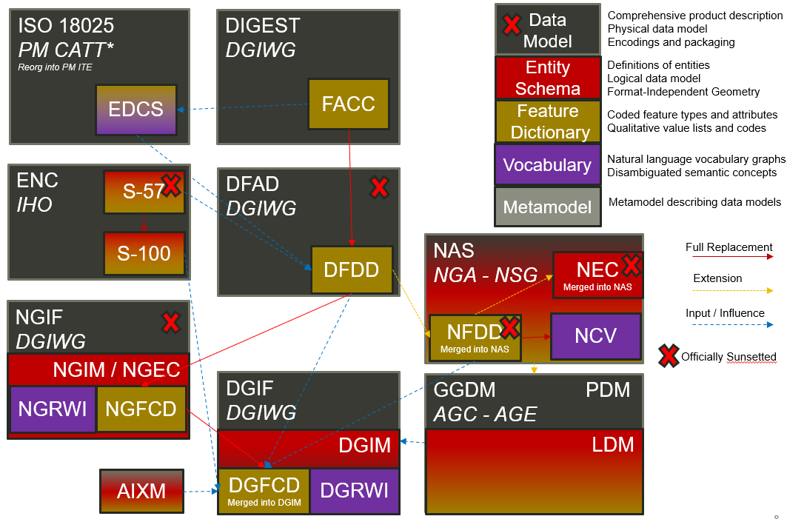
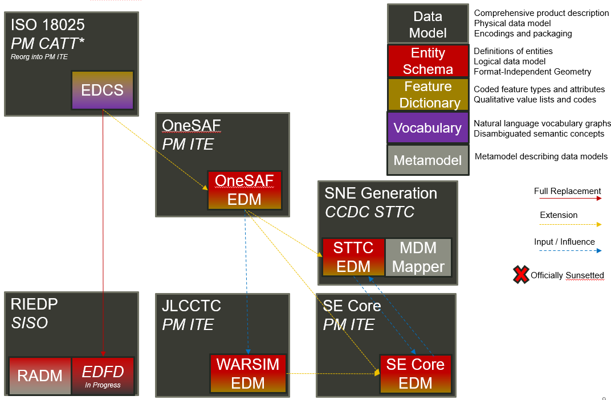
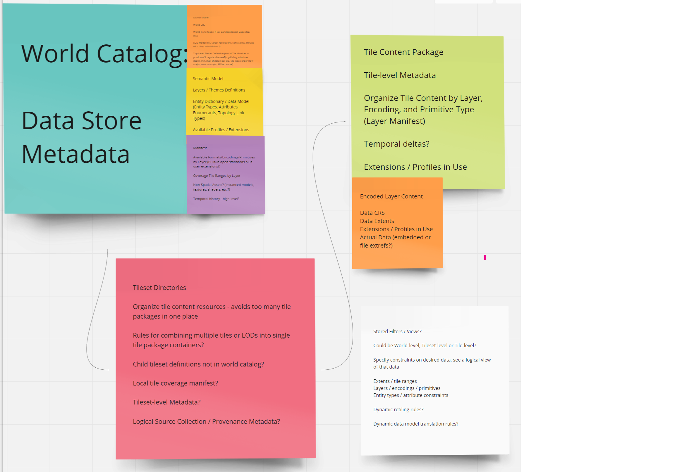
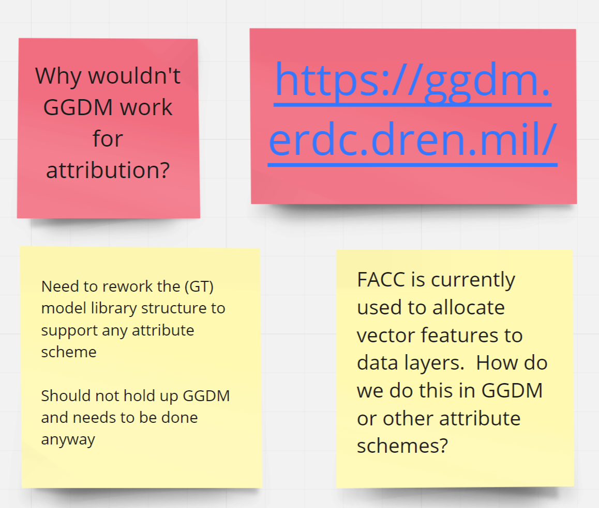
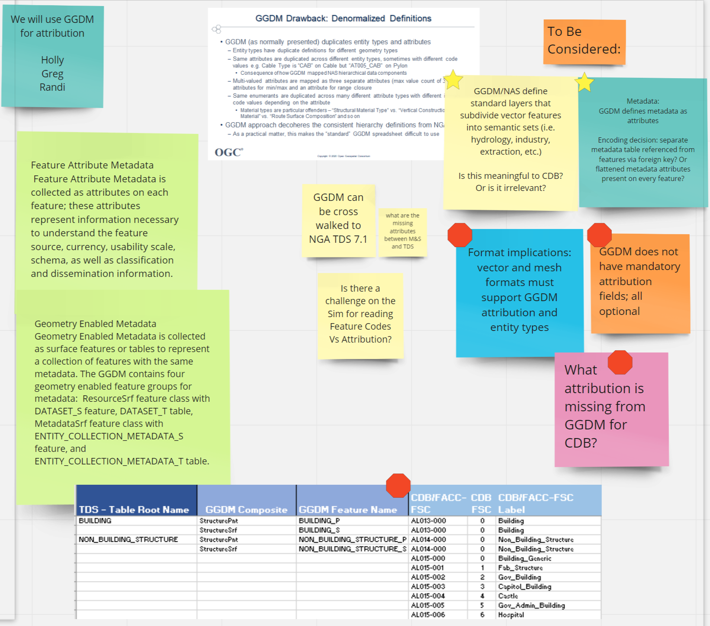
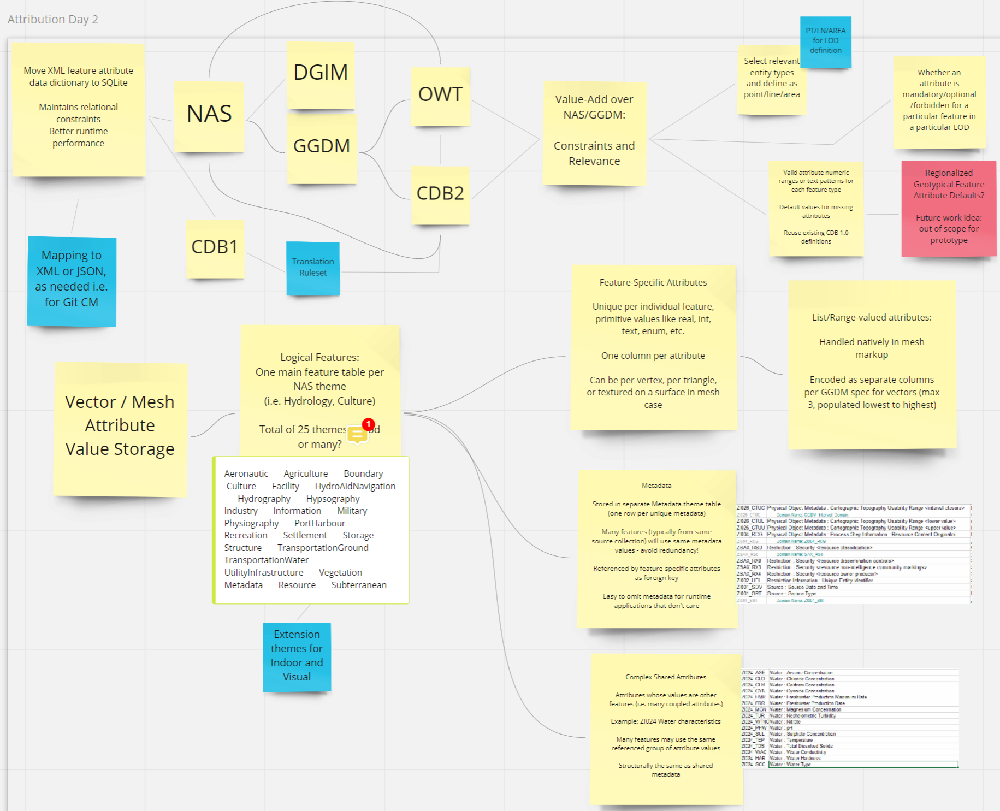
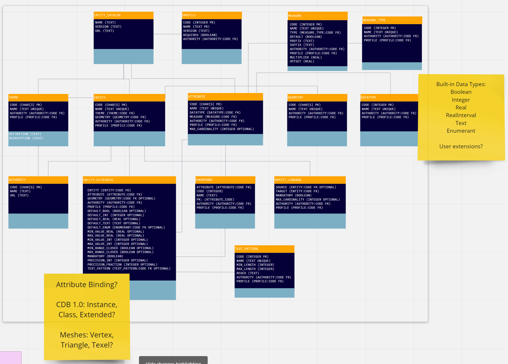

[[Attribution]]

:figure-caption: Figure ATTPh3 -
:figure-num: 0

== CDB-X Attribution

One of the strengths of CDB as an interoperability standard, beyond the underlying geospatial representation standards it deploys, is the adoption of a controlled semantic vocabulary for feature types, attributes, and values. This approach - variously called a data model, a feature dictionary, or an entity catalog - is a necessary component of semantic interoperability between simulations. The feature attribution model goes beyond specifying the physical geometry, spatial referencing, and file formats used to represent the CDB data store to ensure simulations have a consistent and correlated deep understanding of the content semantics - to ensure a road is always a road, a lake is distinct from a river, width and height always has a consistent meaning, and so on. This semantic interoperability is necessary to ensure proper operation of simulation behaviors both for supporting human players and artificial intelligence agents.

The current CDB standard for attribution is primarily based on the officially obsolete DIGEST Feature Attribute Coding Catalogue (FACC) standard and has not integrated ongoing development and standards developed by other activities since OGC CDB 1.0. For several years, there have been discussions concerning how to modify the CDB standard to support newer feature attribution coding schemes and controlled vocabularies to align with current standards and best practices. While the existing CDB standard theoretically supports representing other controlled vocabularies through modifying the CDB metadata XML (with some gaps identified in this report), at this time no changes to the CDB standard to adopt or promote other coding schemes has occured. This section provides 1.) information on the current approach in CDB 1.x, 2.) requirements for evolving the CDB standard to accommodate newer coding schems and 3.) the experimental framework and results from the work in the CDB-X activity.

=== Current CDB 1.x Attribution Approach

OGC CDB versions 1.x use a CDB Feature Data Dictionary (FDD) as the controlled vocabulary for attribution.  An Excel spreadsheet version of the CDB 1.X Feature Data Dictionary is available on the public https://external.ogc.org/twiki_public/pub/CDBswg/WebHome/CDB_FDD.xlsx[CDB wiki].

The CDB 1.x feature codes and subcodes are primarily based on the  https://www.dgiwg.org/DIGEST[DIGEST Feature and Attribute Coding Catalog 2.1] (FACC) with additional concepts from a few other sources notably https://standards.sedris.org/18025[ISO 18025 EDCS].  From that website: _FACC) specifies geospatial information concepts used by member nations of the multi-national Defence Geospatial Information Working Group (DGIWG) community. These concepts characterize aspects of real-world entities (or objects) and related properties, including those that are not necessarily visible or have a tangible physical form (e.g., airspace). The DGIWG FACC is a comprehensive dictionary and coding scheme for feature types, feature attributes (properties or characteristics associated with features), and attribute values (domain of feature attributes)._

[The abbreviations and acronyms are defined and/or expanded in the OGC CDB 1.x Standards and Best Practices documents]

In the FACC, each major feature category is further divided into subcategories identified by the second character of the five-character code containing an alphabetic value from "A" to "Z". Finally, the third, fourth, and fifth characters of the five-character feature code are a numeric value from 000 to 999. This value provides unique feature type identification within categories. Thus, all features must be identified by all five alphanumeric characters; e.g., the feature named "Building" is denoted by the code "AL015". Feature codes are listed in Annex A of the FACC Data Dictionary.

Each feature is associated with a textual description, which provides a human readable dictionary definition for the feature. Each Feature Code is also associated with a short human readable name. 

|===
|*Code*	|*Name*	|*Definition* 
|AA010 	|Mine 	|An excavation made in the earth for the purpose of extracting natural deposits. (See also AQ090)
|BB150 	|Landing Place 	|A place on shore where landing from the sea is possible.
|DB180 	|Volcano 	|A mountain or hill, often conical, formed around a vent in the earth's crust through which molten rock, ash, or gases are or have been expelled.
|FA001 	|Administrative Area 	|An area controlled by administrative authority.
|GB075 	|Taxiway 	|A prepared surface providing access to/from runways and the aircraft parking area, terminal area, or service area, etc.
|===

An OGC http://ogc.standardstracker.org/show_request.cgi?id=544[Change Request Proposal] (CRP) related to CDB attribution was generated during OGC Testbed 13:

`NOTE: An overview of the Testbed 13 activity is provided in the <<attrtestbed13, Background Section>> section of this ER.`

=== Ongoing Standards Development

DIGEST FACC, which was originally developed by the Defence Geospatial Intelligence Working Group (DGIWG) in June of 1991 based off of earlier standards, was most recently updated to the widely used 2.1 version in September of 2000. FACC was officially sunsetted (retired) by DGIWG on October 17, 2012 (see http://portal.dgiwg.org/files/7827[disposition here]) and by the NSG on December 31, 2012 (see https://gwg.nga.mil/documents/asfe/DGIWG_FACC.htm[disposition here]) after a long deprecation period. FACC was replaced by successor standards DGIWG Feature Data Dictionary (DFDD) and associated extension US National System for Geospatial Intelligence (NSG) National Feature Data Dictionary (NFDD). These successor standards were a largely compatible superset of the FACC codes and definitions that did not make any fundamental architecture changes. As a consequence, many commercial and government tools and standards - including CDB 1.0 - continued with FACC 2.1 despite it being officially retired.

The successor standards did bring in additional definitions loosely inspired by https://standards.sedris.org/18025/[ISO/IEC 18025:2005 EDCS] and maritime definitions from  https://iho.int/uploads/user/pubs/standards/s-57/31Main.pdf[IHO ENC S-57]. The NFDD standard eventually was reformulated into the https://nsgreg.nga.mil/voc/registers.jsp?register=NCV[NSG Core Vocabulary (NCV)] and https://nsgreg.nga.mil/doc/view?i=5042[NSG Application Schema (NAS)] which recast the existing standards in terms of logical data models expressed using the Unified Modeling Language (UML) in compliance with the https://www.iso.org/obp/ui/#iso:std:iso:19109:ed-2:v1:en[ISO 19109:2015 Geographic Information Rules for Application Schemas] and the semantic https://www.w3.org/OWL[Web Ontology Language (OWL)] vocabulary; both the DFDD and NFDD have been retired as well. 

The current NAS specification also introduced substantial vocabulary changes describing the metamodel itself. The most substantial change is that the term "feature" was generalized into the more abstract term "entity" to accommodate vehicles, lifeforms, devices, and abstract ideas like metadata and statistics. The term "enumeration" is still in use to describe a controlled vocabulary of attribute values, but the alternate term "codelist" is also used and the actual values themselves are generally referred to as "listed values." The NAS also introduced a new conceptual model for relating different entities through "associations" - such associations themselves are also entities that mediate complex relationships between entities.

The US Army Geospatial Center codified the https://nsgreg.nga.mil/doc/view?i=3029[NAS 7.0] reformulation of NFDD into a practical subset targeted at the mission of outdoor environments for the ground warfighter, with encoding standards accommodating limitations of Shapefiles and SQL databases in implementing the general NAS model: this particular application schema became the https://ggdm.erdc.dren.mil/pages/contents/v3.0.html[Ground-Warfighter Geospatial Data Model (GGDM)]. Through a set of various NATO initiatives, the parallel DFDD eventually became the https://www.dgiwg.org/dgiwg-standards/205[Defence Geospatial Information Model (DGIM)] that also aligned with the NAS 7.0 and considerably overlapped with and took inspiration from GGDM 3.0, albeit with more divergence. The DGIM extended the NAS with some additional definitions from ongoing data model development for the maritime https://iho.int/en/s-100-universal-hydrographic-data-model[IHO ENC S-100 Universal Hydrographic Data Model] and the https://www.aixm.aero[Aeronautical Information Exchange Model (AIXM)] which may be of substantial relevance to CDB for addressing any gaps found in the NAS.

Concurrently, NSG has published an official https://nsgreg.nga.mil/doc/view?i=3031[NAS 8.0] update - the current officially mandated standard - and follow-up quarterly updates to address errata, add extensions, and reformulate documentation. The most recent update at the time of writing is the https://nsgreg.nga.mil/doc/view?i=5042[NAS X-3] published on June 30, 2020. These updates introduced substantive changes to move away from legacy representations, separated out the traditional FACC 5-letter feature codes and 3-letter attribute codes into a separate "Platform Specific Model" document, separated out view assignments to a separate document, and added definitions for OGC GML concepts. However, the core of NAS today is still recognizably derived from its distant FACC ancestor and still has substantial overlap with it.

A full diagram of the lineage of various geographic information standards is presented here as developed by Geometric Progress LLC for the STE One World Terrain Data Model Working Group.

==== Data Model Lineage - DIGEST FACC Branch

==== Data Model Lineage - ISO 18025 Branch

Directly relevant to this experiment is the adoption of NAS compliance as a design goal and the selection of GGDM 3.0 as the starting point to meet that goal for the US Army Synthetic Training Environment (STE) One World Terrain (OWT) data model in October 2019. The STE Cross-Function Team saw substantial benefits to moving toward NAS by using GGDM after verifying that the GGDM link:++Experiments/Attribution/SE Core to GGDM Gaps.xlsx++[met over 90% of current requirements for the existing SE Core use cases] for the Army behaviors that were currently met by the existing SE Core Environment Data Model based on https://standards.sedris.org/18025[ISO 18025], although substantial gaps for future use cases were identified that were relevant to this experiment. NAS compliance and GGDM interoperability will align the STE simulation and training semantics with existing use cases for geospatial intelligence and operational use, directly relevant to the Army's goal of "train as you fight." However, unlike the Army Geospatial Center use case for Shapefiles and GeoPackage SQLite tables for point, linear, and polygon features, the OWT use case primarily intends to deploy GGDM attribution attached to 3D content such as triangle mesh models at the mesh level, the vertex level, the triangle level, and applied to model surfaces via raster coverage texturing. The OWT 3D model approach is also relevant to notional glTF mesh layers and geotypical and geospecific models explored in other sections of this Engineering Report. There are similar efforts in NGA - notably the FG3D effort - that are also working toward the integration of 3D content with semantic standards.

=== CDB-X Discussion and Requirements for CDB-X Experimentation

==== Experimentation Background

Migrating the CDB attribution to NAS compliance using GGDM at the initial set of definitions was an early improvement identified for CDB X based on input from current CDB stakeholders over a number of OGC CDB SWG meetings, particularly given that STE One World Terrain was identified as being a desirable interoperability target. Greg Peele, one of the Tech Sprint participants, has described his work as a sub-contractor on the team recommending a Data Model for the U.S. Army One World Terrain (OWT) effort in multiple presentations to the OGC Interopable Simulation and Gaming Domain Working Group.  Greg's most recent - though out of date relative to OWT development and this experiment - OGC presentation entitled *"Entities, Attributes, and Enumerants, Oh My!  Applying GGDM for Interoperable One World Terrain Semantics"* to the ISG DWG may be found here:
https://portal.ogc.org/files/?artifact_id=93666

The GGDM itself is, in practice, a selection of 624 feature types from the NAS 7.0 (with some duplicates for different geometry representation) to meet the mission requirement of outdoor environment representation for the ground warfighter, with a set of associated attribution for each feature type. For attributes with a controlled set of values - also known as enumerants or codelists - the set of values is either explicitly enumerated with integer codes or externally referenced via a separate dictionary of text strings. In principle every GGDM feature type should match up to an NAS 7.0 logical entity, every GGDM attribute should match up to an NAS 7.0 attribute, and every GGDM enumerant should match up to an NAS 7.0 listed value; all of these should then match vocabulary terms defined in the NCV 2.0. In practice, GGDM did augment the NAS with a small number of additional definitions integrated from the NGA Topographic Data Store (TDS) and the US Environmental Protection Agency Water Resource Database (WRDB). 

GGDM adapted the more abstract NAS entity types by binding them to specific geometric representations: Point, Curve (Linear / Line String), Surface (Polygon), and Table (abstract / no geometry). Each such geometric binding shared the same 5-letter FACC-like code as specified by the NAS Platform Specific Model (available a separate file in more recent NAS versions) but suffixed the feature name with an appropriate character 'P', 'C', 'S', or 'T'. The attribute definitions were bound to entity types per entity geometry, so in cases where more than one geometry applied to the same entity type, a particular may be present on one but not the other or on both depending on the specification. In the vast majority of cases GGDM only defined one geometry type per entity type however. The GGDM developers did clarify that an implementation that did not split out entity types by geometry but used some other mechanism to constrain attribute presence and dataset organization by geometry type to align with GGDM requirements would still be considered compliant with GGDM since in both cases the results comply with the NAS logical data model.

GGDM also organized entity types into a "feature index" that specified broader themes or layers such as Hydrography; these themes were also specific to each geometry type. The feature index also defined five levels of detail: Global, Regional, Local, Specialized, and Composite. Each entity type was cross-referenced to specify in which themes the entity belonged to at each level of detail, or to mark that a feature was not represented at a particular of level of detail. This approach to feature organization substantially diverged from the base NAS standard, which instead defined a set of "view groups" (more abstract) and "views" (more specific) to create a two-level hierarchy of entity type organization but did not define any levels of detail. The GGDM feature index themes appear to be related to an older version of the NAS "view groups" but the two are curretly out of sync. Unlike in GGDM, NAS views are non-exclusive so an entity type may belong to more than one view, although one view is typically marked as the primary view for that entity type. In more recent revisions of the NAS such as NAS X-3, the entity to view assignments are available as a separate document from the main content definitions.

One substantial innovation of NAS and GGDM over earlier standards is moving from a flat table-based feature dictionary to a full logical data model compliant with ISO 19109 which allows for multi-valued attributes, range-valued attributes, complex attributes with named sub-fields, and relationships between features. The NAS logical data model expresses these innovations in pure UML without implementation guidance, while the GGDM defines an encoding to represent them in traditional table-based systems.

For multi-valued attributes, GGDM defines a separate attribute code for each value, with the second value and so on suffixing the attribute code with an ordinal index - e.g. for FFN "Feature Function", the first value would be FFN, the second value would be FFN2, the third value would be FFN3, and so on. GGDM sets a max cardinality of 3, but there is no technical reason why more values could not be used in other applications.

For range-valued attributes, GGDM splits them into three attribute values of upper, lower, and interval closure (an enumeration describing whether the lower and upper values are considered part of the range) - for example for WDA "Average Water Depth" you would have WDAL "Average Water Depth <lower bound>", WDAU "Average Water Depth <upper bound>", and WDAC "Average Water Depth <interval closure>" as three separate attributes. This is a replacement for the clumsy approach in DIGEST FACC that used enumerations of a predetermined set of ranges for these attributes instead of explicitly specifying the range numerically.

Finally, for complex aggregate attributes and feature relationships, GGDM defines a scheme to take the logical value relationship as a hierarchy and flatten it into prefixed attributes that combine the datatype or feature type with the target attribute code; GGDM defines this flattening such that no attribute code exceeds 10 characters however so some particularly complex attributes have the prefixed names truncated. An example of a complex aggregate attribute is RIN_RTN "Route Identification <route designation>" - the NAS UML defines Route Identification as a separate class with a Route Designation attribute. An example of a feature relationship expressed as an attribute is ZI006_MEM "Note : Memorandum" which is a reference to a feature of type Note with an attribute value of Memorandum. In some cases the related features are fully embedded in the source feature and thus duplicated for every feature; in others the related feature is referenced by a foreign key using the UFI "Unique Entity Identifer" attribute.

Each of these three cases can also be combined with each other - for example, a multi-valued or range-valued attribute on a related feature, or a chain of multiple aggregated or related features - although doing so tends to quickly hit the 10 character truncation limit for the attribute code. While currently used for Shapefiles and GeoPackage implemetnations, this particular encoding scheme for complex attributes is not strictly necessary to claim GGDM conformance; directly representing multi-valued, range-valued, and complex attributes natively by some other mechanism such as JSON, binary markup, or separate SQL tables would still be considered compliant with the GGDM logical data model and the NAS so long as the attribute semantics remains the same. Also, using the label or natural language name for entities, attributes, and enumerations instead of the FACC-like codes the actual attribute storage would still be considered compliant with GGDM and NAS - this is a physical encoding implementation choice.

Given the historical lineage of the NAS and GGDM, there is a substantial overlap between GGDM and the CDB 1.x Feature Data Dictionary. However, neither standard is a strict superset of the other. NAS and GGDM have changed existing definitions inherited from FACC as well as adding many new definitions. CDB has made substantive changes to add a new concept of "Feature Subcode" that did not exist in prior standards, bring in a different se of definitions from ISO 18025, and add new definitions for aeronautics and building interior components. STE One World Terrain, in particular, had identified gaps in the GGDM standard for building interiors, aeronautics, vegetation, and materials which are all current CDB use cases, so the existing CDB extensions over FACC may end up being complementary to GGDM rather than redundant and may correlate with ongoing standards development in other domains.

==== Experimentation Goals

Given the strong consensus that adopting NAS using the GGDM as a starting point represents the best path forward for CDB X, we planned an experiment to validate this hypothesis and determine what gaps and difficulties this change would introduce, with a particular focus on any changes in CDB storage structure would be implied by moving to GGDM. During the initial Phase 3 of the CDB X Tech Sprint, we created an initial metamodel describing the proposed schema for representing the target GGDM data model and a notional SQLite metadata encoding to store it in a more runtime-efficient way than the current CDB 1.x XML metadata.

The first planned experiment was to create a prototype software code library representing the proposed CBD X feature dictionary metamodel. This prototype would define runtime classes for each of the metamodel concepts and implement a proof of concept reader that could load both the existing CDB 1.x XML feature and attribute dictionary metadata as well as loading the GGDM 3.0 entity catalog as conventionally formatted in an Excel spreadhseet. The prototype would then finally implement proof of concept support for storing the dictionary content in the proposed SQLite metadata encoding, with a stretch goal of also implementing sample XML and JSON encodings for comparison. The primary goal of the first experiment was not necessarily to fully implement all of the capabilities, but rather use the prototype to identify and document any deficiences or mismatches in the proposed CDB X feature dictionary metamodel - ideally with proposed corrections - that would interfere with migrating existing CDB 1.x feature data or representing the proposed NAS-compliant dictionary.

Since CDB 1.x and GGDM have essentially compatible semantics of what an entity (feature) type is, the next phase of the experiment was to assess data model mappings between GGDM, TDS, and CDB to determine how cleanly the existing CDB feature types translate to GGDM feature types and identify any substantial gaps in GGDM as well as mappings that lose precision or involve additional complexity. We are particularly interested in identifying how much of the mapping preserves the existing CDB feature code, feature label, or ideally both. We also planned to use the gaps identified to suggest a mitigation strategy for filling those gaps either using existing CDB 1.x definitions or from other open standards and to examine similar efforts conducted by SE Core and STE One World Terrain. While initial assessments suggested that attribution and enumerant values would likely map mostly directly due to both CDB and GGDM largely pulling from the same FACC ancestry, we also planned to document any mismatches we found regarding attribute values. We planned to review GGDM and NAS entity types and attribution for describing feature-level metadata to propose a possible mechanism to implement that in CDB X. Ideally, as a stretch goal, we planned to adapt the prototype software library developed for the first experiment to use name and code matching to generate an automated mapping to compare with the manual assessment; however, we were unable to meet that stretch goal.

The third "experiment" is more of a thought experiment to coordinate with the tiling, vector features, and 3D model breakout groups to identify what changes to the feature dictionary and data model will imply on changes to structure and content of the CDB datasets - particularly vector and 3D model datasets. This will identify the key areas of standards development for attribution outside of the feature dictionary metadata itself. It may also inspire changes to the CDB dataset structure and content to better align with the target GGDM data model.

=== CDB X Experiment Findings

The three experiments conducted successfully generated a number of findings initially captured as Github tickets. The prototype code library for the feature attribute metamodel was partially implemented to a sufficient degree to identify the mismatches with both the CDB 1.0 feature dictionary and the target GGDM 3.0 data dictionary and provide partial implementation for both the core SQLite encoding and the stretch goal XML encoding, but not the JSON encoding. These results generated substantial interest among the STE One World Terrain stakeholders to sponsor the completion of the prototype code library targeted at the One World Terrain data model use case. The breakout group reviewed and assessed a number of mappings and reports between GGDM, TDS, and CDB 1.x to capture the major mismatches and findings. However, we did not achieve the stretch goal of using the code library to generate automated mappings for comparison so that experiment remains as future work; we believe this may be a useful technique for approaching the mapping to NAS X-3 and DGIM that we propose as a recommendation. Finally, after substantial discussion on Slack and via Github, we identified the relatively few areas where changing the GGDM data model had a substantive impact on the CDB dataset storage.

==== Entity Metamodel Comparison

The CDB 1.x entity metamodel is overall similar but less complex than the GGDM and NAS entity metamodel; this is to be expected since all of these standards derived from the same FACC metamodel but the NAS and GGDM have undergone substantial development since then to align with current data model practice. NAS and GGDM renamed the "feature" concept to the more general form "entity" to accomodate phenomena that were not traditionally considered features like devices, lifeforms, vehicles, and abstract ideas. However, the basic notion of an entity being a particular phenomenon with a unique identity in the simulated or real world that is described by attributes with particular values is still the same. NAS and NCV explicitly define a semantic ontology hierarchy of entity type subclassing that refines very general and abstract entities into specific entity types, which can be very useful for semantic understanding of complex datasets. This hierarchy is implicit and assumed in GGDM as an application of the NAS rather than explicitly stated. It does not exist at all in CDB 1.x modulo being implicit for a few items brought in from external standards for building interiors and explicitly via the generalizations (more in terms of aggregation than subclassing) specified by the category/subcategory organization of entity types and by feature subcodes.

Both the CDB 1.x and the GGDM represent entity types using a 5-letter code mostly inherited from FACC, although NAS and GGDM have modified some existing codes and both have added new ones. CDB 1.x specifies entities purely semantically and then specifies a recommended geometry type and data set for each entity type, as well as relying on the semantics of the first two letters of the FACC-like 5 letter code to organize entity types into a two-level category hierarchy for 3D model storage. NAS specifies entities purely semantically; entities that do have a physical geometry have an associated attribute that may be a point, curve, or surface value or combination thereof. GGDM specifies entities separately per geometry type using a suffix on the entity name and does specify a theme (data set) for each entity type, albeit separately for each of five levels of detail. GGDM and NAS entities may be related to other entities through associations which is a concept that does not currently exist in CDB 1.x but may prove very useful for data de-duplication, feature-level metadata, and annotation. CDB 1.0 additionally defines a specific semantic concept of feature subcode that does not exist in GGDM and NAS. 

Primitive attributes are also essentially the same conceptually - they describe a particular quantiative or qualitive property of an entity type using a name, a short code, and a data type, a measurement unit for measured quantities, and constraints on the values. In traditional FACC the attribute codes are always 3 characters. CDB added a number of additional attributes with 4 character codes, many of which are related to model instancing. GGDM attributes are typically 3 character codes for simple attributes, however suffixed attributes for multi-valued and range-valued attribute are 4 characters and prefixed attributes for complex data types and feature relationships may be up to 10 characters. The primitive data types of Boolean true/false, integer, real number, text, and (partially) enumeration are essentially the same in both standards, although the multi-valued, range-valued, and complex attribute value types in GGDM do not have an equivalent iN CDB 1.x. While the core concept of attributes is equivalent, the details of constraints, in particular, do vary substantially. Another substantive difference is that attributes are bound to datasets in CDB 1.0 but are bound individually to geometry-specific entity types in GGDM. CDB also has a concept of optional attributes with default values to fill in missing information, whereas all attributes are mandatory in GGDM and no default values exist.

The controlled vocabulary for qualitative attribute values - enumerations, codelists, etc. - is similar conceptually. For closed vocabulary sets, GGDM and CDB 1.x are essentially compatible in that they identify a list of terms and assign them numeric ordinal indices (values may be skipped). For open vocabulary sets that reference external standards, GGDM specifies them using text strings either in a separate sheet in the GGDM Excel spreadsheet or through an externally web-accessible registry. CDB 1.x has no equivalent to this kind of text-based codelist and would currently have to store such values as freeform text with no validation.

Groupings to organize entity types into datasets, collections, and categories are substantially different between CDB 1.x and GGDM and this difference will need to be reconciled.

One concept that exists explicitly in the NAS but is implicit and not stated in GGDM and CDB 1.x is the notion of physical quantities, which describe the types of measurements that may be made for values. For example, a quantity of "Length" is defined to measure linear distance and the measurement units of "metre" and "foot" are realizations of that quantity. This concept is primarily used to identify which units may be converted to each other and what those conversion factors are.

Based on this comparison, we believe that the metamodel for CDB 1.x currently is mostly a compatible subset of the current NAS metamodel modulo a few mismatches discussed in following sections. We recommend extending the current CDB XML metadata to add the NAS metamodel capabilities that are currently not supported. The CDB core conceptual model should not mandate any particular data dictionary or content, but rather provide the conceptual and logical metamodel for describing any ISO 19109 compliant application schema to the maximum extent practical; there should be no technical reason why one could not develop an extension profile for CDB for any particular data dictionary that complies with ISO 19109.

With that conceptual metamodel in place, we then process to create a new NAS-compliant CDB Data Dictionary captured in a backward-compatible CDB_Feature_Dictionary.xml and CDB_Attributes.xml (and related files) starting with GGDM - we present detailed recommendations in follow-up findings on how to accomplish this goal. Such an approach would enable a backward compatible path to migrating the current standard to NAS compliance using GGDM (with some modifications) as the encoding mechanism to deal with complex attribution so no structural changes to CDB 1.x vector encoding are needed. However, we also recommend developing for the full CDB X major revision a replacement database metadata strategy that encapsulates the entire data model and data dictionary in a single SQLite file that will be easier for runtime clients to use and query at runtime, especially since clients will be expected to have SQLite support anyways if GeoPackage is the vector dataset encoding. CDB X enhancements would also enable developing native representations of complex attributes for newer encodings that may not necessarily need the GGDM encoding simplification approach.

==== Feature Subcodes not in GGDM

One very concrete difference between CDB 1.x and GGDM is that CDB 1.x defines a built-in concept of "Feature Subcode" in addition to the normal "Feature Code" specifying the 5-letter code. This feature subcode is, in practice, stored as a separate attribute in the vector attribution table and is an integer value of up to three digits describing a specific subtype of the broader feature type. The introduction of feature subcodes was a substantial change from the originating FACC standard and no other standard we assessed uses this concept; http://ogc.standardstracker.org/show_request.cgi?id=544[OGC CDB ticket 544] highlights that using feature subcodes does not comply with ISO 19109 or the NAS. Relatively few CDB feature types use feature subcodes; however, the ones that do tend to be highly relevant such as power plants, buildings, vegetation, and building interior components.

Based on assessment, many but not all of the CDB subcodes originated from different FACC enumerated attributes playing a more specialized role. For example, the subcodes for AD010 "Power_Plant" are directly traceable to the values of the POS "Power Source" attribute which still exist on the GGDM AD010 "ELECTRIC_POWER_STATION_P" although CDB defines some additional values that are not present in FACC or GGDM such as "Solar", "Wind", and "Internal_Comb". In some cases very general attributes such as FFN "Feature Function", PPO "Physical Product", MFY "Medical Facility Type", and so on are used to make these distinctions in GGDM particularly in regards to buildings and structures. Due to the lack of definitions for individual vegetation objects and building interior components in GGDM - as previously identified by STE One World Terrain - the CDB 1.0 feature subcodes for these types are objects are novel and have no counterpart in GGDM.

CDB X cannot include the concept of feature subcode and remain compatible with GGDM, NAS, OWT, or ISO 19109. A mapping strategy will need to be defined and missing semantic definitions will need to be added to the CDB X extension of GGDM, ideally formulated using NCV vocabulary so it can be submitted back to the developers of GGDM and NAS for inclusion in future revisions of those standards. We recommend treating the CDB 1.x feature subcode conceptually as an attribute - purely for mapping purposes - rather than its own concept, whose valid enumerated values are different depending on the entity type. Where possible, this attribute should be mapped to existing GGDM or NAS attributes such as POS, FFN, and PPO. In cases where an appropriate attribute exists but not all feature subcodes have valid mappings, we recommend adding new enumerant values to represent those concepts using the existing CDB 1.0 definitions. In cases where appropriate attributes or entity types do not already exist in GGDM or NAS, additional decisions need to be made. We believe looking at other standards would be the best first choice - the DGIM and its referenced standards IHO S-100 and AIXM may provide substantial definitions for maritime and aeronautics, for example. In the event that no open standard provides suitable definitions, the first decision is whether to create separate entity types for each subcode definition if they are sufficiently different from each other - and these can be still be related by subclassing relationships at the logical level as is done in the NAS - or to create a single entity type encompassing all of them and then defining an enumerated attribute to represent the possible feature subcodes. Building interiors merit a separate discussion due to the complexity and role other external standards such as IFC/BIM, CityGML, IMDF, and others play.

It would be possible to perform this change in a structurally backward-compatible way without changing the schema of the current CDB 1.x XML metadata standard. This approach could be done by simply not using feature subcodes - or more accurately, only ever using feature subcode "000" to avoid breaking the parsing structure - when writing the replacement Feature_Data_Dictionary.xml that captures the NAS-compliant and extended entity types that replace the feature subcodes. Replacement attributes used to map feature subcode would also have to be added to CDB_Attributes.xml file. Once this is in place, feature subcodes could be deprecated, but not removed until CDB X. For CDB X, we recommend simply not including feature subcode as a concept at all and map CDB 1.x databases using feature subcode as a codelist or enumeration attribute.

==== Mapping between CDB, TDS, and GGDM

We reviewed sets of link:Experiments/Attribution/GGDM_to_CDB_Crosswalk_20200713.xlsx[existing mappings between NGA TDS 6.0, TDS 7.0, GGDM 3.0, and CBD 1.0] that had been developed by Cognitics, Inc. and others to assess the completeness of the mapping from CDB 1.0 to GGDM 3.0 primarily focused on entity type and attribute mappings.

The primary findings for entity types is that out of roughly 2,000 CDB entity types (including distinct subcodes) approximately 30% of them have a direct and obvious mapping to GGDM 3.0. Of this 30% that do have obvious mappings, almost all of them either match on 5-letter code, on entity name (ignoring case and geometry suffix), or frequently both due to shared lineage from FACC. Some very common entity types did change either code or name between CDB and NAS/GGDM - for example AL015 is Building in CDB but it's AL013 in NAS and GGDM, whereas AD010 is "Power Plant" in CDB and "Electric Power Station" in NAS and GGDM - so it's not accurate to say CDB is a subset or superset of NAS or GGDM in terms of names, codes, or definitions.

Of the 70% of CDB feature types that did not immediately map to GGDM, the majority are various specific types of buildings and structures that CDB represents as unique entity types or feature subcodes than does NAS or GGDM. In GDDM, many of these concepts are handled as a more generic AL010 Facility, AL013 Building, AH055 Fortified Building, or similarly generic entity type with one or more attribution values specifying the details. We believe these mappings do at least partially exist - perhaps even for a majority of the entity types - but will require substantial effort to develop and cross-reference to ensure the semantics are compatible and that missing values are added since it is not a straightward name-based match.

There are also substantial gaps in the GGDM data model for particular categories present in CDB 1.x. Most broadly, GGDM lacks any representation for individual vegetation objects (other than EC005 "Tree") and any representation for building interior components except for a handful that also can exist standalone in the outdoor environment. GGDM also lacks any definition of detailed material composition or aeronautically-rigorous light points, although CDB 1.x handles materials and light points as separate conceptual things that are not part of the CDB feature dictionary. Other areas where there are some gaps include climate zones and biomes, detailed aeronautics, detailed maritime features and port structures, and fighting positions and other military-related dynamic terrain obstacles. In retrospect, most of these gaps should be expected because of GGDM's specific mission to apply the NAS to the specific needs of the outdoor environment for the ground warfighter, although the lack of infantry-relevant fighting positions and dynamic terrain obstacles is a little surprising given that mission.

The latest version of the full NAS (currently NAS X-3) provides definitions for many but not all of these gaps so our main recommendation is to revisit mapping CDB 1.x to the latest full NAS X-3 rather than the GGDM subset to capture the true coverage of the mapping - this approach will also ignore geometry mismatches since the NAS does not separate entity types by geometry. Domains that we know for sure the NAS X-3 does not cover is building interiors and individual vegetation; these will require a separate approach synthesizing findings of multiple existing civilian standards. Maritime definitions not present in the latest NAS may instead be available in DGIM courtesy of IHO S-100. Aeronautics definitions definitions not present in the latest NAS may instead be available in DGIM courtesy of AIXM. The unmet stretch goal of updating software to provide fully automated mappings as a starting point will likely be very useful to such a follow up experiment if a suitable NAS and DGIM loader is written.

For attribution, the situation is a bit more straightforward in most cases. CDB has a very limited selection of 66 attributes relative to much larger GGDM and NAS; the migration to NAS will allow for much more detailed semantic representation of the environment with 1,942 different unique attributes at the cost of higher resource use when actually used. For attributes with built-in meaning to the CDB structure itself, they primarily did not map to anything in GGDM or NAS; examples primarily related to model instancing and topology connections such as BBH "Bounding Box Height" as well as the CMIX "Material Identifier" and CNAM "Class Name" foreign keys. This is to be expected and these attributes will likely remain unique to CDB, although the model instance and material attribution may have some synergy with the visual data model being developed for STE OWT.

Most of the remaining attributes had straightforward mappings from CDB 1.x to GGDM due to the shared FACC lineage. However, one unexpected quirk is that many measured attributes in FACC were integer attributes with very limited (one meter or one degree) precision with alternate attributes specifying real values to full precision; CDB went with the latter for obvious reasons of accuracy. NAS and GGDM amended FACC to change all the integer-valued measured attributes into real-valued attributes to capture the proper intended semantics, and removed all of the alternate forms. Examples include AOO "Angle of Orientation" vs. CDB using AO1 "Angle of Orientation with greater than 1 degree resolution" and WID "Width" vs. CDB using WGP "Width with Greater Than 1 meter Precision". The NAS changes in this regard make sense and simplify the data model to how many vendors were already using it in practice. While it does not affect CDB mapping, similar changes were made in CDB to remove the alternate FACC attribute forms that specify measurements in non-SI units; the NAS instead provides a set of quantity and measurement definitions to allow implementations to store measurements in any unit if desired while specifying the standard unit for each attribute. The main exception is for the few cases such as SPD "Speed Limit (MPH)" vs. SPM "Speed Limit (KPH)" where the distinction between the units is legally or semantically relevant and not just a measurement detail.

Summarizing the methodology we propose for mapping CDB to a NAS-compliant data model:
. Start with existing CDB 1.0 to GGDM mapping to identify core set of compatibility for outdoor environment (revisit attribute based mappings for subcodes)
. Conduct full mapping from CDB 1.0 to NAS X-3 or newer to capture NAS compliant mappings and document NAS gaps
. Conduct mapping to DGIM followed by IHO S-100 for maritime gaps in mappings to NAS, develop NCV definitions for these gaps
. Conduct mapping to DGIM followed by AIXM for aeronautics gaps in mappings to NAS, develop NCV definitions for these gaps
. Coordinate with OGC CityGML, STE OWT, and other stakeholders to synthesize a building interior data model and develop NCV definitions for these gaps
. Coordinate with STE OWT and civilian environmental agencies to synthesize a detailed vegetation data model and develop NCV definitions for these gaps
. Any remaining gaps will require new semantic development to create NCV vocabulary and frame in NAS compliant logical model

We recommend not just capturing the new NAS-compliant definitions into a new CDB_Feature_Dictionary.xml, but also defining a ruleset format in XML or some other easy to use encoding - possibly leveraging technologies like ShapeChange - for defining the translation rules from CDB 1.0 feature dictionary to the NAS-compliant feature dictionary in a reproducible way. While most translation rules will be a simple 1:1 mapping from feature type to feature type, some will rely on conditional mappings of values for feature subcode or other attribute values and a few are fairly specific. This particular approach could also be used to develop other sets of standardized data model mappings from or to ISO 18025, vanilla DIGEST FACC 2.1, or different versions of NAS or DGIM to improve the migration path of interoperabillity between data sets.

==== Existing FDD Metadata Missing Attribute Details

The existing CDB 1.x standards specify more details in the feature and attribute dictionaries as human-readable descriptions and graphics than are actually present in the machine-readable XML. These details are relevant in migrating to the NAS-compliant attribution model and it is unreasonable to expect clients to hard-code them based on reading the specification. The two key items that are missing at the machine-readable level for the current standard are the definitions of which attributes should be present on each dataset and the list of valid enumerant values for each attribute. Both of these gaps can be filled in a straightforward backward-compatible way by adding XML elements to existing metadata as a minor revision in CDB 1.3 or beyond.

For linking attributes to datasets, this could be organized either by specifying a list of datasets under each attribute in the in the CDB_Attributes.xml, or by specifying a list of attributes under each dataset in the Datasets.xml. In either case, this linkage would also be modified by an elements pecifying whether the attribute's presence is "Preferred", "Supported", or "Deprecated" to match the existing CDB 1.x human-readable specification; we additionally propose adding status for "Mandatory", "Optional", and "Retired" status as discussed later regarding default values and mandatory attribution.

For defining enumerants, we recommend adding an <Enumeration> element under the <Value> element in the CDB_Attributes.xml and for each valid enumerant value, add a <Term> element that specifies the name/label, the integer code, and the full definition/description. The set of valid enumerants for each attribute is already defined in the CDB 1.x specification, it just needs to be captured in this XML.

=== Feature Relationships

One innovation of the NAS above older NFDD and FACC is the adoption of a mechanism for specifying entity relatioships to model complex phenomena. This can be used in a wide variety of ways: to specify spatial-topological relationships such as connectivity, containment, adjacency, and attachment; to specify aggregation of feature types into broader containers or general categories; to specify descriptions of detailed properties shared between multiple features; chains of provenance and derivation; and much more. Strictly speaking in a UML sense the generalization relationship representing the link between child entity subclass and parent entity superclass is also such a relationship, although this is usually modeled specially rather than as a general relationship.

Despite the broad range of possible applications, relationships really only fall into one of two structural metamodel categories: direct and mediated. Direct relationships describe very simple relationships where the only relevant information is the source entity, the target entity, and the type of relationship. The types of direct relationshiops might include:
* Association - completely generic relationship (UML)
* Generalization - subclass to superclass (UML)
* Realization - implementation to interface (UML)
* Aggregation - object to collection (UML)
* Composition - part to whole (UML)
* Containment - object to container
* Connection - physical attachment link between siblings
* Adjacency - physical proximity without attachment between siblings
* Description - object to detailed information about it
* Representation - logical object to physical geometry or encoding

Mediated relationships are necessary when the relationship itself needs further description such as attribution. In UML and ISO 19109 application schemas, relationships by thesmelves cannot have attributes. The resolution is to introduce mediating entity types that represents the relationship itself, and then define a direct relationship from the source to the mediating entity and from the mediating entity to the target.

The NAS tends to represent direct relationships as complex attributes with implied relationship semantics (strictly speaking, this could be derived from the exact UML connector though). GGDM then deploys these direct relationships by flattening them out into prefixed attributes where the attributes of the target feature are embedded on the source feature. The NAS also defines a small number of mediated relationships, but these are not currently deployed in GGDM.

We propose adding relationship support to CDB 1.3 in a backward-compatible way by creating a new Relationships.xml that describes the set of direct relationships and places constraint on which entity types can relate to which other entity types - by what relationship type and also what is the maximum cardinality of that relationship. The source, target, and if relevant mediator entity types will be references into the CDB_Feature_Dictionary.xml. A sample XML file for this might hypothetically look like:

[source,xml]
----
<Relationships>
 <Types>
  <Relationship><Name>Description</Name><Definition>blah de blah de blah</Definition></Relationship>
  <Relationship><Name>Connection</Name><Definition>blah de blah de blah</Definition></Relationship>
 </Types>
 <Constraints>
  <Relationship>
   <Source>AP030</Source>
   <Target>ZI016</Target>
   <Type>Description</Type>
   <Cardinality>1</Cardinality>
  </Relationship>
  <Relationship>
   <Source>UG000</Source>
   <Mediator>UK004</Meidator>
   <Target>AL013</Target>
   <Type>Description</Type>
   <Cardinality>Unbounded</Cardinality>
  </Relationship>
 </Constraints>
</Relationships> 
----

Actually implementing feature relationships should be delegated to the vector, raster coverage, and 3D model encodings. However, we believe that the defined constraints would enable the use of foreign key columns (i.e. by integer ID referencing into a different table) to represent relationships in a GeoPackage encoding with each modeled entity including mediating entity stored in its own relevant table by dataset.

==== Grouping Features into Datasets and Categories

One sustantial metamodel difference how entity (feature) types are organized into datasets and categories. CDB 1.0 currently provides two different ways of organizing entity types that are used in unrelated ways. 

The first, relying on the two-letter prefixes of the FACC-like codes specified in the Feature_Data_Dictionary.xml metadata file, organizes entity types into categories and subcategories. For items derived from FACC, this organization generally is semantically coherent in which similar or related entity types end up in the same category. The same is generally less true for entity types in CDB that were not derived from FACC; such extensions, particularly the entity types starting with 'U' and 'V', tend to be more organized by origin of definition than by semantics although the subcategory usually still provides some semantic grouping. The category/subcategory grouping is used primarily to decide folder paths and file names for 3D models.

The second, specifying separately in the Datasets.xml metadata file, organizes entity types into separate datasets (layers) which then in CDB 1.0 imply different files and file formats for each dataset. The datasets represent both raster coverages such as Elevation as well as 3D model data sets and vector datasets; the vector data sets can then be further implemented as point, linear, and polygonal sublayers. This concept of grouping is core to the current CDB 1.0 standard and dictates filenames, formats, and content. As a substantial divergence from GGDM, the CDB 1.0 standard specifies the list of valid attributes at the dataset level rather than for each entity. CDB X may relax the storage organization impact due to experiments with GeoPackage containerization, but the groupings may still affect internal tables in the GeoPackage.

NAS and GGDM do not exactly have equivalent concepts to either one of the CDB 1.0 grouping types. The closest concept in NAS is the concept of "view groups" and "views" which are a two-level hierarchy of organization of entity types. Entity types may belong to more than one view, and each view may only belong to one view group. The two-letter FACC-like prefixes in NAS do not have any normative meaning since they are defined by a separate "Platform Specific Model" rather than being a core part of the entity type definition, although in practice new entity types in NAS still select 5-letter codes in a way that mostly maintains semantic groupings based on the first two letters. The closest concept in GGDM is the feature index, which is recognizably similar to the NAS view groups but not consistent with them, but are geometry specific.

The original design from Phase 3 only accounted for NAS view groups and views as a replacement for category and subcategory - assigning each entity type only to its primary view - but the experimentation showed this was insufficient to model CDB 1.0 due to the core role datasets play in the CDB storage layout and attribution. The fact that attributes are specified at the dataset level is a curve ball; in NAS only entities may conceptually have attributes, not containers or groupings, which made the initial design insufficient to migrate CDB 1.x databases into the new logical model.

Going back to the most abstract level - the NCV - gave some insight on how to reconcile this mismatch. At that level, every definition is simply a vocabulary term, with containers being just a different type of term that can have children. This is not exactly what we needed, but we realized that combining that with a concept of relationships from the NAS would enable us to generalize containers such as datasets to also be entities. 

So the specific recommendation to map CDB 1.x to the NAS conceptual model is as follows:
. Define entity types that represent each dataset and associate the relevant attributes to each dataset as described in the prior section
. Add a "generalization" relationship from each dataset to NAS entity type ZI031 "Dataset"
. Define entity types for each category and subcategory
. Add an "aggregation" relationship from entities to datasets that contain them
. Add an "aggregation" relatioship from entities to their containing subcategory
. Add an "aggregation" relationship from subcategory to its containing category

In CDB 1.x all of these constructs would be implicitly set up by the definition of the Datasets.xml and Feature_Data_Dictionary.xml, whereas in CDB X these could be explicitly represented in the data model SQLite storage and logical model.

In CDB X, we recommend the NAS-compliant replacement to do the following:
. Define entity types that represent each dataset, aligning with NAS/NCV where possible
. Define attributes for each entity type as specified by NAS and GGDM
. Add a "generalization" relationship from each dataset to NAS entity type ZI031 "Dataset"
. Use the existing NAS view groups and views as the replacement of category and subcategory, defined as entity types
. Add an "aggregation" relationship from entities to datasets that contain them

As part of a backward-compatible change to CDB 1.x, we recommend adding an <Aggregation> element sequence to the current <Subcode> element to allow specifying additional containers for entity types beyond the category, subcategory, and dataset containers implied by the current structure. This will provide a migration path to generally specifying of arbitrary depth of views and containers compliant with ISO 19109. We also recommend adding a <Generalization> element to each <Subcode> element to capture the parent/child subclassing relationship for entity types defined by NAS.

==== Per-Entity vs. Per-Dataset Attributes

As explained in the previous section about feature groupings, one divergence of CDB vs. NAS and GGDM is that CDB 1.x defines which attributes are valid at the dataset level, whereas NAS and GGDM define the set of valid attributes and their associated constraints specifically for each entity type (and in GGDM, unique for each geometry type). To migrate toward NAS compliance, CDB X will need to specify the set of valid attributes per entity type. The previous sections proposes a recommendation of how to adapt the existing per-dataset attribute definitions to the proposed CDB X conceptual model to maintain backward compatibility.

However, the inverse can also be done: extend the CDB_Feature_Dictionary.xml to add a new XML <Attributes> element under the existing <Feature_Type> element to list the set of valid attributes for that particular entity type referencing the definitions present in CDB_Attributes.xml. Each such element could include an optional XML modifier for each attribute to specify that the attribute only applies to a particular geometry type to represent GGDM geometry-specific constraints. Another XML modifier could apply the same "Mandatory", "Preferred", "Optional", or "Deprecated" status as currently prescribed for linking attributes to datasets. This <Attribute> element could also specify the same set of constraints such as range, precision, etc. to override the global definition for that specific feature type, although in practice most will probably just use the global definition.

This recommendation would enable implementing NAS-compliant per-entity attribution constraints within the current CDB 1.x structural framework via backward-compatible extensions while allowing the prior per-dataset definitions to remain in place as a deprecated element while clients migrate, which can then be fully retired in CDB X as a breaking change. The global attribute definitions are still useful from an NCV deep semantics standpoint of capturing which attributes across different entity types have the same semantic meaning.

==== Multi-Valued Attributes

GGDM and NAS added the conceptual model for multi-valued attributes and many existing FACC attributes were retrofitted to become multiply-valued due to many entity types logically having more than one material, function, product, etc. Notably, many of the attributes that are likely to be mapping targets for CDB feature subcodes become multiply valued such as FFN "Feature Function", POS "Power Source", and PPO "Physical Product". For NAS compliance, the CDB X logical data model must support multi-valued attributes.

The GGDM provides a very convenient way to represent multiply-valued attributes that preserves backward compatibility with clients that do not understand multi-valued attribution. The attribute is defined with its name and code as normal, and the corresponding Shapefile or SQL column provides the first value of the multiple values. Each additional value is suffixed with an ordinal and defines the next value. So for example FFN column defines the first "Feature Function" value, FFN2 column defines the second "Feature Function" value, and so on. GGDM imposes a hard limit of 3 values, but no such limit needs to exist in CDB. Semantically, GGDM also imposes two useful constraints: values must be ordered by significance with the most significant (i.e. highest relevance) value first, and must also be filled out in order: FFN2 cannot be set if FFN is blank, for example. Clients not aware of multi-valued attributes will simply read the first and most relevant value and see the remaining value columns as simply unknown attributes, whereas clients aware of multi-valued attributes can interpret them directly.

This change can be accomplished with a backward-compatible update to CDB 1.3 to update the <Attribute> element in CDB_Attributes.xml to have an optional <Cardinality> element with <Min> and <Max> children specifying the minimum and maximum number of values permitted for the attribute. Clients not aware of this change can simply ignore this element and treat the attribute as a scalar value reading the most significant value. If the <Cardinality> element is not present, a default value of 1 for both <Min> and <Max> may be assumed. Actual storage of attribute values in the Shapefile encoding will follow the GGDM ordinal-suffix column convention described previously.

For CDB X, the cardinality of attributes msut be properly represented as well. More options exist in terms of value encoding - for example using a single column encoded using "Well-Known Binary" list of values would be an option, as well as sticking with the GGDM ordinal-suffix convention. For 3D model encodings such as glTF, multi-valued attributes are already inherently supported in binary buffers due to the use of visual vertex attriutes of position, normal vector, etc. For advanced simulation, particularly for civilian infrastructure, extending the NAS concept to allow weighted multi-valued attributes may also be useful where the data can specify the percentage or a weight relevance factor of each value to precisely state what fraction it contributes to the overall entity; this would an area of new research if adopted.

==== Range-Valued Attributes

GGDM and NAS added the conceptual model for range-valued numeric attributes specified as a lower bound, an upper bound, and a closure enumerant specifying whether the left, right, or both endpoints of the range are included. This is primarily used for representing attributes on larger-scale aggregate features such as EC015 "Forest" where the value represents an average or range of uncertain values over a whole curve or surface rather than a precise value at a specific point. FACC had previously represented such attributes instead using enumerations that provided a set of predetermined range buckets to choose; that approach was very imprecise particularly at the highest and lowest range buckets. For NAS compliance, the CDB X logical data model must support range-valued attributes. These types of attributes can particularly be useful for procedural random generation of point models and other detailed content from much coarser aggregate linear and polygon features.

The GGDM provides a mechanism for representing range-valued attributes: the base attribute code is suffixed with 'L' for the lower bound, with 'U' for the upper bound, and with 'C' for the closure enumerant to define three Shapefile or SQL attribute columns that fully specify the range. This approach works, but is not backward compatible with clients that do not understand range-valued attributes which is a drawback for an incremental change. We propose a slightly different approach for backward compatibility to add this to CDB 1.3: specify the mean or midpoint of the range as the base attribute code without a suffix, specify the width of the interval as the attribute code with the 'W' suffix, and the endpoint closure enumerant with the 'C' suffix as in GGDM. Clients not upgraded to work with range-valued attribution would then simply read the midpoint of the range as a single scalar value which is a reasonable fallback. Attributes could be marked as range-valued by adding an additional <Mode> element as a child of the <Range> element in <Attribute><Value> with possible values of "Scalar" and "Interval" with "Scalar" being the assumed default if missing; additional modes could be added in the future if applicable. The actual vector or model encoding could still decide to only use the single scalar value or the full range value depending on data content availability. While GGDM range-valued attributes are always real numbers, there is no inherent reason to disallow integer attributes from being range-valued as well to simplify the XML schema.

For CDB X, little would change except range-valued attributes would be natively part of the data model. The proposed mean-width-closure attribute encoding could still be used, or alternate encodings packing the values into triplets in a binary structure. An area of future research may be adding metadata to specify additional details of the range such as the random distribution in use such as "Uniform" vs. "Normal" vs. "Exponential" - such an extension would be extremely useful for procedural generation of individual feature attribution from containing zones or aggregations.

==== Text Patterns and Codelists

CDB already provides for text attributes currently and provides for specifying a minimum length constraint. For basic text attributes, the current CDB approach is sufficient. However, GGDM and NAS define two more advanced variants of text attributes that would benefit from a backward-compatible update to specify them. The first is the notion of "Structured Text" which is a text attribute that matches a particular layout and pattern. Examples of structured text includes dates, Basic Encyclopedia Number, and URIs. This could easily be accommodated in CDB 1.3 by adding to the <Attribute><Value> tag in the CDB_Attributes.xml a new tag for <Pattern> which is simply a regular expression that the values must match.

NAS and GGDM also define a concept of codelist attributes, which are effectively open-ended enumerations stored as text values rather than as integer codes. In many cases, these codelists are references to external ISO standards like country codes. Much like precisely defining the existing integer-based enumerations, we recommend explicitly capturing the codelists into the <Attribute><Value> element as the child element <Codelist> specified by one of two mechanisms: either explicitly with a sequence of <Term> elements specifying the value and definition, or implicitly for ISO standards and such by providing the name and URI to the referenced standard.

This change does not imply any change to vector encoding and would be carried forward exactly as described into CDB X. Clients not aware of the pattern constraint or the codelist definition would simply treat such attributes as freeform text as is currently done.

==== Instance, Class, and Extended Attributes

CDB 1.x provides three different encoding techniques for representing attribution. Instance-level attribution is the most traditional approach, where each attribute is treated as a column and each entity is treated as a row, so every entity has a unique value. Class-level attribution provides a level of indirection in which a separate table has each unique row of attribution and entities reference the row providing their attribution via the CNAM foreign key attribute; this approach allowed for de-deduplication if multiple features had exactly the same attribution for a subset of their attributes. Extended attributes were a third representation using a separate table in which each attribute value was a separate row with a column for feature ID, attribute code, and attribute value. Currently, attributes in the CDB_Attributes.xml identify whether they are preferred, supported, or deprecated for each of the instance, class, and extended encodings.

No similar concept exists in NAS or GGDM, and we believe this concept should not be present in CDB  either, at least not at the feature data dictionary level. This sort of thing instead represents a physical encoding choice that may vary substantially between different databases based on actual content and capabilities of the container formats. In particular, all breakout groups had a consensus that Extended Attributes were no longer necessary as they were not widely used, were extremely inefficient, and are totally unnecessary with a GeoPackage or glTF encoding. We saw some potential applicability for class-level attribution as a compression technique at the encoding level, possibly using foreign key constraints in GeoPackage. Feature-level metadata and information feature relationships - described separately - provide a more structured way for providing common descriptions shared by many features that better solve the use case when semantically many features do in fact share the same values for any reason other than chance.

We recommend fully deprecating Extended Attribution in CDB 1.3 to be removed completely in CDB X. We also recommend deprecating for CDB 1.3 in CDB_Attributes.xml the <Level> tag identifying which attributes are preferred, supported, or deprecated for each attribution encoding and to consider all attributes to be instance-level attributes at the logical level. Clients already must be prepared to handle all attributes at both the instance and class levels, so no change will occur in that regard. Whether class-level attribution should exist as an optimization technique for vector and model containers remains an open question that should be resolved at that level without any feature data dictionary implications.

==== Mandatory vs. Optional Attributes and Default Values

GGDM considers all attributes mandatory and thus no default values (aside from the global defaults of false, 0, and the empty string) are defined. Many but not all enumerations have a value for "unknown." For the operational purposes for which GGDM was designed, this is sensible. However, for the much wider modeling and simulation use case for which CDB is designed, many attributes may not have data availability, some may truly be optional, and in any case modeling and simulation will need reasonable default values to assume for procedural generation of content to support behaviors and other modeling goals.

CDB already provides a mechanisms to specify a default values for attributes specifically for each dataset that uses them in the Defaults.xml file. The exact elements and formatting for this is awkward and relies on specific text formatting of the <Name> element, but it sufficient to meet the requirement. However, currently no mechanism exists to specify the default value for an attribute when it used for a particular entity - the case in which it is mostly semantically meaningful - and there also no mechanism to specify whether a particular attribute is required or optional for a particular dataset or entity.

We propose adding these definitions as a backwards-compatible extension to CDB 1.3. We propose adding the <Default_Value> element to be a valid child of each <Attribute> defined under a <Feature_type> in CDB_Feature_Attributes.xml (specified previously) to define with the same <Default_Value> syntax as currently present in the Defaults.xml, minus the <Dataset> element, to specify the default value of an attribute for a particular feature regardless of what dataset it is in. As discussed in the prior section about capturing existing constraints into the XML metadata, we also recommend capturing the <Status> of an attribute relative to both its containing dataset or it containing feature where these bindings are specified as one of the following statuses:
* Mandatory - the attribute must be present on this dataset or feature and it is validation error for it not to be set
* Preferred - the attribute is strongly recommended to be present on this dataset or feature
* Supported - the attributed may be present on this dataset or feature with no judgment on whether it should be present
* Optional - the attribute may be present on this dataset or feature but is considered purely optional and may be safely omitted
* Deprecated - the attribute may currently be present on this dataset or feature but is dicouraged and may be removed in the future
* Retired - the attribute was allowed in a previous version of the standard to be present on this dataset or feature but is currently no longer allowed (not strictly necessary but may be more useful for error messages vs. attributes that are just completely made up)

For range-valued elements, additional elements would need to be added to support defining the default value's range width and closure type in a way that clients would ignore if they don't understand it. If a default value should be mulit-valued, that case should also be defined in a way that clients unaware of it can ignore it.

Clients unaware of the new feature attributes defaults would simply ignore them and not use them, as well as ignoring the <Status> element added in various places.

For the CDB X, all of the feature defaults and status can be directly consolidated and represented in the CDB X SQLite data dictionary without issue.

==== Organizing Attributes by Domain

One prior observation is that the migration to NAS will extend CDB from 66 attributes currently to a possibility of 1,942 NAS attributes, or even more of augmented by additional standards for maritime, aeronautics, and building interiors. While great from a completeness standpoint, this has a corresponding impact on resource use and many CDB clients will only be interested in a small subset of those attributes for a particular use case.

We propose developing a new conceptual mechanism for organizing entities and attributes into one or more functional domains such as "Physics", "Visual", and so on so that a particular user can quickly identify which entities and attributes might possibly relevant to them and only load and use those attributes; tools could then easily use this to tailor full repository CDBs into slimmed-down CDBs intended for edge computing or other streamlined use cases. Domains could be composed into larger domains to make it easy to describe any particular use case.

Aside from tailoring to optimize a CDB for a particular use case, domains could also be useful to clients to provide default functional behavior for broad classes of entity types without explicit simulation support for each entity type - for example, every entity type in a "Solid" domain could have a default interaction to block line-of-sight and weapon fire simulations in a client device unless specifically overriden by entity type or attribution, whereas entities not in that domain would not affect such simulations by default.

As a new concept in the metamodel, substantial care would need to be taken to careful define the semantics of domains. One research question would be whether domains are a type of entity and thus can arleady be described using the entity and aggregation mechanisms proposed in prior sections, or whether this should be done as its own separate orthogonal concept.

==== Metadata vs. Attribution

One major topic across all geographic information standards right now is metadata approach. Historically, metadata tended to mean one of two orthogonal things: provenenance metadata describing the authorship, acquisition, accuracy/precision/uncertainty, and creation process of particular data, and indexing metadata which provides simplified summaries of the data to make it easier to discover through search techniques. The latter is primarily provided for by the CDB organizational structure itself, but the former is a major gap of substantial importance.

The reality is that, as the NAS development proves, the historical distinction between metadata and attribution is largely artificial and unnecessary. Structurally, metadata is attribution and attribution is metadata; the only difference is which entity types provide for which attributes and how they are related. For provenance metadata, typically many features share the same provenance metadata since they were generated from the same data sources using the same authorship and workflows - the provenance itself can be represented as a single entity with attributes and other reference entities such as workflow steps, with all features with the same provenance referencing the same provenance entity. 

The NAS and GGDM provide for the following entity metadata types, for example:

* ZI001 Source - representing a single data source
* ZI002 Restriction Information - description of a unique set of commercial and classification restrictions controlling data
* ZI004 Data Process Step - describes an individual workflow step of an overall production process
* ZI005 Geographic Name Information - representing a particular abstract named thing
* ZI006 Note - a general sticky note that can be attached to just about anything
* ZI026 Physical Object Metadata - general information about cartographic usability of an object with associated process workflow
* ZI031 Dataset
* ZI039 Entity Collection Metadata
* ZR102 Acquisition Process Metadata
* ZR106 Data Quality

In a purely flat Shapefile-like encoding, GGDM binds these metadata entities to individual features by taking all of their attributes and applying them as prefixed attributes to the source entity, duplicating the metadata values for every entity that uses them. This approach is simple and can be done today in CDB 1.x, although it is very resource inefficient. With the CDB X GeoPackage encoding, these metadata entities can instead be stored in their own dataset tables inside of the GeoPackage and simply referenced by the relevant features using a foreign key attribute implementing an entity-level relationship. It would even be possible to use a table inside of the GeoPackage to provide the collection-level data for all contained tiles, datasets, the GeoPackage as a whole, or even the containing CDB as a whole.

Subtantial metadata-specific work would need to be invested to determine the exact details of which NAS metadata is necessary for the CDB NAS profile and the exact representation of metadata in the target encodings. We recommend using the latest version of the NAS cross-walked against the NSG Metadata Foundation (NMF) and the ISO 19115 Geographic Information Metadata standards.

==== CDB Vector Geometry Data Model vs. Other OGC Standards

One minor divergence we found in OGC CDB 1.x vs. the other OGC standards was the definition of vector geometry. OGC Simple Features provides an implementation of ISO 19125 that describes the vector feature model used in essentially all modern geographic applications with core geometry types Point, Curve (typically realized as LineString) and Surface (typically realized as Polygon). The existing CDB 1.x standard is inconsistent about the terminology used, and in the machine-readable CDB_Feature_Attributes.xml the non-standard terms Lineal and Areal are used instead of Curve and Surface (as used in GGDM) or LineString and Polygon (as used in OGC Simple Features for the equivalent geometry). The set of valid geometry types is also not defined in the CDB 1.x XML metadata aside from implicitly in the CDB_Feature_Attributes.xml as references in the <Recommended_Dataset_Component> element.

These are very minor issues, but should be resolved. We propose updating the CDB 1.3 specification to consistently use the same terms from OGC Simple Features - whether it is "Curve" and "Surface" or "LineString" and "Polygon" is a matter for debate - to also align those terms with the equivalent terms in the latest NAS which were themselves pulled in from OGC GML. We also propose, for completeness, creating a new Geometries.xml metadata file for CDB 1.3 that captures the list of valid geometry types in that particular CDB. While most clients likely will have specialized handling of geometries, this can be used as a validation check for a client to make sure it can process all geometries specified in the metadata file. Unfortunately, to maintain backward compatibility, we cannot fix the geometry names as used in CDB file name structure and CDB_Feature_Attributes.xml <Recommended_Dataset_Component> values; that will have to wait until CDB X to fully align the specification with other OGC standards.

Strictly speaking, the latest NAS defines geometry as a type of entity in the same sense as a feature, lifeform, or idea, including giving each geometry a 5-letter FACC-like entity code; the vertex geometry of a feature is then treated as a particular attribute for entities that have physical geometry at the logical level. However, it is unclear whether this view of geometry would be practically useful in any way; by nature specific encodings like GeoPackage and glTF treat geometry specially.

One final question to investigate later on geometry is whether there is any benefit to expanding CDB to support the full geometry capabilities specified by OGC GML; the increased generality would have a tradeoff with the performance constraints for which CDB was designed.

==== Entity Dictionary Storage Design

As part of the code prototype experiment, we started experimenting with a SQLite table design for representing the entirety of the proposed CDB X logical data model and code to read and write it. We did not complete this implementation, but based on our partial efforts found no reason to believe there was an substantial technical barrier to doing so. We also observed that by laying out the metamodel in UML, it would be possible to create equivalent XML and JSON schemas - perhaps through tools like ShapeChange - to offer multiple possible encodings of the CDB X metadata.

Based on cross-referencing the GGDM, NAS, and NCV with CDB-specific requirements, we notionally identified the following tables as important. This structure is intended to be experimental rather than prescriptive - we believe this should be an area of further research for CDB X. It may also be appropriate to conduct experiments on using an SQLite data dictionary vs. XML or JSON data dictionaries to see if the impact on clients is noticeable.

* Entities - core vocabulary of entity types
** ID  - primary key
** Label - NCV label
** Code - FACC code
** Definition - full definition
** Generalization - base Entity type
** Type - Entity, Geometry, Category, Dataset
* Quantities - core vocabulary of measurement physical quantity types
** ID  - primary key
** Label - NAS label
** Definition - full definition
* Measurements - core vocabulary of specific measurement units
** ID  - primary key
** Label - NAS label
** Quantity - foreign key referencing which quantity this measurement measures
** Prefix - prefix when used (typically empty, example could be $ for currency)
** Suffix - suffix when used (i.e. m for metre, may be empty if suffixes not used)
** Multiplier - multiplication factor to go from this unit to base quantity unit
** Divisor - divisor to divide by to go from this unit to base quantity unit (keep exact precision when this is how conversion is defined)
** Offset - offset to addto go from this unit to base quantity unit (typically 0 except for temperature)
** Derivation - mathematical expression to describe how derived measurement is composed of products of powers of base units
* Datatypes - core definitions of attribute value types and base constraints, de-duplicate attribute value definitions
** ID  - primary key
** Label - name of datatype
** Primitive - underlying primitive Boolean, Integer, Real, Text
** Minimum - minimum value (integer and real variants)
** Maximum - maximum value (integer and real variants)
** Precision - preferred decimal precision for real attributes
** Closure - whether minimum and/or maximum are included in valid range
** Mode - Scalar (0) or Interval (1)
** Measurement - the default measurement unit if applicable (also used for min/max)
** Cardinality - maximum cardinality of values (1 is scalar, more than 1 allows multiple values)
** Length - maximum length of text values
** Pattern - regular expression pattern that text value must match
** Enumerated - if true, then controlled vocabulary (enumeration values if integer or codelists if text) applies from Codelists table
* Attribute - core definition of attribute vocabulary (independently entity types)
** ID  - primary key
** Label - NCV label
** Code - FACC code
** Definition - full definition
** Datatype - the default datatype for this attribute (optional)
** Quantity - the physical quantity this attribute measures, if applicable
* Codelists - definitions of enumerated value vocabulary
** ID - primary key
** Datatype - foreign key to parent datatype
** Filter - foreign key to EntityAttribute if this codelist should only apply to a particular entity and attribute binding
** Index - integer value if applicable (enumerations)
** Code - text value if applicable (codelists)
** Definition - full definition
* EntityRepresentations - table to bind entities to particular geometry representations
** ID - primary key of binding
** Entity - foreign key to entity type
** Geometry - foreign key to geometry entity type
** Container - foreign key to category or dataset entity type
** Label - override for entity label when used in this context
** Code - override for entity code when used in this context
* EntityAttributes - table to bind attributes to particular entities with datatypes
** ID - primary key of binding
** Entity - foreign key to entity-representation definition the attribute applies to
** Attribute - foreign key to attribute definition
** Datatype - foreign key to datatype specifying attribute value type and constraints
** Label - override for attribute label when used in this context
** Code - override for attribute code when used in this context
* Relationships - core set of relationship type definitions
** ID - primary key
** Label - name of relationship type
** Directed - boolean true if directed, false if bidirectional
* EntityRelationships - table to constraint how entities can relate to each other
** ID - primary key of binding
** Source - foreign key to source entity type
** Mediator - foreign key to mediator entity type, if applicable
** Target - foreign key to target entity type
** Cardinality - maximum number of target entities that a source feature may relate to
** Definition - detailed definition of the purpose of the relationship

==== Data Dictionary Versioning, Changes, and Extensions

One challenge with maintaining long-running data repositories is that data model standards evolve over time; the vast distance between FACC 2.1 and NAS X-3 is a great illustration of that. For CDB X, we believe that capturing the exact version of data model used and, ideally, the lineage and authority of each definition will be useful to clients for managing their data over periods of years and decades.

We identified the following concepts relevant to data dictionary configuration management (which also overlap with metadata standards):

* Agent - an organization, standards body, or individual that performed or approved some action
* Standard - representation of a complete specific version of a data dictionary definition
** Author - the authority that originally created a particular definition
** Publisher - the authority that approved a particular definition for inclusion in a particular release version
** Title - the name and concept of a particular compilation of definitions - e.g. GGDM, NAS, CDB, OWT
** Version - the specific iteration of a particular titled compilation of definitions, typically a version number
** Creation Date - the date on which a particular version of a titled compilation was authored
** Publication Date - the date on which the particular version of a titled compilation was published

The available lineage of any particular feature dictionary - including the current CDB 1.x Feature Dictionary - would consist of a set of Standards referencing a set of Agents that authored and published them. Individual definitions would then be tracked through a sequence of Actions describing what was done with the definition, each Action referencing the Standard in which it occurred:

* Action - a particular change related to a definition
** Author - the agent that created that particular action (may be different from overall standard author)
** Publisher - the agent that approved that particular action for inclusion (may be different from overall standard publisher)
** Creation Date - the date on which the action was authored
** Effective Date - the date on which the action should actually take effect
** Standard - in which standard this particular action was taken
** Action Type - the specific action that was taken
*** Creation - a new definition was created from scratch without referencing any existing Standard
*** Adoption - a definition was integrated from another Standard, which must be referenced - subsequent adoptions will override prior actions
*** Amendment - an existing definition was modified relative to its most recent creation or adoption
*** Application - an existing definition was bound to a new use case e.g. an attribute was added to an entity or a listed value was added to an enumeration
*** Deprecation - a definition was marked for deprecation to begin the process to sunset its use in the standard
*** Retirement - a definition was retired and is no longer valid for use in the standard.

This experiment was purely a thought experiment of how to manage multiple versions of data dictionaries over the lifetime of a single CDB. Among other things, this would enable different containers in the CDB to reference different versions of the standard to enable data model updates without invalidating older data, or to migrate a particular CDB between different data dictionary standard versions. Whether any of this is a desireable use case is a separate question for the CDB SWG to answer. The one use case where tracking the lineage of a particular definition is of utmost important is the integration of non-NAS definitions - these need to be clearly distinguished so that the appropriate work can be done to propose them for NAS adoption or filter them out for use cases that mandate NAS-only attributes. While it was not the intent of this thought experiment, some of these concepts may also be useful for CDB content revisioning.

==== Relationship to Materials

The current CDB 1.x standard specifies a simple yet fairly robust physical material system that is more advanced than what is present in NAS and GGDM. Detailed material information is critical for modeling and simulation, particularly for sensor modeling, weapon fire penetration modeling, blast effects modeling, and chemical/biological/radiological/nuclear/explosive (CBRNE) modeling.

The GDGM and NAS approach provides simple enumeration attributes describing material composition of particular feature types - examples include MCC "Structural Material Composition", VCM "Vertical Construction Material", PYM "Pylon Material Type", and BMC "Bottom Material Type". The enumeration values for these material types tends to be limited and fairly broad - examples include "Wood", "Metal", "Concrete", and "Brick". Most of these attributes are multi-valued, although no mechanism exists to describe the proportion of each material or assign them to individual components. Thus the best detail you can typical obtain is to say an entire building is made of brick or an entire river has a bottom of soil. While this baseline capability is important for simulations that don't need more detail, it is insufficient for physically-accurate simulations. Regrettably, the enumerations aren't even consistent between different attributes: "Wood" might have value 5 for one attribute and value 15 for a different attribute, and may or may not have the same actual definition. This is a flaw in the NCV vocabulary for materials due to literally importing the FACC 2.1 material enumerations that NSG is aware of.

The CDB 1.x approach defines a similar set of base materials that serve as primitives in the material system. These base materials are roughly similar to the NAS material enumerants, but more detailed and independent of any particular attribute or enumeration. There is one such base material table in the CDB metadata. More complex materials can then be defined at the tile and model level using composite materials that combine base materials using a primary substrate, an optional surface substrate, and any number of subsurface substrates each with a specified thickness. These materials can then be applied to raster material coverages or to assign materials to model components. This approach is defined completely independently of the feature and attribute data model, however.

The gap of GGDM and NAS regarding materials was identified as a problem by the STE One World Terrain Data Model Working Group. Based on those findings, US Army CCDC is funding research efforts to create a NAS-compliant data model for materials. The baseline goal for the material data is model is to fully represent CDB 1.x and SE Core materials including substrate definitions, but goes substantially further in defining an entity model for base materials that includes physics parameters affecting kinematics and electromagnetism phenomena, weighted chemical and isotope composition, and radiation and other emitters. This research will also explore other ways of combining materials such as conglomeration. The research goal of this effort is to define a material system that not only can provide a semantically rich material model but also provides enough specific quantitative detail that each simulation can interpret each material the same way in terms of inputs to physics effects. This goal will be demonstrated with a material library implementing the actual parameters (or at least decent guesses) for the coarse material enumerations currently defined in the NAS as well as showing detailed materials applying to mesh surfaces and volumes through texturing.

We recommend leaving the CDB material system as-is for CDB 1.3, but coordinate with STE One World Terrain and other stakeholders to integrate the material data model and material library concepts into a NAS-compliant data model for CDB X.

==== Relationship to Lights

The current CDB 1.x Lights.xml and Lights_Client.xml defines a data model of sorts for light name hierarchy and light rendering properties. While we did not conduct a detailed investigation or mapping, the superficial assessment suggests that these definitions can be refined into a NAS-compliant data model and incorporated into the main feature data dictionary by modeling them as entity types, attributes, and entity-level relationships. Some of the relevant concepts may be present in the latest NAS, and the AIXM data model may go into more detail. This is an item that should probably be left unmodified in CDB 1.3 and investigated further for CDB X.

==== Relationship to Model Components

While we did not conduct a detailed investigation of model components, a brief glance at Model_Components.xml and Moving_Model_Codes.xml suggests that it would be extremely straightforward to reformulate these in terms of the proposed NAS-compliant data model as entity types, attributes, and enumerations with entity-level relationship constraints. This is an item that should probably be left unmodified in CDB 1.3 and investigated further for CDB X. If this content is to be included in CDB X, that would be a good time to do this reformulation taking advantage of the fact that most - possibly all - of these definitions are likely to be present in the current NAS version.

==== Building Interior Considerations

Building interiors - and underground structures, having similar considerations - introduce substantial complexity in the data model and attribution. CDB 1.x currently specifies a building interior data model that is mostly a literal encoding of the US Army OneSAF Ultra-High Resolution Building (UHRB) data model. Each building component item - structural items such as walls, organizational items such as floor levels and rooms, and fixtures and furniture - are represented as an entity (feature) type with a CDB-invented 5-letter FACC-like code typically starting with 'U'.  Unfortunately, the UHRB specification is no longer publicly available, effectively orphaning the CDB 1.x definitions. Even more unfortunately, building interiors is also a near-complete gap in the NAS and GGDM entity definitions, so this leaves CDB X with substantial work to do.

Building interiors are a specialized use case - many aeronautics, maritime, and large-scale ground environment simulations simply don't need that level of detail. However, emerging applications in architecture, engineering, and construction (AEC), autonomous navigation for robotics, serious games for training, and high-fidelity live/virtual/constructive simulations modeling urban warfare critically rely on rich building interior data models. There are a number of different existing building data models out there for various purposes: the Industry Foundation Class (IFC) is used as a Building Information Management (BIM) interchange format in CAD and AEC, OGC CityGML and associated standards are actively being developed for multiple communities to represent from individual building components all the way up to full cities, and Apple has recently submitted a new Indoor Mapping Data Format to OGC as a community standard primarily aimed at autonomous navigation.  

This has also been identified by the STE One World Terrain Working Group as a critical gap in the OWT data model, with an initial interim proposal submitted based on cross-referencing the existing CDB 1.x definitions with other open standards. As part of the OWT assessment, Greg Peele conducted a rough link:++Experiments/Attribution/Interior Assessment and Correlation.xlsx++[initial cross-walk between different building interior standards] and took freeform notes on the link:++Experiments/Attribution/Assessment of IFC 4.docx++[key elements found in IFC 4.3]. One deeply problematic finding on this cross-walk is that there are substantial incompatibilities and gaps between these different standards. Another substantial problem is that while IFC is the most widely used for AEC and CAD interchange, it is particularly complex yet does not sufficiently constrain its semantics for true interoperability: many attributes describing building interior components are unconstrained freeform text in the natural language of the author rather than a controlled vocabulary. If you're lucky, that freeform text might or might not reference municipial, provincial, or national standards where the building is constructed. If not, then all bets are off. There is no off-the-shelf solution that will meet the CDB X or OWT needs right now. Compared to other standards, Apple IMDF is much more limited in scope but relatively precise - it is unlikely to add anything new semantically but can act as a good data input source.

Given CDB's relationship to OGC, the proper step forward for CDB is to cross-reference the existing CDB 1.x definitions to CityGML, IndoorGML, and similar efforts - ideally keeping the same 5-letter FACC-like codes but using CityGML labels where possible. One substantial question to resolve is whether to use existing NAS and GGDM definitions for elements that could be either indoor or outdoor, or to define separate indoor entity types and use the NAS entity types only for freestanding outdoor items. Examples of such dual-use entity types would include AL175 "Courtyard", AL195 "Ramp", AL260 "Wall", AQ150 "Stair", and AP040 "Gate". Some artifacts introduced by the literal UHRB mapping can be cleaned up in the current CDB 1.x feature dictionary: in particular, a number of duplicate feature type definitions exist in the current CDB 1.x feature dictionary with different 5-letter codes, and a number of abstract feature types that aren't actually useful were mapped in from UHRB as well. 

CityGML and IndoorGML can also provide a set of useful definitions for room types, fixtures and furniture, and other items to a richer level of detail while preserving interoperability between OGC standards. Items that are in CDB but are missing from CityGML should also be cross-walked to IFC if possible, acknowledging the difficulty of that task: extensive ongoing efforts have attempted to reconcile the BIM/IFC approach with CityGML for quite some time. We also recommend ongoing coordination with Army Geospatial Center, NGA, and STE One World Terrain as multiple agencies also look at this problem. In any case, representing the full breadth of interior content will require the development of substantial amounts of vocabulary and attribution.

==== Impacts of Attribution Changes on Vector Encoding

Summarizing all of our findings into the impact on the CDB vector encoding: there really isn't a substantial impact, surprisingly. Migrating CDB to NAS and GGDM will of course change the attribute column names in Shapefiles and in the proposed GeoPackage encoding, and will change the possible F_CODE values and in some cases attribute data types, but does not necessarily imply any particular changes to the vector encoding file names or content storage beyond that. If (optionally) the dataset names are aligned with NAS views, then of course those names would change. Everything that we have proposed can still be done in the existing Shapefile encoding in CDB 1.3, although the GeoPackage encoding will make some of it easier to model directly and much more storage-efficient (particularly foreign keys for feature-level relationships). We identified ways that multi-valued, range-valued, and codelist attributes can be implemented such that existing clients unaware of them would simply see the first and most significant value, the range mean value, and freeform text values instead, which is a graceful degradation. The vast majority of the changes apply to the CDB XML metadata and associated implications on the logical data model and its proposed future replacement in the CDB X SQLite data model.

==== Impacts of Attribution Changes on 3D Models

Summarizing all of our findings into the impact on the CDB 3D model encoding: the impact is relatively minor. The main change is that the current CDB 1.x naming scheme models would result in different filenames for models representing entity types whose name or 5-letter FACC code changed between CDB 1.x and NAS/GGDM. Adopting the newer glTF encoding or other advances may open up additional opportunities for more detailed attribution on 3D models, but there is no fundamental reason why the proposed attribution changes to align with NAS in CDB 1.3 couldn't work with the existing OpenFlight models.

The relationship between 3D models and light definitions and material composition if those are reformulated into a NAS-compliant data model would be on substantive breaking chagne if adopted for CDB X. We do not propose making any changes to these definitions for CDB 1.3 and careful consideration should be given on how to best approach that problem.

=== Summary of Recommendations

* Adopt NAS-compliant logical entity-attribute model for CDB X with extensions for CDB use cases
** Store all aspsects of feature and attribute dictionary in single SQLite file for portability and runtime performance
** Use GGDM 3.0 as the initial starting point for definitions to populate CDB X data dictionary
** Match up remaining CDB non-GGDM feature types and subcodes with latest NAS definitions where possible, matching subcodes to attributes where relevant and adding missing enumerant values where necessary (with associated NCV vocabulary)
** Augment NAS definitions with other open standards and new development
*** Match up missing maritime definitions to DGIM followed by IHO S-100 where possible, define NCV vocabulary for such integrated definitions
*** Match up missing aeronautics definitions to DGIM followed by AIXM where possible, define NCV vocabulary for such integrated definitions
*** Coordinate with OGC, NGA, and STE OWT to develop replacement building interior data model incorporating IFC/BIM, CityGML, IMDF, and other open standards
*** Coordinate with OGC, NGA, STE OWT, and civilian environment agencies to develop detailed data model for vegetation
*** Create data model and vocabulary for material and light point definitions and capture into existing material and lightpoint libraries
*** Define NCV vocabulary and NAS-compatible entity and attribute types for CDB feature types and subcodes totally missing in all other standards
** Remove CDB feature subcodes entirely; migrate to existing and new feature and attribute types instead in NAS-compliant structure
** Define entity types for CDB datasets and define "aggregation" relationships from feature types to containing datasets
** Capture feature-level, dataset-level, and database metadata as NAS-compliant attribution meeting the NSG Metadata Foundation (NMF) and ISO 19115
** Define functional role domains and create mechanism to organize attribution by domain for tailoring to runtime devices
* Delegate entity and attribute physical encoding choices to vector and 3D model containers instead of specifying globally
** Deprecate extended attributes entirely, to be removed in CDB X
** Delegate containerization of entity types (one per table, multiple in same table specified by F_CODE attribute, etc.) to vector and model containers
** Delegate decision whether to use class or instance attributes to individual vector and model containers rather than global data dictionary
** Delegate decision of whether to use FACC-like codes, NAS labels, or natural language names for entity types, attributes, and values to vector and model containers
** Delegate decision of whether to flatten complex feature relationships and attributes used GGDM attribute prefixing to vector and model containers
** Delegate decision of whether to flatten multi-valued and range-valued attributes using GGDM attribute prefixing to vector and model containers
** Specify minimum and maximum cardinality of multi-valued attributes in feature and attribute dictionary, allow containers to use a lower maximum if using GGDM attribute prefixing encoding
* Define backward-compatible extensions in CDB 1.3 to add constructs necessary to move toward NAS-compliant attribution
** Capture proposed NAS-complaint replacement feature dictionary in existing CDB metadata XML with necessary extensions
** Only use feature subcode 000 in replacement dictionary and deprecate use of feature subcodes to be removed in CDB X
** Add mechanism to mark numeric attributes as interval ranges (existing non-upgraded clients should see still attribute as single-valued and read mean value from associated unsuffixed attribute, use suffixed attributes for deviation and closure for upgraded clients to read)
** Add minumum and maximum cardinality elements for attribute definitions to specify mininum and maximum element count for multi-valued attributes (existing non-upgraded clients should just see attribute as scalar base value and will only read the first value from associated content, will see ordinal-suffixed attributes as separate attributes)
** Add list of valid attributes to datasets in CDB 1.x metadata XML files to match existing human-readable specification
** Add list of valid enumerants for each attribute in CDB 1.x CDB_Attributes.xml file to match existing human-readable specification
** Add list of valid attributes for each entity type as extension to CDB 1.x Feature_Data_Dictionary.xml to implement NAS-compliant per-entity attributes
** Update CDB 1.x CDB_Attributes.xml to allow specifying text pattern constraints through <Pattern> element and text codelists for text attributes via <Codelist> element
** Update CDB 1.x Feature_Data_Dictionary.xml for each feature to specify its generalization (base) entity type via <Generalization> element
** Update CDB 1.x Feature_Data_Dictionary.xml to add <Aggregation> element to define additional associated category for an entity type, or parent category for a category
** Existing category and subcategory XML structure will add implicit definitions and aggeregation links for the category/subcategory items as used by CDB 1.0 for model storage

==== Phase 3, Day 3

[#img_Peele_Whiteboard_Day_3,reftext='{figure-caption} {counter:figure-num}']
.Greg Peele's Whiteboard from Phase 3 Day 3.

==== Phase 3, Day 4

[#img_Attribution-in-GGDM-prove-me-wrong,reftext='{figure-caption} {counter:figure-num}']
.'Attribution will be in GGDM, Prove me Wrong' Day 4 Sign.

[#img_Attribution-Day-4-Whiteboard,reftext='{figure-caption} {counter:figure-num}']
.Attribution Day 4 Whiteboard.

==== Phase 3, Day 5

[#img_Attribution-Day-5-WIP1-Whiteboard,reftext='{figure-caption} {counter:figure-num}']
.Attribution Day 5 Work in Progress Whiteboard One.

[#img_Attribution-Day-5-WIP2-whiteboard,reftext='{figure-caption} {counter:figure-num}']
.Attribution Day 5 Work in Progress Whiteboard Two.

