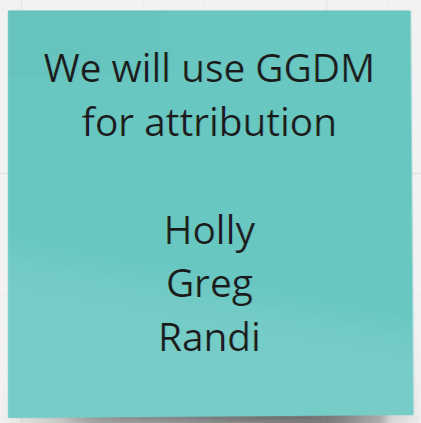

[[Attribution]]

= Summary of history of attribution discussions for CDB X.

The 1.x versions of OGC CDB use a CDB Feature Data Dictionary.  An Excel spreadsheet version of the CDB 1.X Feature Data Dictionary is available on the public CDB wiki at
https://external.ogc.org/twiki_public/pub/CDBswg/WebHome/CDB_FDD.xlsx

CDB V1.x feature codes and subcodes have been sourced from FACC, SEDRIS, DIGEST 2.1, DGIWG FDD, UHRB, and other sources.  [The abbreviations and acronyms are defined and/or expanded in the OGC CDB 1.x Standards and Best Practices documents]

An OGC Change Request Proposal (CRP) related to CDB attribution was generated during OGC Testbed 13:
http://ogc.standardstracker.org/show_request.cgi?id=544

Note:  Most of the images in this section of the report are snippets of the Miro whiteboard used for collaboration throughout Phase 3 of the Tech Sprint.  The board was archived at various points through the spring by the moderator.  At the time of the drafting of this report, the link to the Miro whiteboard is at:
https://miro.com/app/board/o9J_kqG1Jw0=/

= Phase 3 Consensus

There was early consensus during Phase 3 of the Tech Sprint to attempt to experiment with and potentially adopt an approach to attribution generally called "GGDM".  Greg Peele, one of the Tech Sprint participants, has described his work as a sub-contractor on the team recommending a Data Model for the U.S. Army One World Terrain (OWT) effort in multiple presentations to the OGC Interopable Simulation and Gaming Domain Working Group.  Greg's most recent presentation, entitled *"Entities, Attributes, and Enumerants, Oh My!  Applying GGDM for Interoperable One World Terrain Semantics"* to the ISG DWG may be found here:
https://portal.ogc.org/files/?artifact_id=93666

= Phase 3, Day 3

[#img_Peele_Whiteboard_Day_3,reftext='{figure-caption} {counter:figure-num}']
.Greg Peele's Whiteboard from Phase 3 Day 3.
image::images/Greg Peele Day 3 whiteboard.png[width=1000,align="center"]

= Phase 3, Day 4

[#img_Attribution-sub-team-consensus,reftext='{figure-caption} {counter:figure-num}']
.Day 3 Consensus and formation of the Attribution sub-team.

[#img_Attribution-in-GGDM-prove-me-wrong,reftext='{figure-caption} {counter:figure-num}']
.'Attribution will be in GGDM, Prove me Wrong' Day 4 Sign.
image::images/Day 4 Attribution in GGDM Prove me Wrong sign.png[width=500,align="center"]

[#img_Attribution-Day-4-Whiteboard,reftext='{figure-caption} {counter:figure-num}']
.Attribution Day 4 Whiteboard.
image::images/Attribution Day 4 Sub Team Whiteboard 1.png[width=1000,align="center"]

= Phase 3, Day 5

[#img_Attribution-Day-5-WIP1-Whiteboard,reftext='{figure-caption} {counter:figure-num}']
.Attribution Day 5 Work in Progress Whiteboard One.
image::images/Day 5 Attribution Whiteboard WIP1.png[width=1000,align="center"]

[#img_Attribution-Day-5-WIP2-whiteboard,reftext='{figure-caption} {counter:figure-num}']
.Attribution Day 5 Work in Progress Whiteboard Two.
image::images/Day 5 Attribution Whiteboard WIP2.png[width=1000,align="center"]
