[[vectorgpkg]]

== CDB X Vector Data in GeoPackage

=== Performance of CDB Vector Data in Large GeoPackage Containers

=== Abstract
To test potential approaches to storing CDB vector data in GeoPackage, we performed several different experiments to determine the viability of storing very large quantities of vector data in a smaller quantity of large GeoPackage files rather than a very large number of small Shapefiles. Some of our experiments also set out to determine if there are upper limits in how much CDB content can be stored in a GeoPackage. 
This document details our approach and results. We found that GeoPackage is capable of meeting the performance and size constraints for vector data in a CDB if properly defined. We found that it is probably not feasible from a performance standpoint to do a direct conversion of existing Shapefile content to GeoPackage. To gain the most from GeoPackage, some approaches to level of detail (LOD) and other CDB content should be reconsidered, such as the way significant size is used in CDB.
We also found that it is very important to design the schema, including proper index design, when using GeoPackage. Shapefiles are very simple for developers to use, as there is not a lot of flexibility when it comes to how to store data. Conversely, GeoPackage is very flexible, and how it is used can have a major impact on performance. If the exact schema and indexes for GeoPackage are properly defined as part of the CDB specification, users can expect very good performance, even for large datasets.

=== Objective
The purpose of these experiments was to examine performance in searching for and interacting with CDB features stored in very large unitary GeoPackage containers.
The design intent of the large datasets consisted of three main considerations:
•	Be very large in terms of feature counts
•	Be CDB-like in terms of feature attribution
•	Be ‘representative’ of real-world feature density over a large area.
The source data was prepared for the USA, including Alaska, Hawaii and Puerto Rico. Testing, however, was limited to only CONUS.

=== Data Sources
Four containers were prepared: 
1.	cdb-usa-bldg-ssiz.gpkg
2.	osm-hydro-to-CDB.gpkg
3.	osm-roads-to-CDB.gpkg
4.	combined-features-conus.gpkg

==== Data Source 1 - cdb-usa-bldg-ssiz.gpkg:
This file contains 39,079,781 point features. Its size on disk is 5,249,290,240 bytes. The following is an image showing the attributes on features in the attribute table.

[#img_logical-model,reftext='{figure-caption} {counter:figure-num}']
.Attribute table for US CDB building data.
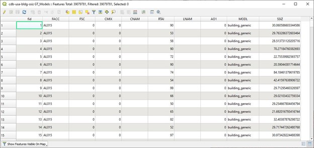

These point features were created using the following process:
a.	Building footprints for the United States area were extracted from OpenStreetMap sources.
b.	An approximate ‘significant size’ for each building we calculated using the formula:
SignificantSize = sqrt($area) * 1.5
c.	The centroid of each footprint polygon was generated, preserving attributes.
d.	The centroid points were passed through an 'OSM to CDB Attribute Translator' to assign CDB-like attribution.

This data is contained in a layer named “GT_Models”, though the nature of the data can be considered as an agnostic representation of either GT or GS CDB models.
It should be noted that the original OSM building footprints do not have a ‘height’ attribute, so the derived significant size is approximate and present only for illustrative and comparative purposes.

==== Data Source 2 - osm-hydro-to-CDB.gpkg:
This file contains two layers. Its size on disk is 5,043,081,216 bytes.

The first is Hydro_Network_Areal, with attributes shown below.  It contains 2,126,072 features.
 
[#img_logical-model,reftext='{figure-caption} {counter:figure-num}']
.Hydro_Areal_Network CDB layer attribute table.
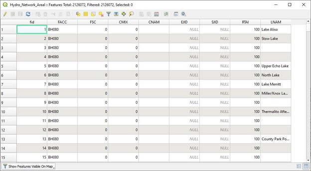

While named a ‘network’ layer, no effort was made to conduct a topological analysis and assign junction IDs.  The CDB-like attribution is merely representative.  This layer was created by combining OSM hydrographic areals based on a very simple attribute filter, and then running the results through an 'OSM to CDB Attribute Translator’ with rules set to create very generic CDB attributions.

The second layer is ‘Hydro_Network_Linear, with its attribution shown below.  It contains 4,252,603 features.
 
[#img_logical-model,reftext='{figure-caption} {counter:figure-num}']
.Hydro_Network_Linear CDB attribute table.
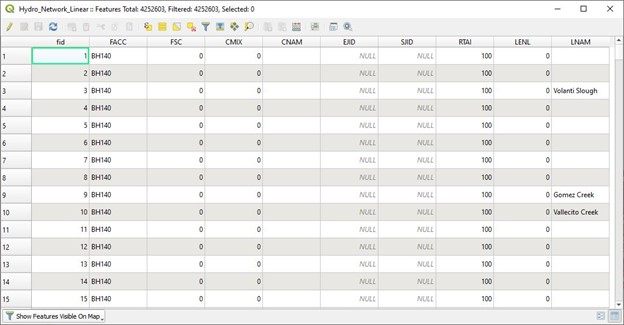

Again, no effort was made to conduct a topological analysis and assign junction IDs.  The CDB-like attribution is merely representative.  This layer was created by combining OSM hydrographic linears based on a simple attribute filter, and then running the results through an 'OSM to CDB Attribute Translator’ with rules set to create very generic CDB attributions.

==== Data Source 3 - osm-roads-to-CDB.gpkg
This file contains roads derived from worldwide OSM. It contains 90,425,963 features. Its size on disk is 29,832,347,648 bytes.
 
[#img_logical-model,reftext='{figure-caption} {counter:figure-num}']
.OSM roads layer attributes table.
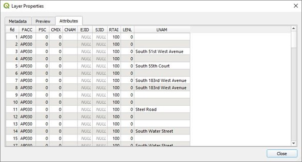

Like the hydrographic features described above, this dataset does not contain a true network – topology was not analyzed and CDB junction IDs are not set.

==== Output
The final container, combined-features-conus.gpkg is simply a single container with each of the aforementioned layers copied into it.  Its size on disk is 18,164,895,744 bytes.

[#img_logical-model,reftext='{figure-caption} {counter:figure-num}']
.Layers of the final data container.
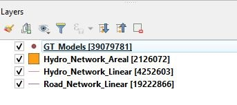

The layer ‘Road_Network_Linear’ was clipped from the world-wide road coverage, to approximately the CONUS area, to cover the same extents as the other three layers.  

=== Performance Testing

==== Attribute Queries and Performance Summary
The objective of this testing was to explore a combination of spatial and attribution filtering in a CDB-like environment.
To illustrate the importance of properly designing the schema when migrating from a Shapefile to a GeoPackage-based CDB, we converted all the vector data in a CDB directly. We used an approach similar to "Design Approach 4" in the discussion paper entitled *OGC CDB, Leveraging GeoPackage Discussion Paper* (https://portal.opengeospatial.org/files/?artifact_id=82553). The conversion grouped all vector features by dataset and geocell into a single GeoPackage file. Each vector feature was assigned a value for LOD, HREF, and UREF to correspond to the original Shapefile filename. A test was developed to randomly seek through the CDB and read features. The test script had a list of 8243 individual Shapefiles, but each file was opened and read in a randomized order. In the case of the Shapefile, each file was opened by filename, and all of the features were read. In subsequent tests with GeoPackage, the same content was read (using the list of Shapefile filenames), but instead of opening the Shapefile, the script performed a query based on the LOD, HREF, and UREF attributes.
In our test, reading the ShapeFiles took 0:01:29 (1.5 minutes). With no indexes on the GeoPackage attributes, the queries took over one hour (1:01:47). Next, we created an index for the LOD, HREF, and UREF attributes and repeated the GeoPackage test. With the indexes, finding and reading the same features took 0:00:49, only half of the time it took to read the Shapefiles.

==== Methodology
* The testing environment was a single Windows workstation, 16 CPU cores, 64 GB of system RAM, and very large SATA disk storage.  No ‘exotic’ (SSD, M2, etc.) storage devices were used.
* Tests were created as Python scripts, leveraging the ‘osgeo’ Python module. Timing information was captured using Python’s ‘time’ module. Python 3.7.4 (64-bit) was used.
* Each timing test was performed in the approximate CONUS extents of North 49 degrees latitude to South 24 degrees latitude, and from West 66 degrees longitude to West 125 degrees longitude.
* Prior to running a test, a ‘step size’ is defined – typically corresponding to a CDB LOD tile size. A list of every spatial filter in the entire extent is created, then randomized.
* Also, prior to a test, a ‘significant size’ filter is set. When the layer ‘GT_Model’ is encountered, this additional attribute filter is applied. The intent is to mimic LOD selection, in addition to the spatial filter.
* There are three timing steps:
** Timing step one is the elapsed time to apply the spatial filter.
** Timing step two is the elapsed time to return a feature count based on the combined spatial and (if any) attribute filters.
** Timing step three is the elapsed time to read the features from the layer into a Python list.
* At the end of processing and timing each ‘tile’ defined by the collection of spatial filters, a corresponding ‘shape’ is created and written into the test record output file.  
The output attribution is as follows:
count:	the number of features returned after application of filters
filter_t – 	time to complete the filtering operation(s) in seconds
count_t:	time to complete the feature count operation in seconds
read_t :	time to complete feature read operation in seconds.  This includes reading from the GeoPackage container and appending each feature to a Python list.
Sequence: 	order that the tile was processed
‘$geometry’: 	tile extents derived from spatial filter polygon
Note: tiles that return zero features do not create a test output record.

==== Results
===== Experiment 1:  Step size .25 degrees (CDB LOD2), significant size > 13.355 (LOD2 significant size) 
Test results coverage is shown in the figure below.

[#img_logical-model,reftext='{figure-caption} {counter:figure-num}']
.Test results coverage at LOD 2.
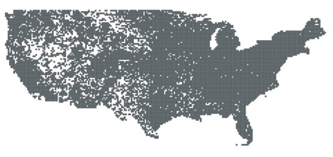

This test simulates retrieving point features corresponding to CDB LOD2 and only models with the corresponding lowest significant size (as defined in the CDB 3.2, Table 3-1).  The conclusion that is drawn from this test, however, is that spatial filtering time is insignificant and appears to not be correlated to the number of features found. 
The time it takes to count and read filtered features appears to be a direct correlation to number of features found.

The Experiment 1 attribute table results are shown in the figures below, each filtered on a different field.

[#img_logical-model,reftext='{figure-caption} {counter:figure-num}']
.Experiment 1 test results attribute table sorted by 'feature count'.
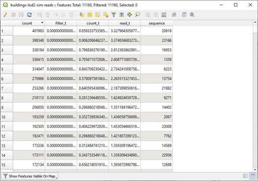

[#img_logical-model,reftext='{figure-caption} {counter:figure-num}']
.Experiment 1 test results sorted by 'filter_t'.
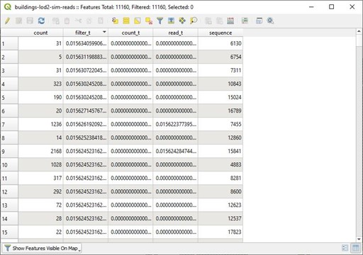

[#img_logical-model,reftext='{figure-caption} {counter:figure-num}']
.Experiment 1 test results sorted by 'count_t'.
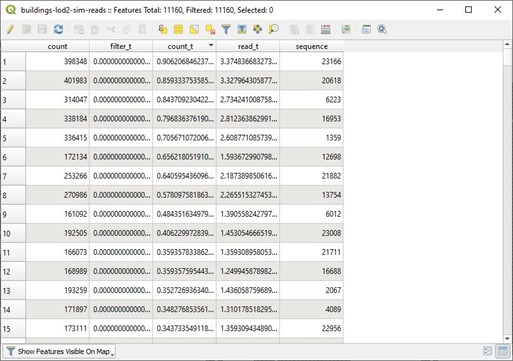
 
[#img_logical-model,reftext='{figure-caption} {counter:figure-num}']
.Experimment 1 test results sorted by 'read_t'.
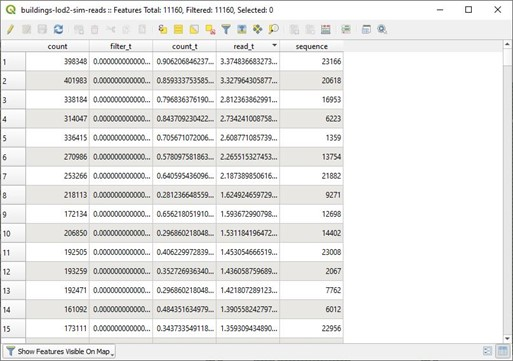

===== Experiment 2: simulation of LOD4, hydro, road, and building layers, significant size (buildings) > 3.39718
Test results coverage is shown in the figure below.

[#img_logical-model,reftext='{figure-caption} {counter:figure-num}']
.Experiment 2 LOD 4 test coverage results.
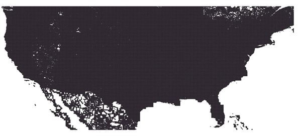

This test uses the combined layers source file and simulates a CDB LOD4 data access pattern. Timing values are totals, accumulating as each layer is filtered, counted as features are read.
Once again, filter timing appears to be insignificant and unrelated to the number of features filtered.  Data in the GT_Model layer has both a spatial and attribute (significant size) filter applies.

The Experiment 2 attribute table results are shown in the figures below, each filtered on a different field.

[#img_logical-model,reftext='{figure-caption} {counter:figure-num}']
.Experiment 2 LOD 4 test sorted by 'feature count'.
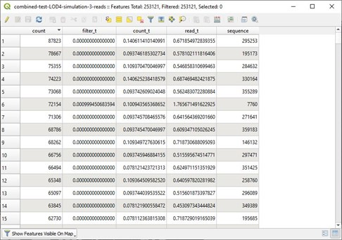

[#img_logical-model,reftext='{figure-caption} {counter:figure-num}']
.Experiment 2 LOD 4 test sorted by 'filter_t'.
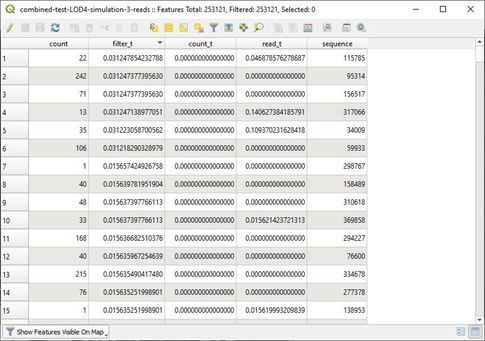

[#img_logical-model,reftext='{figure-caption} {counter:figure-num}']
.Experiment 2 LOD 4 test sorted by 'count_t'.
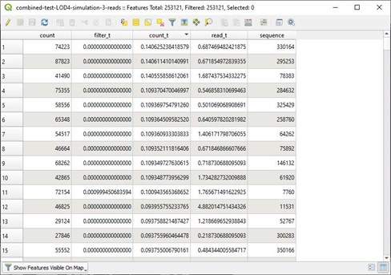

[#img_logical-model,reftext='{figure-caption} {counter:figure-num}']
.Experiment 2 LOD 4 test sorted by feature 'read_t'.
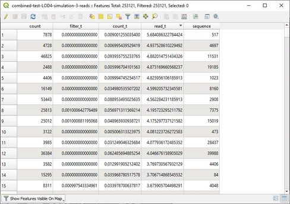

=== Conclusions and Recommendations
1.	It appears practical to store large amounts of feature data in single GeoPackage containers and retrieve that data by applying spatial and attribution filters that correspond with typical CDB access patterns.
2.	Spatial filters easily mimic the existing CDB tiling scheme.
3.	Storing ‘significant size’ on model instancing point features can significantly improve the model retrieval scheme, rather than storing models in the significant size related folder scheme.  Storing and evaluating significant size on instancing points can make visual content and performance tuning much more practical.
