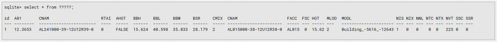
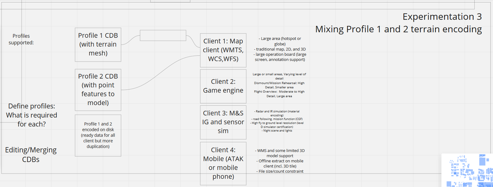
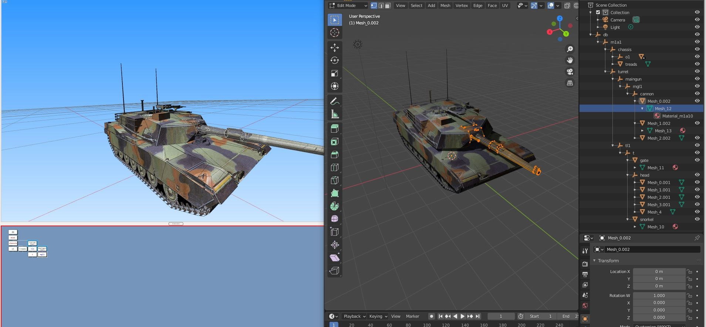
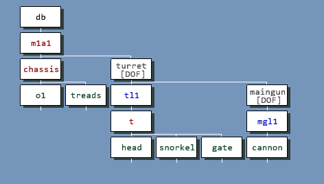
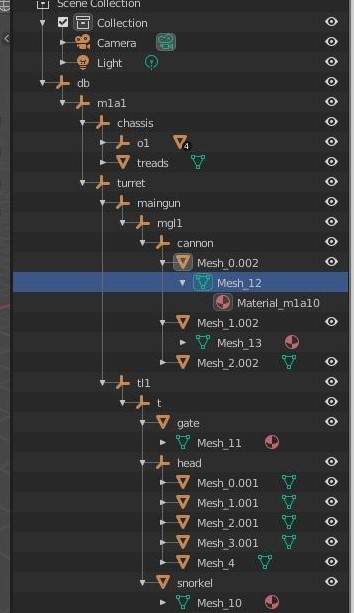

[[threedcontent]]
== 3D Models and other 3D Content

This section discusses the proposal to use glTF to encode and store 3D models in the CDB X data store. This section also describes the prototype testing performed during the the <activity>. In CDB, 3D models are such phenomenon as trees (static), buildings, transmission towers, or helicopters (dynamic).

Currently, the OpenFlight specification is used to define all the 3D models in a CDB data store. The current OGC CDB 1.x core standard and https://portal.opengeospatial.org/files/16-009r4[Volume 6 CDB Rules for Encoding Data using OpenFlight] specifies all of the rules and requirements for using OpenFlight models in a CDB data store. The early advantage OpenFlight held over many 3d geometry model file formats (.obj, .dxf, .3ds) was its specific real-time 3d graphics industry design.

For CDB X, the participants in the 3D Geospatial Series Tech Sprint II – OGC CDB 2.0 activity agreed that a more modern 3D model encoding and transmission format should be explored. Based on wide adoption and use in many domains, the Khronos glTF 2.0 specification was selected for further research and prototyping. A key part of this activity was to perform a detailed analysis of glTF functionality as compared to OpenFlight capabilities. The participants agreed that no (or as little as possible) functionality should be lost. NOTE: glTF will not be a replacement for OpenFlight in a CDB data store. Instead, glTF is recommended as the preferred encoding for CDB 3D Models. There are a few OpenFlight to glTF conversion tools.

The remainder of this section discusses the findings of the comparison as well as lessons learned from the prototyping activity.

[[Questions]]
=== Questions to be addressed

Following are some of the questions that the 3D Modelling Subgroup initially identified as needing further discussion and possible experimentation. These formed the basis for the specific questions and approaches uses in the CDB-X 3D Prototyping and Experimentation.

. Models be stored in GeoPackage (Editors Note: `Is this a good idea? One could store the glTF in the CDB data store without using GeoPackage - just as OpenFlight today. Need to think about also perhaps having I3S, 3D Tiles, CityGML and other encodings.`)
. Models preferred to be glTF (others allowed) (glb package?)
. Textures shall be xxxx format (png, jp2)  Power of 2 enforced?
. UV Map with model?
. naming convention tbd - should have some metadata use - indexing? directory path? layer? featureID?
. LOD Structure? (3d tiles?  MS LOD extenxtion for glTF) (Editors note: `Shouldn't the same LoD structure be used throughout CDB-X? Otherwise, things get confusing.`)
. Describe model placement

.. point features
..    Terrain Reconstruction
..    Elevation
..    Imagery
..    Areal features. (Editor's note: `We stopped using "aerial" in CDB 1.1 - changed to polygon.`)
..    linear features
. Is there a way to map glTF Material vs CDB physical material?

CDB catalog service for 3D tile inside a tile

=== CDB X Requirements for 3D Model Components

Based on the questions and follow-up discussion, the CDB X participants derived the following requirements for CDB-X model components.

[width="90%",cols="2,6"]
|===
|*Requirement*|*Objectives*
|Improve interoperability with OWT|* Align 3D model geometry attribution in order to support conversion between the two standards. Test that conversion in both directions. +
* Support similar encoding (glTF) to support convergence as standards evolve.
|Serve archiving/repository use case and runtime usage|* Package 3D models LODs in an easy to edit manner while allowing fast runtime access of independent LODs. +
* Increase 3D tools (edit and view) interoperability. +
* Support multiple encoding with metadata to identify which one is used (Starting with OpenFlight and glTF).
|Modernize CDB | * Support newer 3D encoding formats (glTF initially) +
* Support newer attribution (NAS/GGDM) in point feature and in 3D geometry +
* Provide flexibility to extend 3D models components and attribution +
* Review LOD “bins” in context of today’s GPU capabilities +
* Added constructs for better game engine support (navigation and collision mesh, PBR etc..) +
*Review lightpoint (Dataset and in 3D model), light source, lightmap.
|Support SOF use cases : Same dataset for M&S and C2 including the mission command and TAK devices| 
* ATAK: Support 3D view and attribution +
* ATAK:  Support building interior 3D encoding (and 2D floorplan?) +
* ATAK:  Support packing 3D models in small memory footprint +
* ATAK:  Support LOD selection “per model or per zone” to transfer only the required data +
* Mission command: Support merging of CDB (Versioning) to cover large area +
* Mission command: Support 3D WEB based map steaming
|=== 

=== Short and Medium Term Objectives

The following are the short and medium term objectives for the 3D Model Prototyping and Experimentation. These design objectives are based on the initial set of <<questions,questions>> posed by the CDB-X participants.

. Support more 3D model encoding with metadata detailing which is used. Preserve OpenFlight (and potentially improve its usage), add glTF with extensions

. Reduce file count and package models better while providing enough indexing data to allow readers to quickly extract only what they need. Metadata/catalog - support editing/replace use case

. Address GS, GT, model instancing

. Support Building interior with navigation mesh and collision mesh

. Encode 3D models in glTF

.. Node grouping, LOD grouping in json

.. Define CDB extensions for glTF

.. Look at tools to allow CDB attribution editing

. Model packing with MetaData

=== 3D Experiment Object Model

==== The data

This experiment uses a GeoPackage comprised of a point feature table with attribution.

[#img_3d-model-experiment 1,reftext='{figure-caption} {counter:figure-num}']
.3D Experiment 1 attribute table for point features.

==== Attribute changes explored

The following current CDB attribute changes were explored.

- CNAM - no longer needed
- FACC - FSC - Change to GGDM - impact on field type
- MLOD - (LOD of the model to use) This is closely linked to tiling and LODs of vector where each point features would point to a model at a given LOD (should be lower than feature vector LOD). Presume at the moment we keep this.
- MODL - (Name of the model to use). In this case, we should point to a metadata file for the model. Alternatively, the content of the metadata could be encoded in GeoPackage - which is bad for tool operability.

A key challenge to resolve is how to link the model data with the feature data. Currently, the MLOD and MODL are composed and lookup into the tile index of the point feature. Is that functional capability (approach?) preserved? Do we use a model table in Geopackage with a primary key? As decided, models would remain separate files and not encoded in the GeoPackage. So, a unique file name is required for this experiment.

=== Description of 3D formats/encodings and References for this section:

==== OpenFlight

OpenFlight (or .flt) is an open, freely available 3d geometry model file format originally developed by Software Systems Inc. for its MultiGen real-time 3d modeling package and now actively maintained by the OGC member https://www.presagis.com/en/[Presagis]. OpenFlight is an open format, binary encoded with support for user extensions, which is supported widely in modeling and simulation community for dynamic and static 3D model. OpenFlight has numerous constructs that have no equivalent to date in other open standards. In CDB 1.x, OpenFlight is used for  the  representation  of  3D  static and dynamic  models  and  RGB  format  for  the  3D model’s textures. OpenFlight is now an OGC Community standard.

https://portal.opengeospatial.org/files/90663[OpenFlight v16]

.recommendation
[source,ruby]
----
The 3D model group recommends that a new CDB standard adaopts the latest version of OpenFlight, leveraging the extended materials, hot spots and other important constructs it brings.
----

==== GL Transmission Format (glTF) 2.0

glTF is a royalty-free specification for the efficient transmission and loading of 3D scenes and models by applications. glTF uses the JSON standard. glTF is an API-neutral runtime asset delivery format developed by the Khronos Group 3D Formats Working Group.

https://github.com/KhronosGroup/glTF/tree/master/specification/2.0[glTF 2.0] GitHub repo and description.

https://github.com/KhronosGroup/glTF/tree/master/extensions/2.0/Khronos/KHR_lights_punctual[KHR_lights_punctual] is an extension that defines a set of lights for use with glTF 2.0. Lights define light sources within a scene.

https://github.com/KhronosGroup/glTF/tree/master/extensions/2.0/Vendor/MSFT_lod[MSFT_lod] is an extension that adds the ability to specify various Levels of Detail (LOD) to a glTF asset.

https://github.com/KhronosGroup/glTF/tree/master/extensions/2.0/Vendor/EXT_mesh_gpu_instancing[EXT_mesh_gpu_instancing] is an extension that is specfically designed to enable GPU instancing which renders many copies of a single mesh at once using a small number of draw calls. It's useful for things like trees, grass, road signs, etc. 

https://github.com/KhronosGroup/glTF/tree/master/extensions/2.0/Vendor/FB_geometry_metadata[FB_geometry_metadata] is an extension that annotates glTF scene objects with a summary of the cumulative geometric complexity and scene-space extents of the scene's associated scene graph. `Editors note: While the computed total vertex and primitive count are metadata this is very limited metadata and may not meet the needs of the CDB X community.`

https://github.com/KhronosGroup/glTF/tree/master/extensions/2.0/Khronos/KHR_materials_unlit[KHR_materials_unlit] is an extension that defines an unlit shading model for use in glTF 2.0 materials, as an alternative to the Physically Based Rendering (PBR) shading models provided by the core specification. 

https://github.com/KhronosGroup/glTF/tree/master/extensions/2.0/Khronos/KHR_texture_transform[KHR_texture_transform] is an extension that adds offset, rotation, and scale properties to textureInfo structures. These properties would typically be implemented as an affine transform on the UV coordinates. 

=== Original Prototyping Experiments - Keeping for now but will delete when this section is more mature.

Two profiles.

Profile 1 Storing the mesh in as 3D tile: Experiments

. Question: How to store LODs? In glTF extensions, In 3D tiles, in separate glTF
. Question: Are there missing glTF constructs?

Profile 2 Storing the mesh in as 3D tile (Editor's note: `Why just 3D Tiles? Why not a more general approach that allows other encodings/approaches?`)

. Question: What is the ability to source edit the mesh?
. Question: Mixing GeoPackage with 3D tiles?
. Question: CDB catalog service for 3D tile inside a tile

Both Profile 1 and Profile 2

. Question: What are the efficient format/packing for each different end-points:
.. ATAK
.. Mission command (wms/wfs)
.. Modsim
.. Gaming

[#img_3d-model-experiments,reftext='{figure-caption} {counter:figure-num}']
.Profles and Experiments for CBD-X 3D Models.

=== Investigation 1 - Make CDB 3D models easier to maintain/modify
One of the objective of the 3D model refactoring in CDB is to facilitate the editing process. CDB 1.X, 3D model encoding is hard because:
. OpenFlight format has fewer editing tools than other more recent 3D formats. This leads the team to investigate glTF encoding.
. CDB 1.X model components (geometry, texture, metadata) as well as level of details (lods) of those components are stored in different folder. This distribution is not well supported by editing tools and edits often requires to updated many files, including collections such as zips. This leads the team to investigate a component grouping for all 3D model components.

While investigating those solution, one needs to understand the motivation behind the original CDB structure and assess if the impact of the change against the original design criteria.  

CDB 1.X Geospecific 3D models was likely motivated by:
. A single encoding (OpenFlight) for 3D model geometry: At the time of the original spec, OpenFlight remained the most adopted format for 3D models in the Modeling and simulation industry. It meet the requirement of open format, was efficient binary encoding, and was an editable source format supported by a number of tools. Having a single possible encoding increases interoperability by reducing the number of encoding to support on both the producer and the consumer of CDB. Supporting different encodings (OpenFlight and glTF) may result in less interoperability. In some cases, multiple versions of a CDB with the different encodings may be required as different consumers may only support one encoder.
. Facilitate parallel access to all components as opposed to sequential. By grouping all components into datasets (textures geometry, material etc...) into tiles and LODs, a client can assess which tile and component is required and fetch all components in parallel, that is without having to read the result of a request before sending a new request (like wait for geometry to identified referred textures and materials). 

*Focusing on GeoSpecific models*
The initial experimentation targeted the Geospecific models inside the CDB structure as those represent the most challenge. The geoTypical models would need to be reviewed but will likely apply a sub-set of the GeoSpecific concepts. The list of tasks below show the investigation that took place along with the results:

==== TASK 1 - CDB OpenFlight and glTF Feature Analysis

OGC CDB 1.X relies on a number of OpenFlight constructs that have no equivalent in glTF. One of the first task of the group was to list all PGC CDB 1.X requirements w.r.t. 3D model encodings and assess if glTF has equivalent constructs.  The following document reports on this analysis.
include::opf-gltf-analysis.adoc[]

==== TASK 2 - Developing glTF CDB extensions
The CDB glTF extension contains most of the required CDB-specific features, but there are some possible additions that could be made.

*Coordinate reference system*
Openflight can store the projection of a model in its header and this is currently not possible in glTF. 
While not strictly required for CDB (projection is enforced by CDB spec), the group judged this would be useful for interoperability. There's also interest in such an extension for One World Terrain, so this should likely be done as a stand-alone extension and not as part of the CDB extension

*Per face metadata*
The current spec with openflight allows for storing materials or relative priority per-face. However, in glTF faces are usually collapsed into meshes, so there is no way to store information per polygon. 
With the current extension, the solution would be to group polygons with the same relative priority and material into a single mesh and store the information at the mesh level.

There is an extension in progress for OWT to store metadata at the feature level. https://github.com/CesiumGS/glTF/pull/1[This extension] currently supports storing per-vertex metadata, but it could possibly be expanded to support per-face metadata and used in CDB. 

*External References*
This is one of the larger challenges encountered during our investigations. There has been discussion in the past about including an external reference extension in glTF but it was decided not to include it.
In past cases, separate index files were used to reference multiple glTF files from a common source. This is sufficient for some cases, but does not help for the use case of sharing geometry between multiple models. For example sharing common roof clutter objects between different buildings

==== TASK 3 - Prototype a OpenFlight to glTF converter supporting the new extension
Here are some images of a tank 3D model in both format. This model was selected as benchmark as it contains a number OpenFlight specific constructs leveraged in the CDB. Converting this model will exercise many of the proposed glTF extensions.

 

===== OF/gltf size comparison metrics:

*Small CDB size comparisons (898 GS models - without textures)*
Comparing the size of the 300_GSModelGeometry and 303_GSModelDescriptor folders from the source CDB to the 999_ModelGeometry folder in the converted CDB:

[width="30%",cols="2,4]
|===
|*Format*|*Size*
|Openflight|11.0MB 
|Ascii gltf|9.16MB
|Binary glb|6.83MB
|=== 

*Size comparison for a single very large model*

[width="30%",cols="2,4]
|===
|*Format*|*Size*
|Openflight|16.7 MB 
|Ascii gltf|9.27 MB
|Binary glb|10.78 MB
|=== 

In the CDB test case the Ascii glTF is slightly smaller than Openflight, and the binary glb is almost twice as small. 
In the test case with a single large model both the binary and ascii glTF provide a large improvement, but the binary file is actually slightly larger than the ascii gltf. The reason for this is not entirely clear, but it seems to be an outlier based on other tests.

==== TASK 4 - Define a new structure to store 3D models

==== TASK 5 - Define an index file for all 3D model components

=== Investigation 2 - Merging all geometry in a tile
This investigation was not done by the 3D group but the tiling group did....
This type of solution has significant impact on the CDB data model:
. The mesh solution merges many CDB datasets into one. The elevation and 3D features along with the imagery are now all merged into one dataset.
. The attribution to objects on the terrain is currently done in the vector, with a reference to the geometry. In a mesh case, the linkage will likely need to be revered and have the geometry link to the attribution.
 

