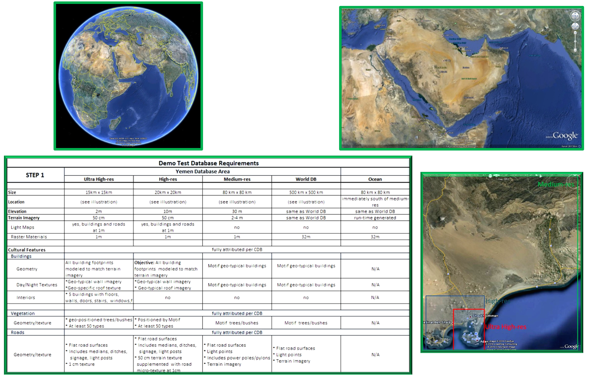
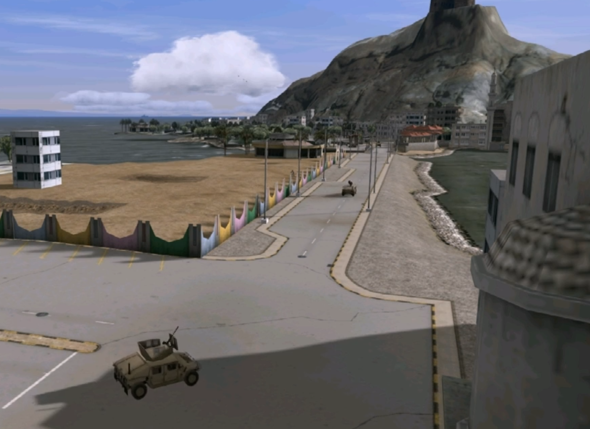
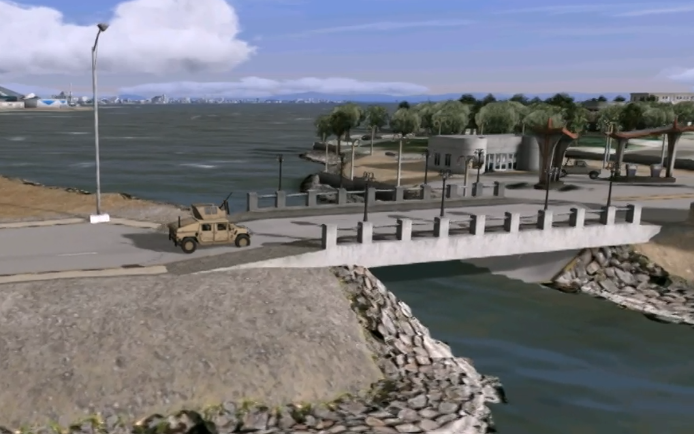
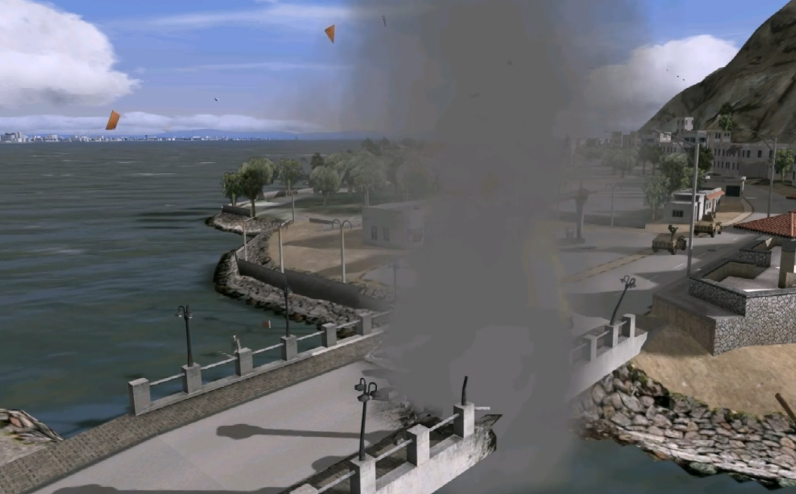

[[Integration_Experimental_Analysis]]

:figure-caption: Figure Integration / Analysis -
:figure-num: 0

= An analysis experiment to explore 'whole-of-CDB X' Integration_Experimental_Analysis

This is the development of a scenario within which to analyze and explore how CDB X will provide for inheritance of top-level 'parent' metadata, making a 'small change' in an already developed and deployed CDB X dataset, and how a change in resource constraints in a small high LOD area is aggregated back 'up' into higher packaging of CDB X.

The 'Use Cases' for this specific scenario are Mission Rehearsal and Mission Planning.  The specific end-user target for this analysis are Special Operations helicopter crews and potential other Special Operations mounted and dismounted resources.

The high level idea is the identification of a specific road bridge in an existing CDB dataset viewed in the context of the highest LOD available, such that vehicle driver eyepoints have the best representation of the ground-based viewpoints.  In this scenario, the road bridge will be damaged by a kinetic event.  The change to the dataset requires the removal/replacement of files, possible deletion of files, possible addition of files, and the 'packaging' of the changes so they can be disseminated in a new target named CDB (CDB version) that can be added quickly to an already deployed repository to provide for the changes resulting from the damaged bridge.

One of the test databases available to the Tech Sprint is the "Yemen" CDB database from Presagis.  The images and other information here is from the pre-Presagis CAE internal Yemen database, so it is possible some of the references below will need to be updated.

For general orientation, the overall description of the CDB Yemen Database follows:

[#img_CDB CAE Yemen Database Description slide,reftext='{figure-caption} {counter:figure-num}']
.An overall description of the Yemen CDB dataset.

A recent Google maps rendering of the general area of Aden Yemen:

[#img_Google Maps recent Yemen overview,reftext='{figure-caption} {counter:figure-num}']
.Aden, Yemen general overview.
image::Images/Aden Yemen overhead map view.png[width=800,align="center"]

A lower level recent Google maps rendering of the bridge to Sira Island, Aden, Yemen:

[#img_Google Maps recent Sira Island bridge,reftext='{figure-caption} {counter:figure-num}']
.Bridge to Sira Island, Aden, Yemen.
image::Images/Sira Island Bridge Google Maps View.png[width=800,align="center"]

The following are relatively low-resolution images of the Sira Island bridge and the area around it from an image generator rendering the Yemen CDB.

[#img_Vehicles on the road to Sira bridge,reftext='{figure-caption} {counter:figure-num}']
.Vehicles on the road to the bridge before Bang.

[#img_Sira bridge from the island side before Bang,reftext='{figure-caption} {counter:figure-num}']
.Sira bridge view from the island side before Bang.
image::Images/Bridge view from the other side before bang.png[width=800,align="center"]

[#img_HMMV on Sira bridge just before Bang,reftext='{figure-caption} {counter:figure-num}']
.HMMV on the Sira Island bridge just before IED detonation in a rehearsal scenario.

[#img_Sira Island bridge damaged with clearing smoke,reftext='{figure-caption} {counter:figure-num}']
.Clearing smoke after IED damage to Sira Island bridge in an IED scenario.

[#img_Sira Island bridge distant view of damage,reftext='{figure-caption} {counter:figure-num}']
.Damaged / fallen Sira Island bridge in background as scenario helicopters depart.
image::Images/Bridge and island area view from departing helos.png[width=800,align="center"]
 
