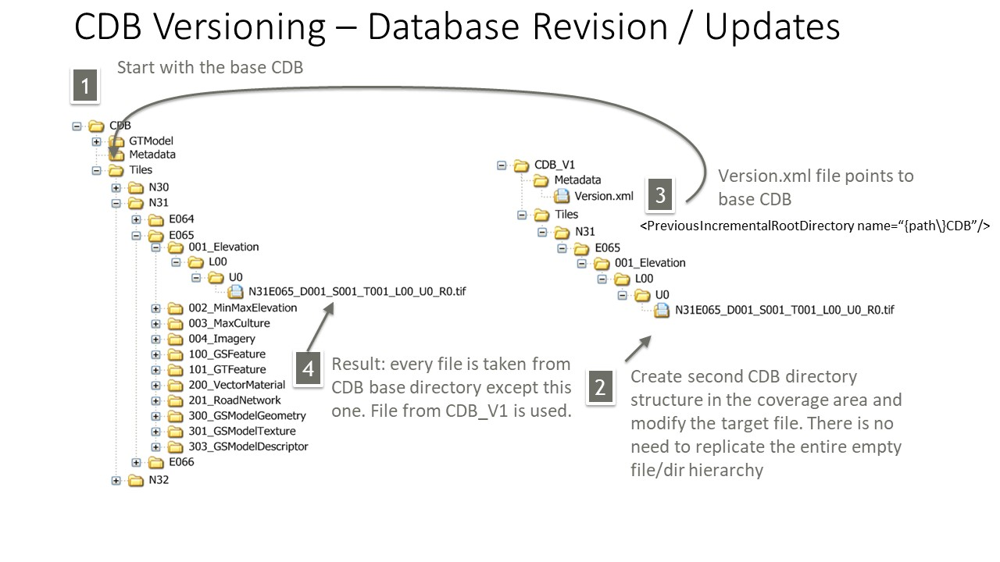
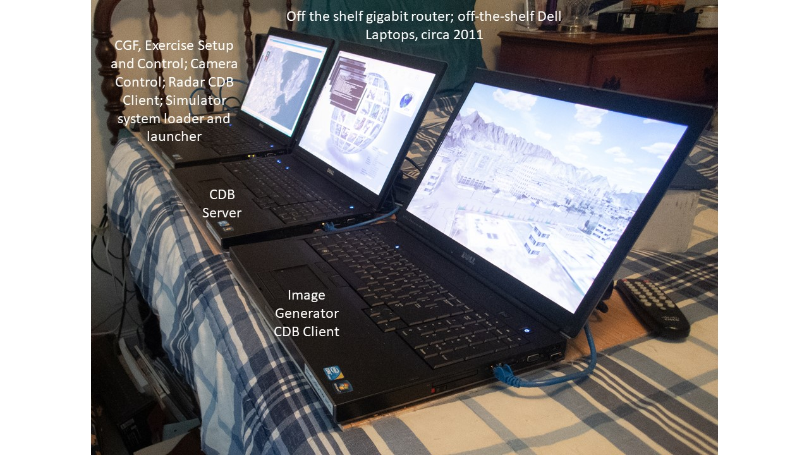
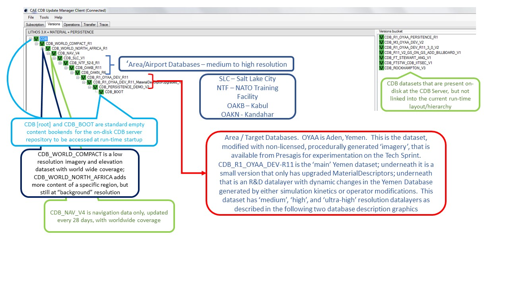
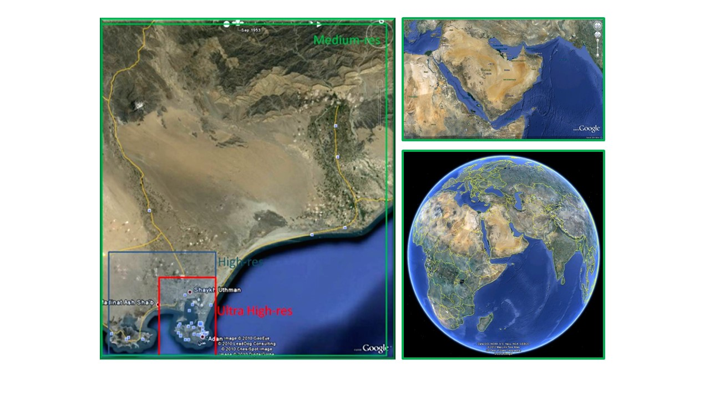
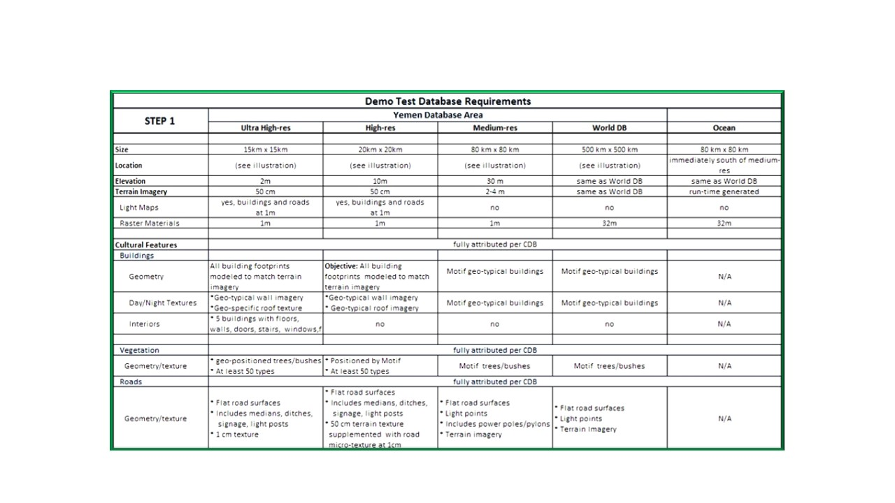
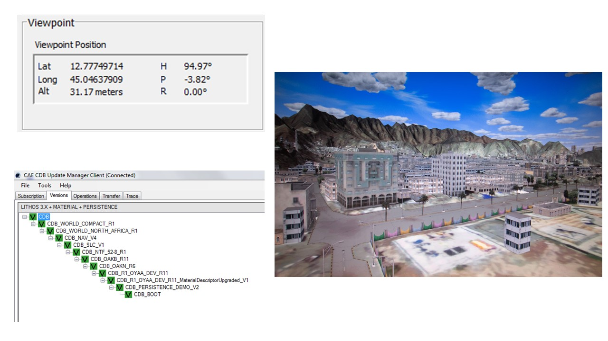
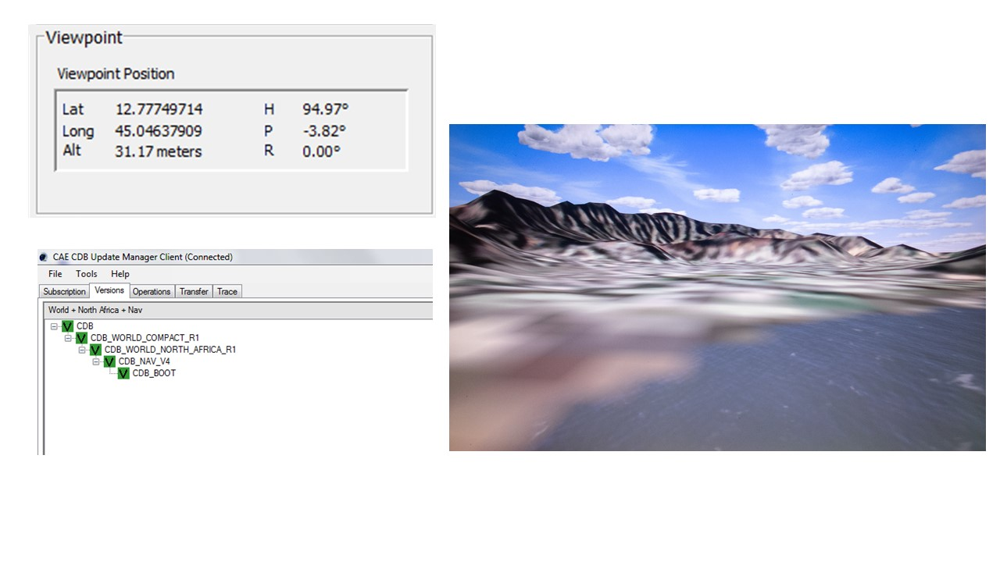

[[Versioning_in_Legacy_CDB]]

:figure-caption: Figure VERS -
:figure-num: 0

= CDB Versioning, old and new

== A review of how 'versioning' is used in legacy OGC CDB 1.X, and how that experience leads to use cases for exploration of versioning in CDB X.

From the beginning of the development of CDB the concept of versioning was designed to support the development and distribution of small changes and to support end-site CDB servers' capability to link each dataset called a CDB to a 'parent' CDB dataset using the Version.xml file in the Metadata subdirectory under the CDB-dataset top level directory.

The specific mechanism that enables versioning in OGC CDB 1.x is the XML element:  <PreviousIncrementalRootDirectory name=    >

The figure below, courtesy of Presagis / Hermann Brassard, shows a Version.xml file in a CDB with top-level directory named 'CDB_V1' pointing to a parent CDB top-level directory named 'CDB':

[#img_Presagis CDB Versioning Explanation Slide,reftext='{figure-caption} {counter:figure-num}']
.Versioning graphic, illustrating how to use a version to 'add' a single elevation coverage file at a specific location.+

OGC CDB's original versioning approach relies on simulation clients to start looking for any file at the 'bottom' of the hierarchy of CDB datasets available on the server and linked by metadata.  Since simulation clients know in advance 'where they are' and 'where they want to go' a file search starts with a location.  Because of the rigid directory and file naming structure of CDB, a simulation client knows where to look for any file and what the file, if present, will be named. In the example above, the simulation client would start looking in CDB_V1.  In this example, CDB_V1 contains only a single file, a .tif file for N31 E065 Elevation at L00 and U0.  If the simulation client is looking for anything else, it will fail to find the file it is looking for, look at Version.xml in CDB_V1, find the <PreviousIncrementalRootDirectory name=“{path\}CDB”/> XML element, and look again for the file in the next higher level CDB dataset in the hierarchy.

The existing requirement is that each CDB can point to 'none' or 'one-and-only-one' parent directory, so that the search tree for the files is deterministic.

In practical use CDB servers at simulation end-sites may not be managed by experts in database architecture.  CAE and other vendors will have developed utilities that allow a local or remote utility to be used at runtime client session startup to create the layout or 'chain' of CDB datasets that are present on a CDB server.

The slide below is a screen shot of a utility called the CAE CDB Update Manager Client, running on a CDB Server, that is part of a CDB simulation demonstration hosted on three laptop computers of about 2012 vintage.  The first image is the laptop computer hardware, the second image is the current chain of versions on the CDB Server laptop at the time of the screenshot.

[#img_CAE DSE 2012 Laptop Hardware,reftext='{figure-caption} {counter:figure-num}']
.CDB Laptop Simulation Demonstration Hardware+

[#img_Presagis CDB Versioning Explanation Slide,reftext='{figure-caption} {counter:figure-num}']
.A specific chain of CDB versions from CDB Boot at the bottom to CDB (root) at the top.+

The boxes and arrows on the graphic above are the author's attempt to show just some of the flexibility available using CDB versioning.  The simulator clients themselves can be set to always point to CDB_BOOT, an 'empty' CDB that only points 'up' to some content.

The top-level CDB_WORLD database can be a managed product maintained by a provider, for which regular updates are provided for example by subscription.  In this example CDB_WORLD_COMPACT_R1 was created specifically for these laptop demonstrators to fit on 1TB of total HDD capability on the server laptop.  At some later point some additional data for North Africa was added to blend with the subsequent development of the Yemen dataset.  CDB_NAV_V4 is another product-managed dataset that provides regularly updated worldwide NAV data.  There are multiple area/airport datasets that were added to the demonstration from various sources; these datasets have mutually exclusive coverage, i.e. they don't overlap in coverage.  Near the bottom of this chain are the datasets from which files are found when 'location' is in the Yemen dataset coverage area.  Datasets in this hierarchy can obviously be of different size, contain different LODs, could potentially contain datasets with different constraints such as security or licensing limits.

The following two graphics compare the various CDB dataset versions that comprise the Yemen data and the lower resolution ocean and world representations:

[#img_Yemen Database Coverages,reftext='{figure-caption} {counter:figure-num}']
..+

[#img_Yemen Database Area Description Table,reftext='{figure-caption} {counter:figure-num}']
..+

So, with the above background in mind, we can look at how the CDB database(s) at an end-user site may be linked either locally or remotely by a utility or directly changing the version.xml file in each dataset so that a simulation client encounters a 'world' of data at run-time startup that can be radically different, and without any change to the basic setup and linkage between the simulation client(s) and their local CDB server.

In the following graphic, the laptop demonstration visual client is an image generator, for which the startup Viewpoint position (what I guess we should now call a GeoPose?) is 'looking' at a street corner in Aden, Yemen.  If we startup that image generator with the chain of CDB datasets shown in the 'Update Manager' window, the IG renders the scene of the street corner on the right half of the Figure:

[#img_Demo IG startup with full CDB chain,reftext='{figure-caption} {counter:figure-num}']
.Demonstration IG at startup with full CDB version chain from World to OYAA.+

In the following graphic, the same image generator with the same starup Viewpoint position, but with a much simpler chain of CDB datasets renders a very different scene.  Note the mountains in background for comparison of the detailed Aden street view above and this view of the same location and viewpoint but with only background level imagery and elevation data:

[#img_Demo IG startup with only background CDB chain,reftext='{figure-caption} {counter:figure-num}']
.Demonstration IG at startup with full CDB version chain from World to OYAA.+

=== Summary

Versioning is used extensively in fielded CDB implementations.  A primary principal of the current approach is the direct replacement of a file in a parent CDB datasate by an identically named file in a linked child dataset.  Anyone at any level in the operation of the site of the simulators is able to assume the files are 'packaged' identically in every CDB dataset, whether it was produced locally, or produced as a product purchased, or acquired through sharing, and so forth.

Versioning is used to distribute a small change very rapidly.  In a previous Integration Analysis document, this author asked all those experimenting in this Tech Sprint to declare how their implementation would deal with a change in which a bridge near this street corner in Yemen is damaged/destroyed.  In CDB 1.X, that small change could be a single Openflight file in a CDB version.  This very small CDB version can be very quickly developed and transported to widely dispersed simulation sites.  Including the change in the 'world' of end site simulation clients after the CDB dataset containing the changed file is on the local CDB server requires rewriting only two version.xml files and restarting the simulation clients.  In actual practice, if the original Openflight model included one or more damage states, the change could actually be accomplished by a selector for the damaged model instead of the default/undamaged model.

Versioning is used so that background level data, including things like worldwide NAV data, can be maintained and distributed on a different schedule than other more localized data.

Versioning is used so that CDB datasets that may have some constraint in one or more layers (such as licensing or security classification) can be distributed separately from unrestricted datasets of the same coverage, and linked into the version chain when appropriate.

Versioning is used to proved temporary changes to a dataset, such as fortifications or obstacles or other objects that support a specific training or rehearsal, but are not part of the permanent CDB collection for the same coverage.

Versioning is also used to quickly disseminate changes that will become part of the permanent collection, but are able to be linked immediately for use and 'flattened' into a parent coverage when appropriate at a later date.
